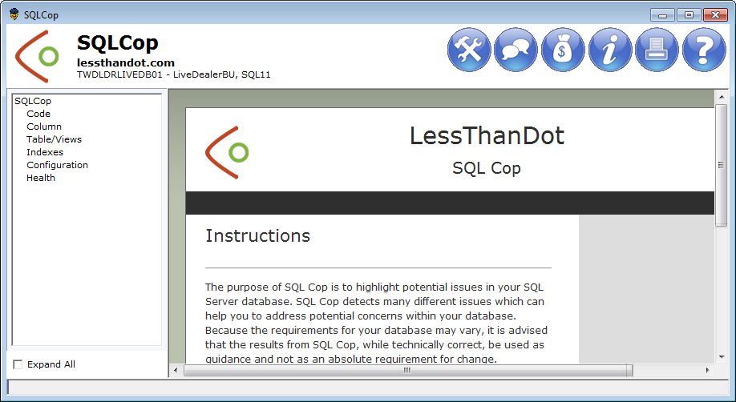
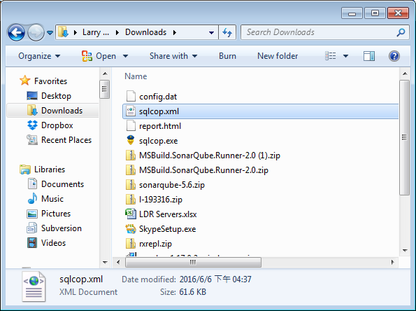
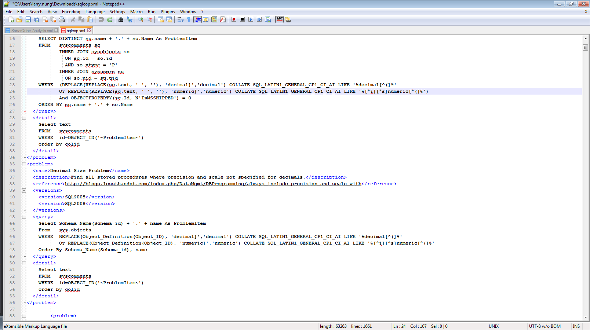
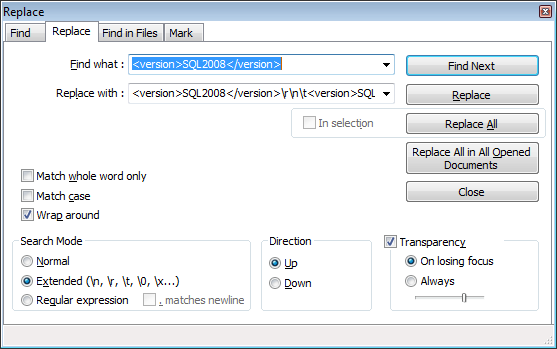
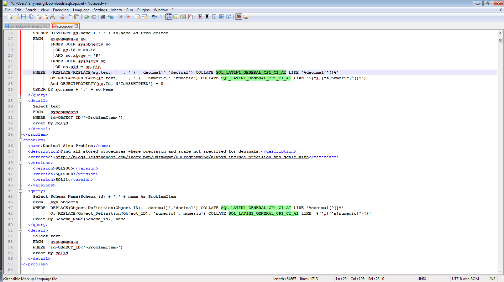

SQLCop 若使用在 SQL Server 2012，會發現無法正常進行靜態分析。  

<!-- More -->

 

這時我們需要開啟 SQLCop.xml 進行設定的調整。  

 

開啟後我們可以看到預設分析的 Rule 只有支援 SQL 2005 與 2008。  

 

這時只要在設定加上 SQL11 的版本即可，這邊可以用 Notepade++ 的取代來做。  

 

取代後設定檔存檔即可。  

 

再次開啟 SQLCop 就能正常的進行靜態分析了。  
