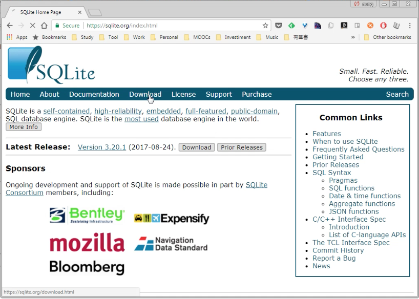
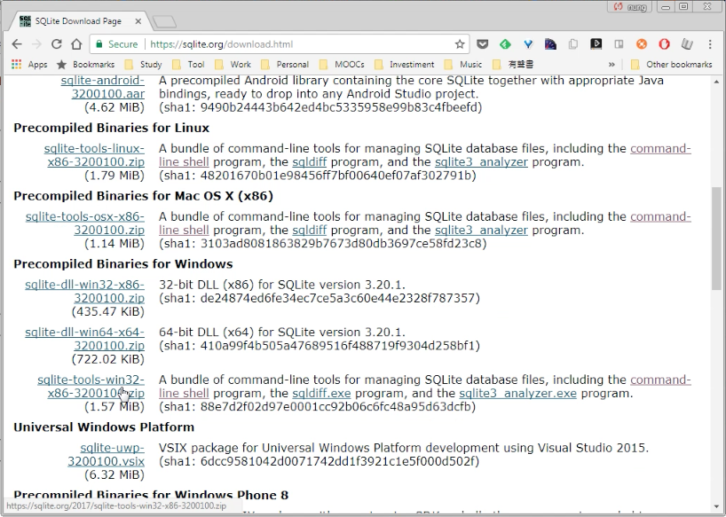
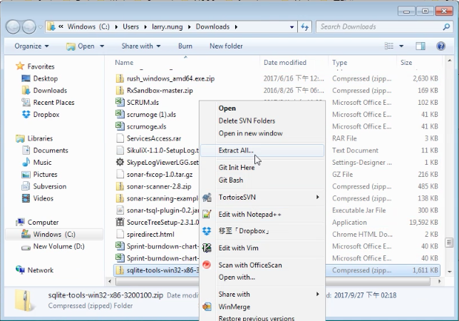
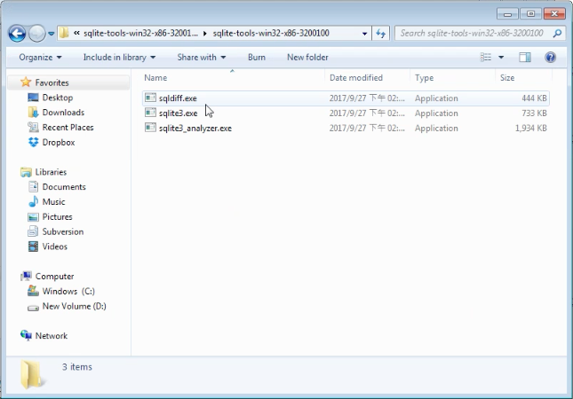
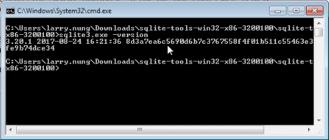
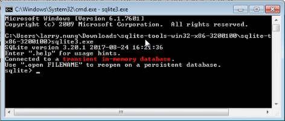
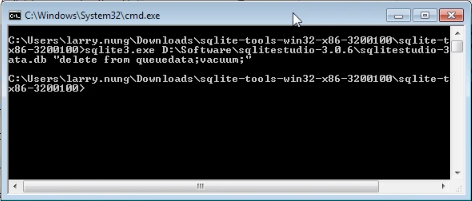

要在 Windwos 下使用 SQLite，可至 [SQLite Home Page](https://www.sqlite.org/) 的下載頁面。  

<!-- More -->

 

下載 Windows 的 binary。  

 

將下載的壓縮包解壓縮。  

 

會看到幾個執行檔，我們主要要用的是 sqlite3.exe 這個執行檔。  

 

可以用 -help 查閱使用方式。

    sqlite3 -help

 

可以用 -version 查閱版本。  

    sqlite3 -version

 

可以直接調用做一連串的 SQL 操作。  

    sqlite3

 

也可以直接對特定 SQLite DB 調用單一 SQL 操作。  

    sqlite3 [SQLiteDB] [SQL]

 

Link
----
* [SQLite Home Page](https://www.sqlite.org/)
* [SQLite Installation](https://www.tutorialspoint.com/sqlite/sqlite_installation.htm)
