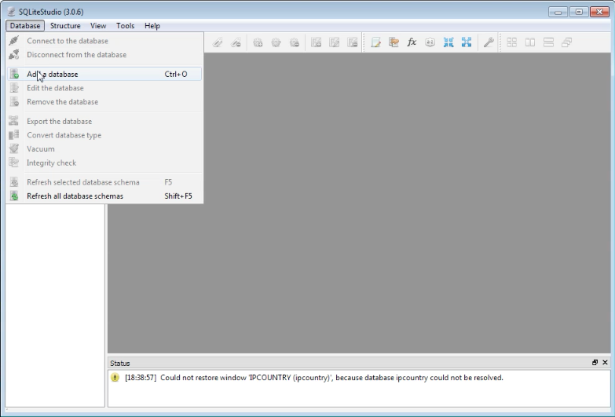
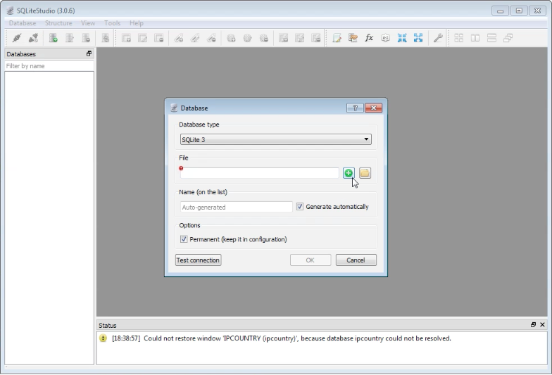
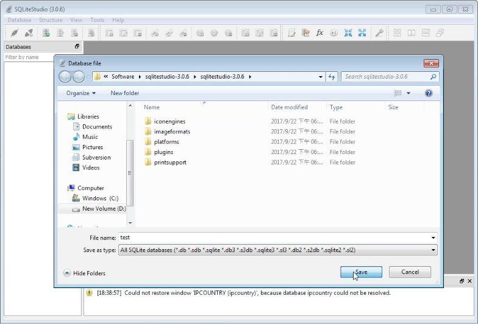
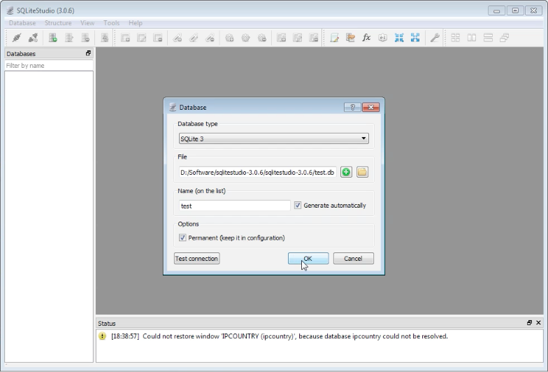
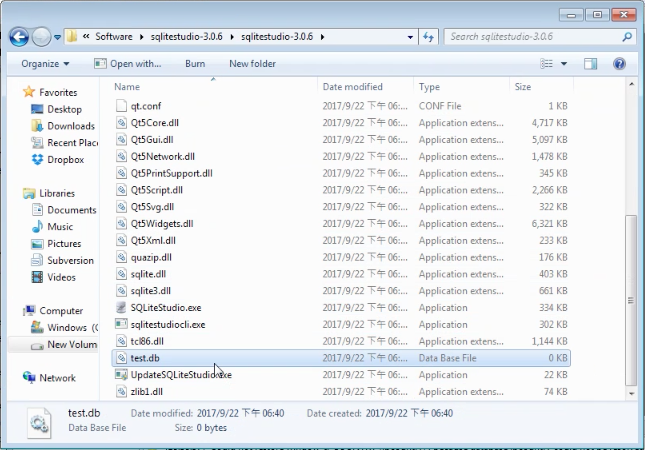

要透過 SQLiteStudio 建立 SQLite 資料庫，可點選 [Database | Add a database] 主選單選項，或是按下熱鍵 Ctrl + O。  

<!-- More -->

 

在開啟的對話框中，點選 File 後面的 Add 按鈕。  

 

設定要建立的 SQLite 資料庫存放的位置與檔名，按下 Save 按鈕。  

 

 

指定的 SQLite 資料庫檔即會被建立。  

 
