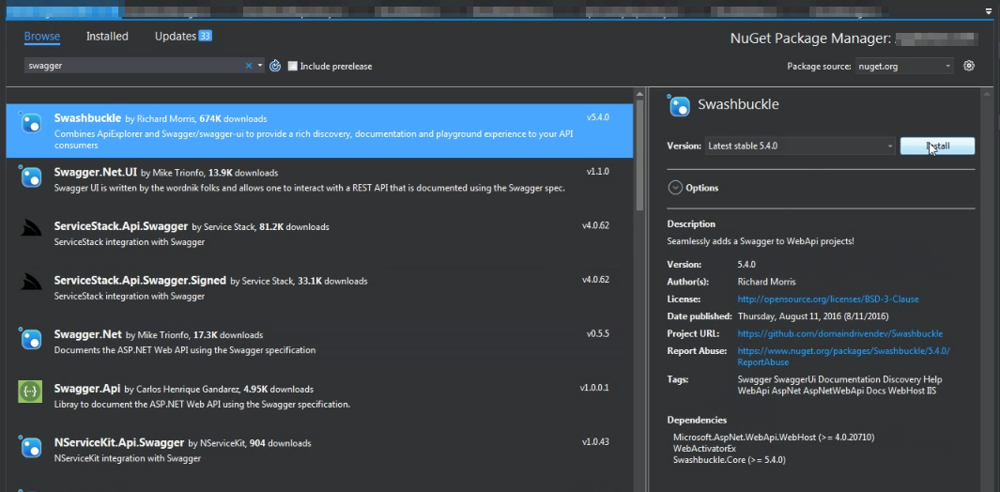
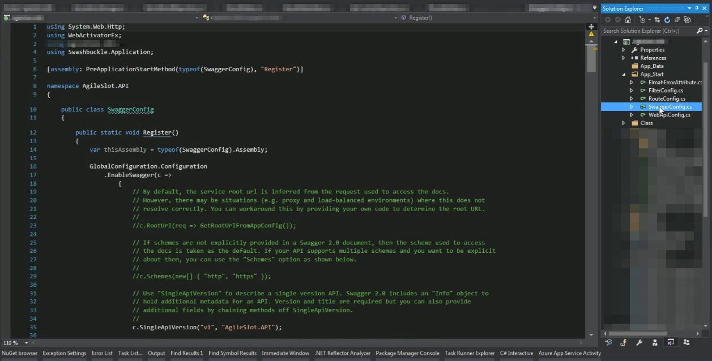
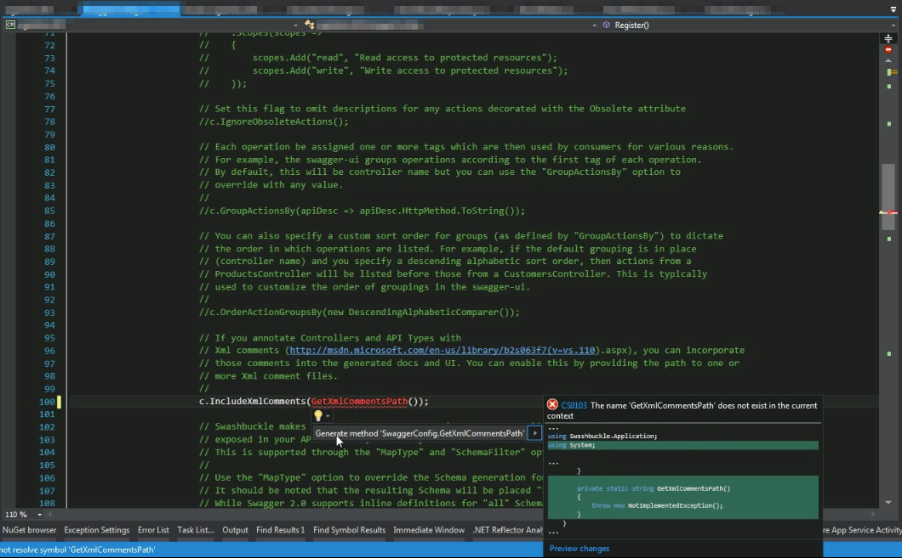
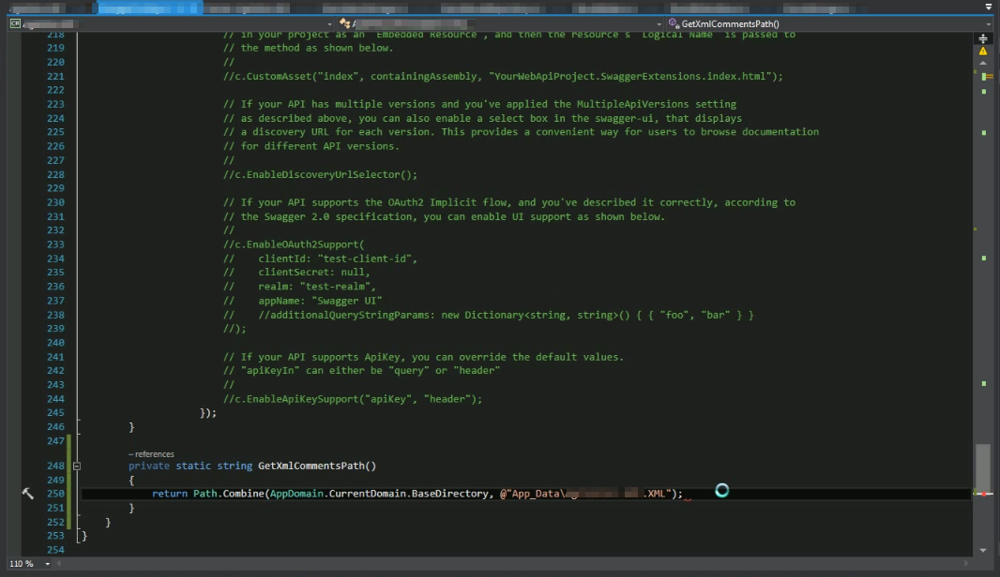
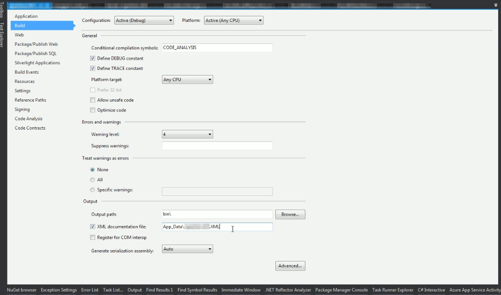
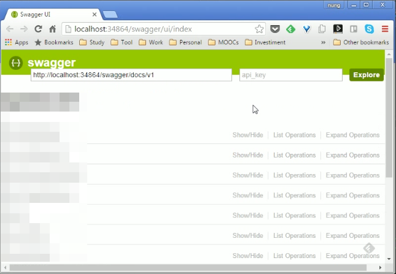

要在 Web API 加上 Swagger 支援，可以為專案裝上 Swashbuckle 套件。  

<!-- More -->

    Install-Package Swashbuckle

 

 

安裝完可以看到 App_Start 目錄下會多個 SwaggerConfig.cs 黨，我們需要依需求去做些設定上的調動。

 

起碼要設定 XML documentation file 的位置，設定只要找到 c.IncludeXmlComments(GetXmlCommentsPath()); 這行，將其註解取消，取消後會看到 GetXmlCommentsPath 這個方法會找不到，這邊需要自己將該方法建立。  

 

GetXmlCommentsPath 方法在實作上只要將 XML documentation file 位置回傳即可。  

 

這邊的 XML documentation file 位置可查閱專案屬性這邊的設定。  

 

設定好後運行將專案運行起來，瀏覽 http://[Domain]/swagger/，沒意外的話就會看到 swagger 頁面。  

 
