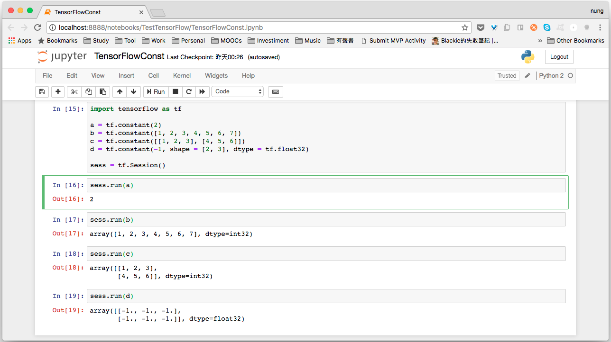

TensonrFlow 的 constant 方法可用來建置 TensorFlow 的常數，其函式原型如下：  

<!-- More -->

    tf.constant(
        value,
        dtype=None,
        shape=None,
        name='Const',
        verify_shape=False
    )

<br/>


其中 value 表示常數的值，dtype 是值的型態，shape 是常數的維度。  

<br/>


可以直接調用 constant 方法並將常數值帶入以建立對應的常數。  

```python
...
a = tf.constant(2)
...
```

<br/>


常數值也可以是一為陣列。  

```python
...
b = tf.constant([1, 2, 3, 4, 5, 6, 7])
...
```

<br/>


或是多維陣列。  

```python
...
c = tf.constant([[1, 2, 3], [4, 5, 6]])
...
```

<br/>


數值的型態 constant 方法會自動識別，但若有需要也可以直接透過 dtype 指定。多維陣列元素若是相同值，可以使用 shape 輔助設定，設定特定維度且特定常數值的常數。  

```python
...
d = tf.constant(-1, shape = [2, 3], dtype = tf.float32)
...
```

<br/>


最後附上完整的範例程式：  

```python
import tensorflow as tf

a = tf.constant(2)
b = tf.constant([1, 2, 3, 4, 5, 6, 7])
c = tf.constant([[1, 2, 3], [4, 5, 6]])
d = tf.constant(-1, shape = [2, 3], dtype = tf.float32)

sess = tf.Session()

sess.run(a)
sess.run(b)
sess.run(c)
sess.run(d)
```


其運行結果如下：   


 
<br/>


Link
----
* [tf.constant  |  TensorFlow](https://www.tensorflow.org/api_docs/python/tf/constant)
