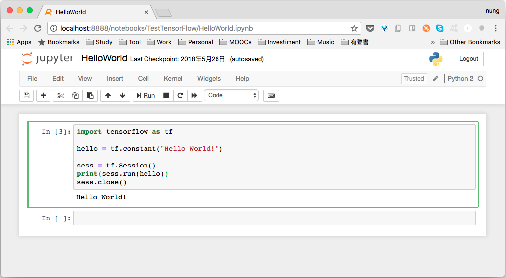
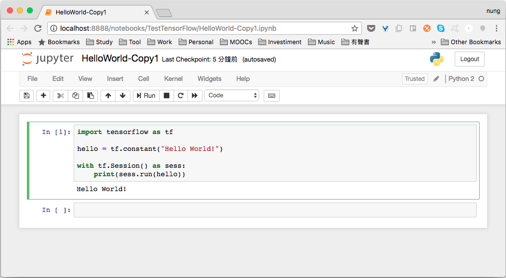

安裝完 TensorFlow 後，可以試著撰寫個簡單的 Hello World 程式。

首先我們需將 tensorflow 匯入。
```python
import tensorflow as tf
...
```
設定一個常數其內容為 "Hello World!"。
```python
...
hello = tf.constant("Hello World!")
...
```
再來要取得 TensorFlow 的 Session，可以把 Session 想成運行 TensorFlow 的環境。
``` python
...
sess = tf.Session()
...
```
將要運行的部分送至 Session 中運行。
```python
...
print(sess.run(hello))
```
最後記得要將 Session 關閉。
```python
...
sess.close()
```
完整的程式會像下面這樣：
```python
import tensorflow as tf

hello = tf.constant("Hello World!")

sess = tf.Session()
print(sess.run(hello))
sess.close()
```
運行結果如下：



也可以搭配使用 with as 寫法，這樣就不需要明確的調用 session.close()。
```python
import tensorflow as tf

hello = tf.constant("Hello World!")

with tf.Session() as sess:
print(sess.run(hello))
```
