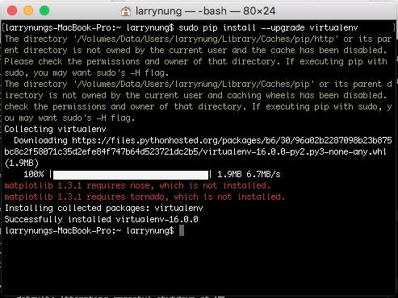
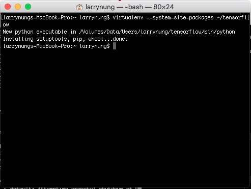
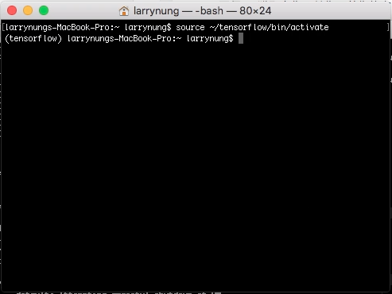
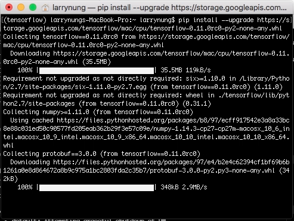
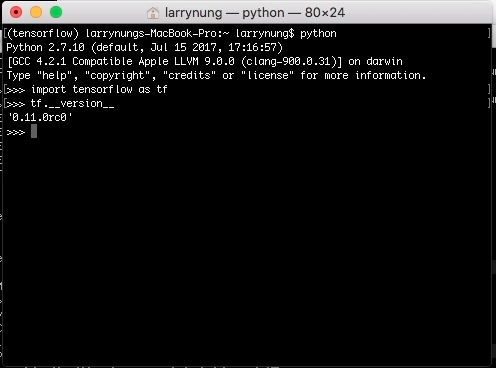

要在 MAC 下安裝 TensorFlow，可以直接透過 pip 安裝，也可以透過 Virtualenv 等方法安裝。  

<!-- More -->

<br/>


這邊筆者使用 Virtualenv，所以要先安裝 Virtualenv。  

    sudo pip install 00upgrade virtualenv


 
<br/>


創建一個沙盒。  

    virtualenv --system-site-packages ~/tensorflow


 
<br/>


啟動沙盒環境。  

    source ~/tensorflow/bin/activate


 
<br/>


最後透過 pip 將 TensorFlow 安裝起來即可。

    pip install --upgrade https://storage.googleapis.com/tensorflow/mac/cpu/tensorflow-0.11.0rc0-py2-none-any.whl


 
<br/>


安裝完後可以使用 python 測試一下 TensorFlow 是否已可正常使用，輸入 python 命令進入交互模式，引用 tensorflow 套件，調用 version 查閱 TensorFlow 的版本。

```python
import tensorflow as tf  
tf.__version__
```


 
<br/>


Link
----
* [在Mac OS X上安装TensorFlow - 纯净的天空](https://vimsky.com/article/3619.html)
