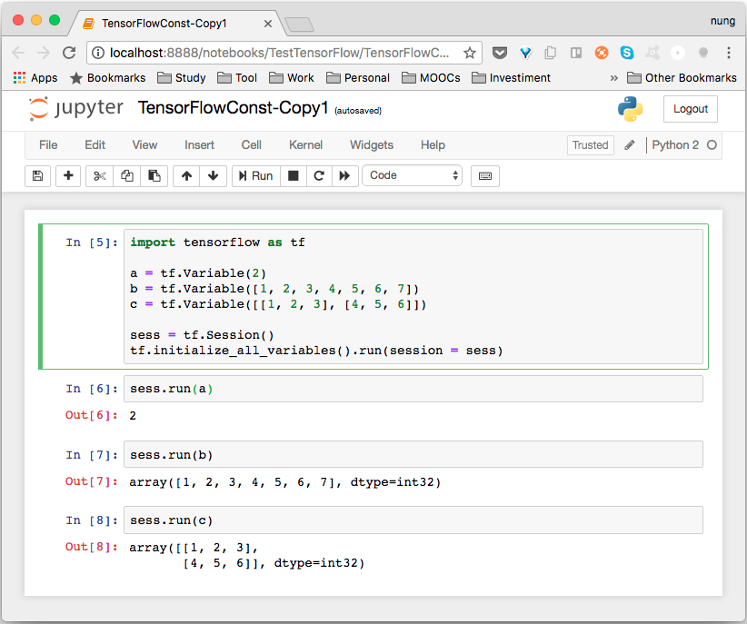

TensorFlow 可以直接調用 Variable 方法並將變數值帶入以建立對應的變數。 

<!-- More -->

```python
...
a = tf.Variable(2)
...
```

<br/>


變數值也可以是一為陣列。  

```python
...
b = tf.Variable([1, 2, 3, 4, 5, 6, 7])
...
```

<br/>


或是多維陣列。  

```python
...
c = tf.Variable([[1, 2, 3], [4, 5, 6]])
...
```

<br/>


最重要的是要記得變數在使用時需要做初始才可使用。  

```python
...
tf.initialize_all_variables().run(session = sess)
...
```

<br/>


最後附上完整的範例程式：  

```python
import tensorflow as tf

a = tf.Variable(2)
b = tf.Variable([1, 2, 3, 4, 5, 6, 7])
c = tf.Variable([[1, 2, 3], [4, 5, 6]])

sess = tf.Session()
tf.initialize_all_variables().run(session = sess)

sess.run(a)
sess.run(b)
sess.run(c)
```

<br/>


其運行結果如下：  


 
<br/>


Link
