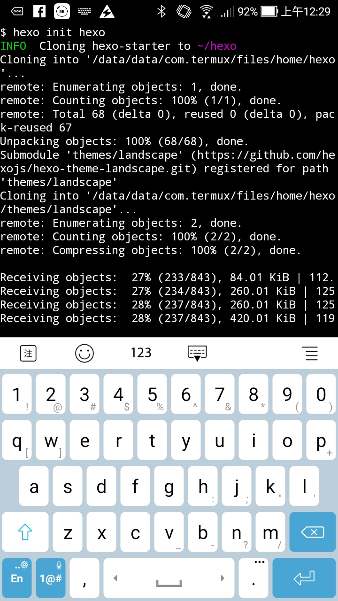
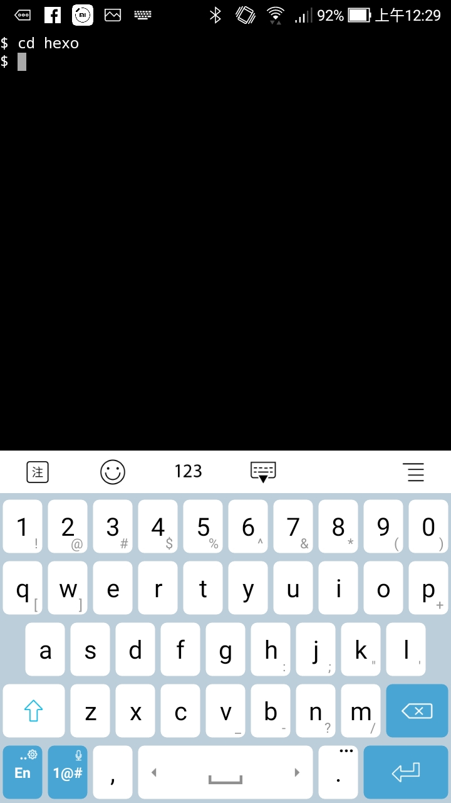
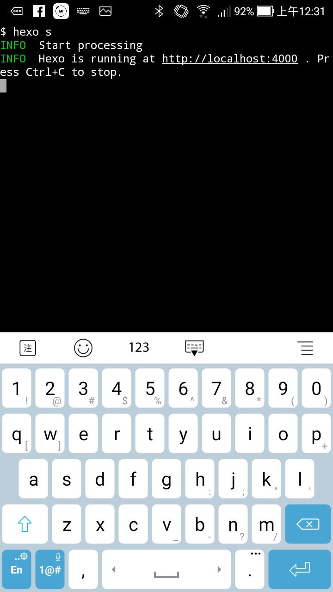
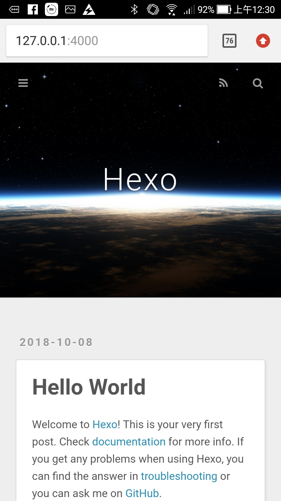

在 Termux 使用 Hexo 並沒什麼特別之處。  

<!-- more -->

 

一樣是要先將 Hexo CLI 安裝到全域。  

    npm install hexo-cli -g

 

接著初始化 Blog。  

    hexo init <Folder>

 

進入剛初始化產出的目錄

 

運行 Hexo 服務。  

    hexo s

 

訪問 http://127.0.0.1:4000 即可看到 Blog 運行的結果。  

