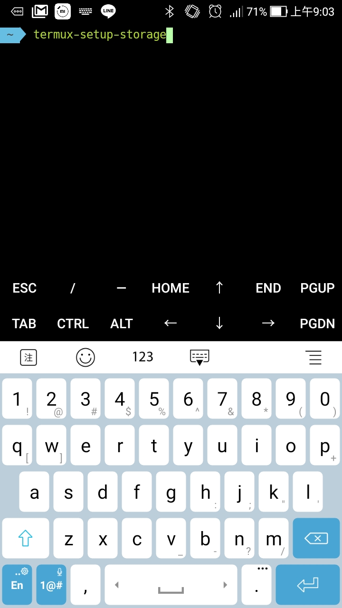

Termux 裝完後預設只能看到 Termux 空間內的資料，若要讓 Termux 能使用到 Android 的內外部空間，需要自行呼叫命令開啟。

開啟只要呼叫下列命令:

termux-setup-storage

開啟時會確認是否授權，點選允許完成授權動作。

命令跑完 Termux 下會多個 ~/storage 目錄。

透過該目錄就可以存取到 Android 的內外部空間了。

Link
----
* [Internal and external storage](https://wiki.termux.com/wiki/Internal_and_external_storage)
* [Termux-setup-storage](https://wiki.termux.com/wiki/Termux-setup-storage)