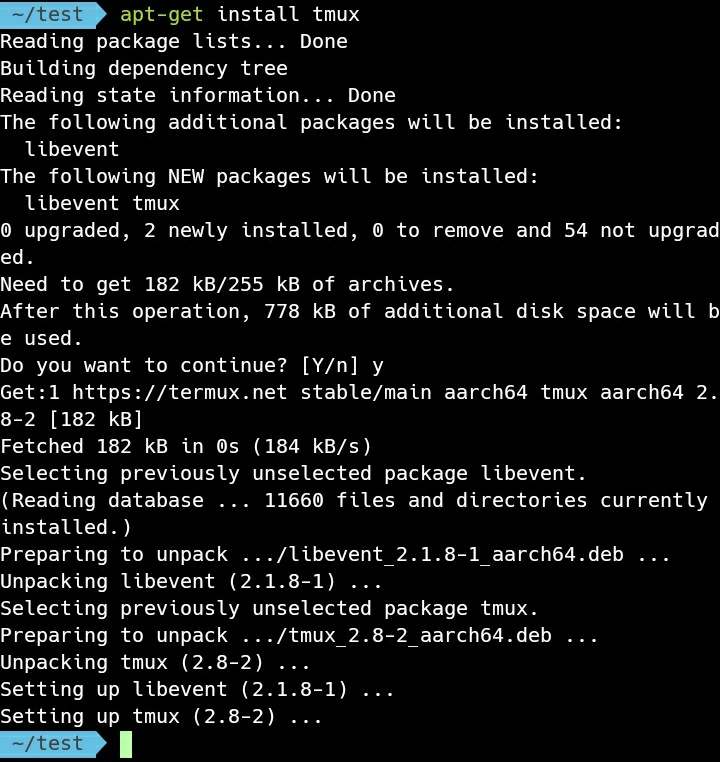
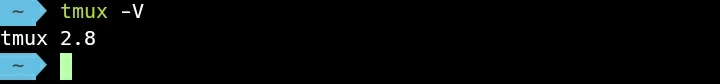
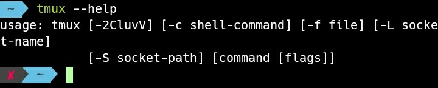
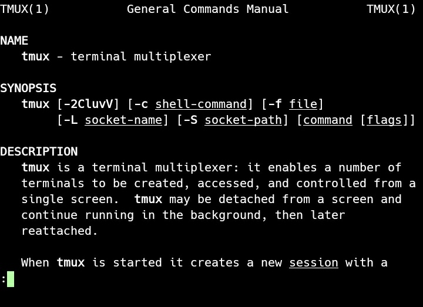
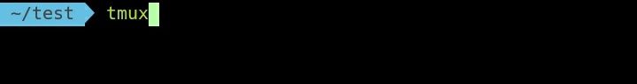
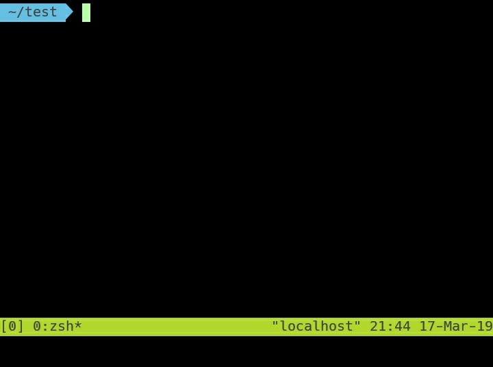
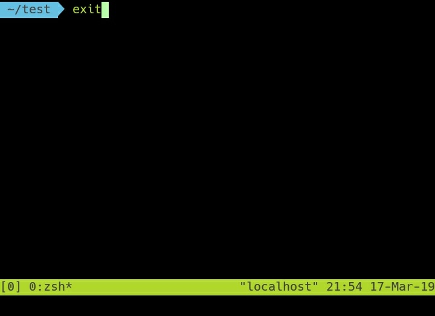
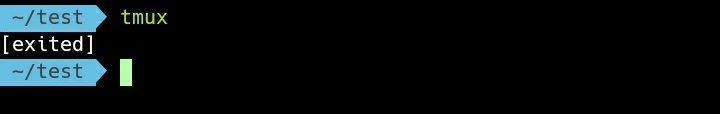

tmux 在 Ubuntu 可透過 apt-get 安裝。

apt-get install tmux

安裝完可查閱版本確認安裝是否正常。

tmux -V

使用方式可帶入 --help 參數查詢。

tmux --help

若要較詳細的使用說明，可使用 man 查閱。

man tmux

在使用上需先調用命令進入 tmux。

tmux

進入 tmux 後即可對 panel/session/window 做些管控。

要離開 tmux 的話調用 exit 命令即可。

exit

