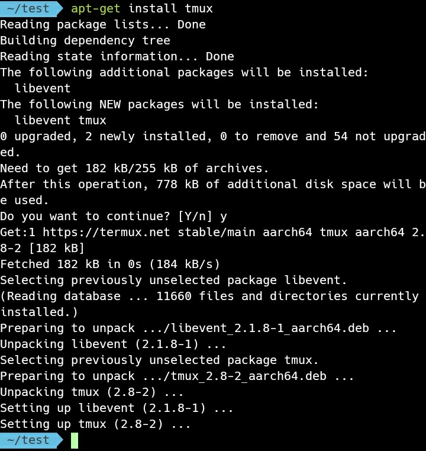

tmux 在 Ubuntu 可透過 apt-get 安裝。  

<!-- More -->

    apt-get install tmux

 

安裝完可查閱版本確認安裝是否正常。  

    tmux -V

 

使用方式可帶入 --help 參數查詢。  

    tmux --help

 

若要較詳細的使用說明，可使用 man 查閱。  

    man tmux

 

 

在使用上需先調用命令進入 tmux。  

    tmux

 

 

進入 tmux 後即可對 panel/session/window 做些管控。  

 

要離開 tmux 的話調用 exit 命令即可。    

    exit

 

