要起用一個新的 tmux session，可直接調用 tmux 命令。  

<!-- More -->

    tmux

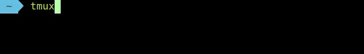

 

tmux session 建立後會自動 attach。  

 

可調用命令查閱 session。  

    tmux ls

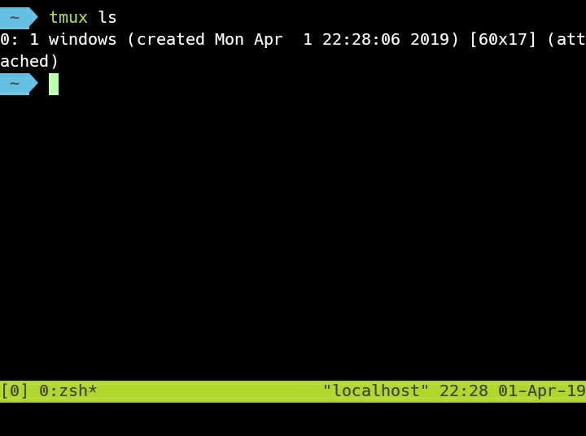

 

要 detach session 可按下熱鍵 Ctrl + b，再按下 d，即可跳離 session。  

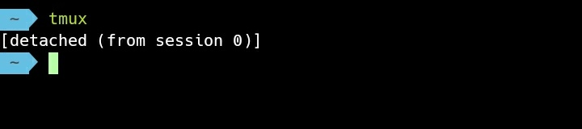

 

再次調用命令建立新的 session。  

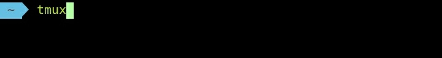

 

可以從左下方中刮弧內的數值查驗當前的 session 編號，很明顯的這不是一開始建立的 session。  

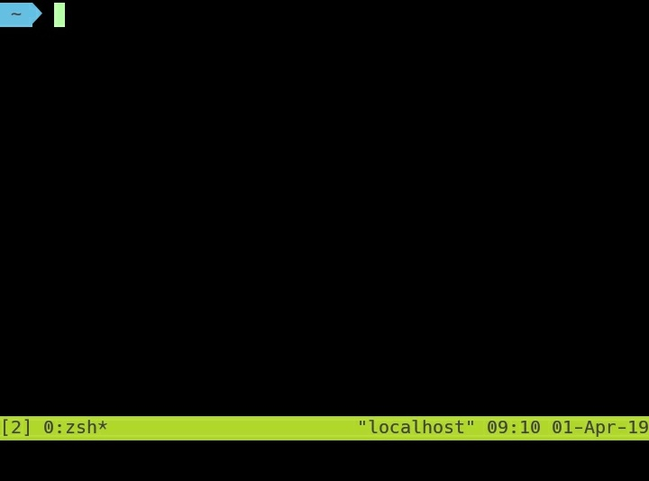

 

查驗 session，可看到確實是建立了新的 session。  

    tmux ls

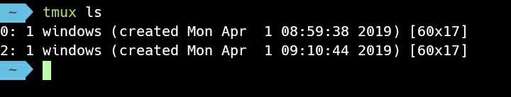

 

如果在 detach session 的狀態要 attach session，可調用命令。  

    tmux attach -t <ID>

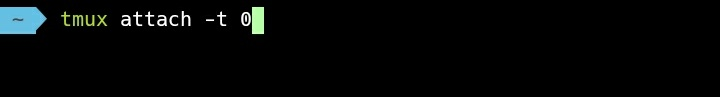

 

可 attach 回指定的 session。  

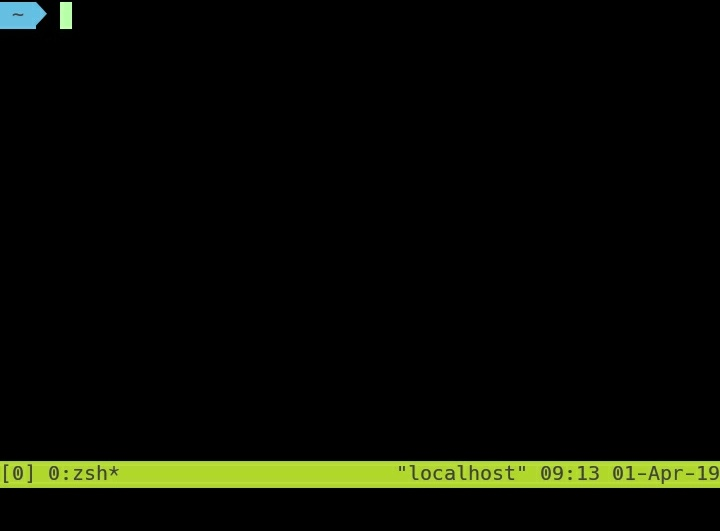

 

如果本來就在 attach 的狀態，可按下熱鍵 Ctrl + b，再按下 s，透過方向鍵選取 session 切換。  

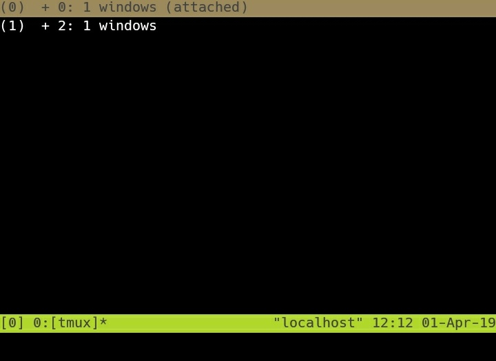

 

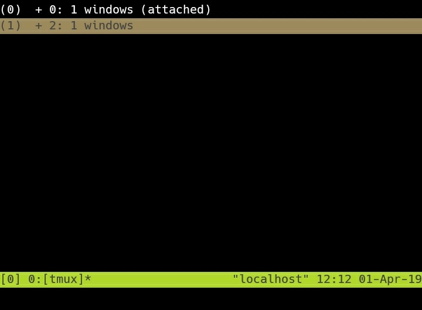

 

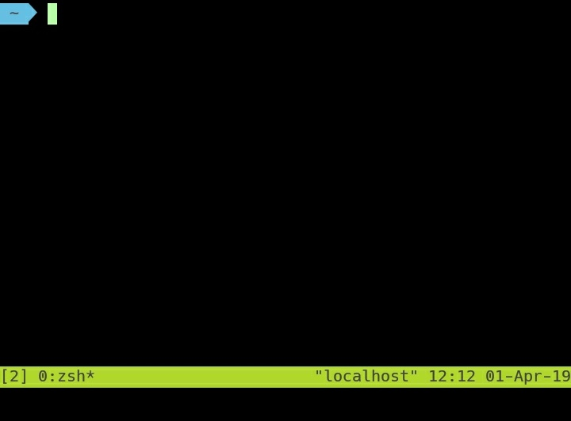

 

要關閉指定 session，不是當前 session 的話，可像下面輸入命令，指定 session 的 ID 去做關閉。  

    tmux kill-session -t <ID>

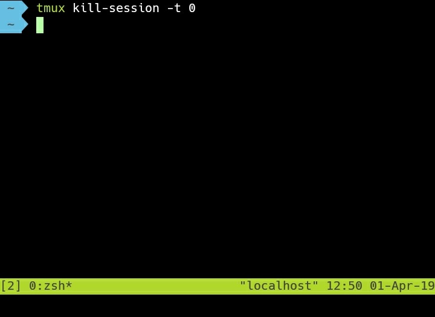

 

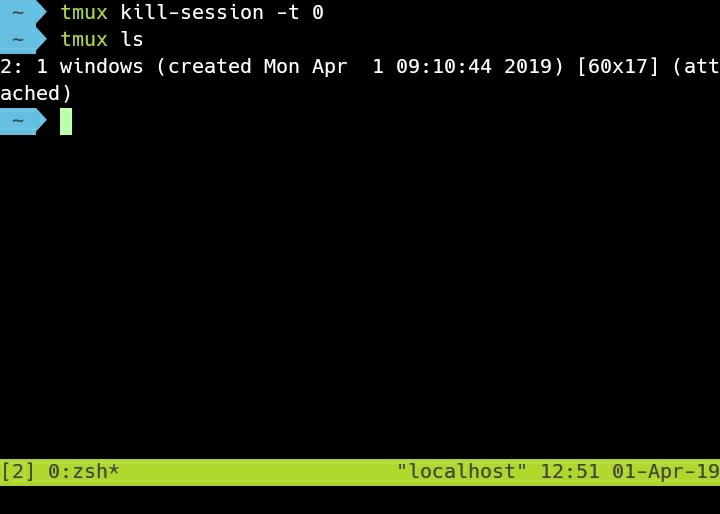

 

實際在使用上可能會起多個 session 同時處理不同的事，每個 session 視需要也可以有不同的畫面切割。  

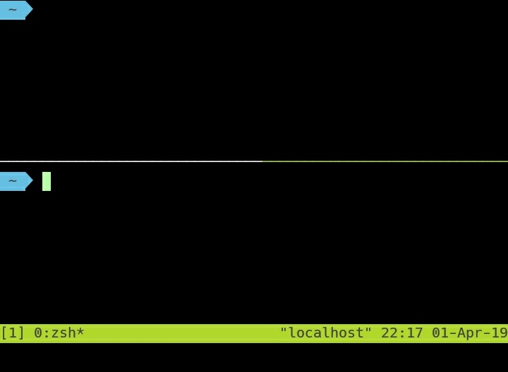

 

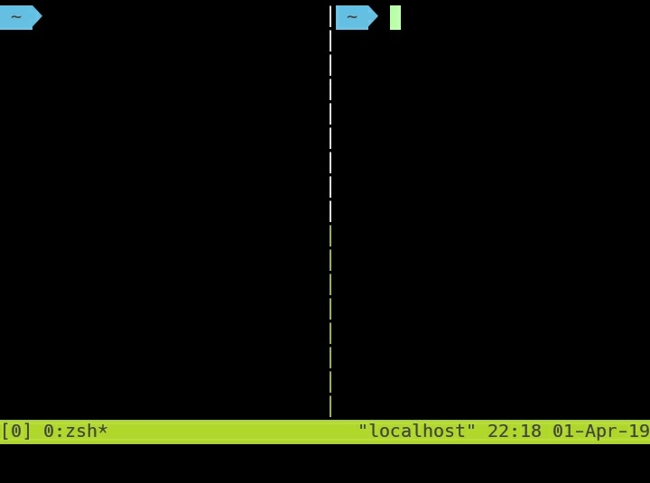
