要對 tmux window 做操作，需先進入 tmux session。

tmux

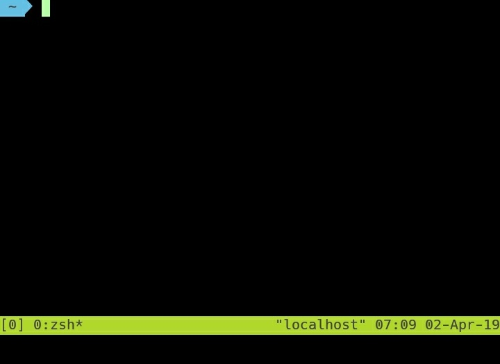

要建立新的 window，可按下熱鍵 Ctrl + b，再按下 c。

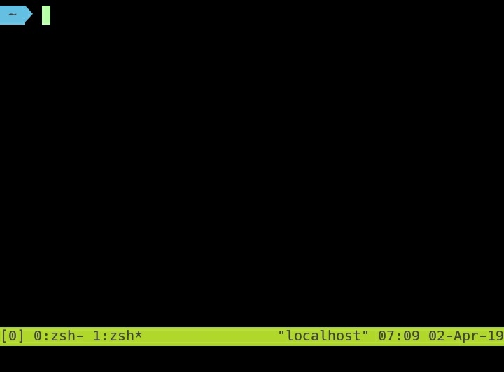

要切到上一個 window，可按下熱鍵 Ctrl + b，再按下 p。

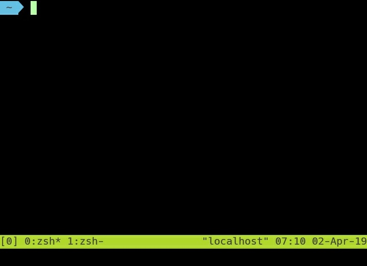

切到下一個 window 可按下熱鍵 Ctrl + b，再按下 n。

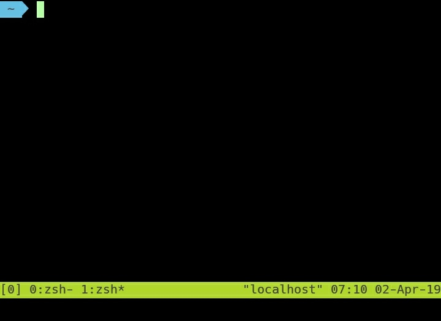

要變更 window 名稱，可按下熱鍵 Ctrl + b，再按下 ,。

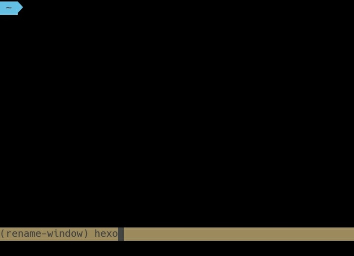

window 名稱即會變更成設定的名稱。

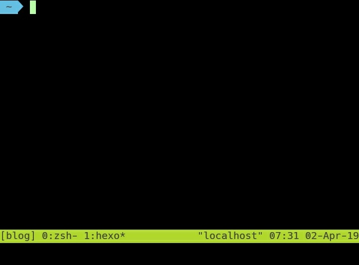

要列出 window 清單去選取切換 window，可按下熱鍵 Ctrl + b，再按下 w。

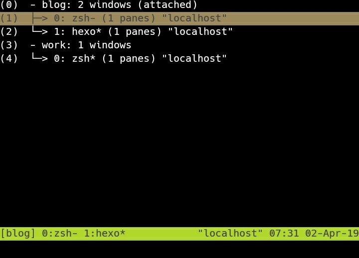

上下移動按下 Enter 選取即可切換至指定 window。

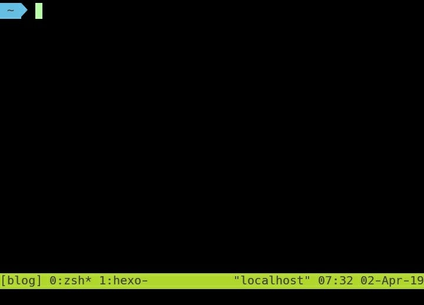

若知道 window 關鍵字想要列出符合的 window 清單去選取切換 window，可按下熱鍵 Ctrl + b，再按下 f，輸入關鍵字後按下 Enter。

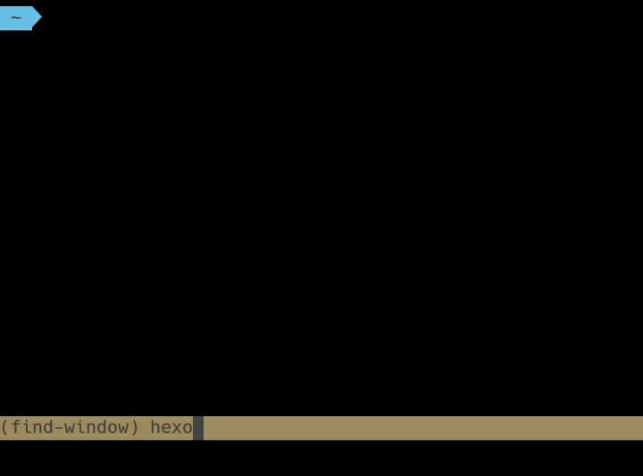

可看到符合關鍵字的 window 列表，上下移動按下 Enter 選取即可切換至指定 window。

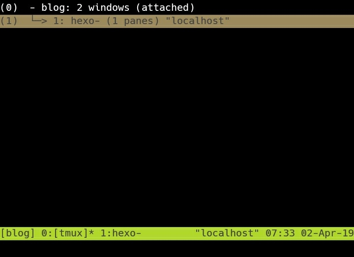

要刪除當前 window，可按下熱鍵 Ctrl + b，再按下 &。

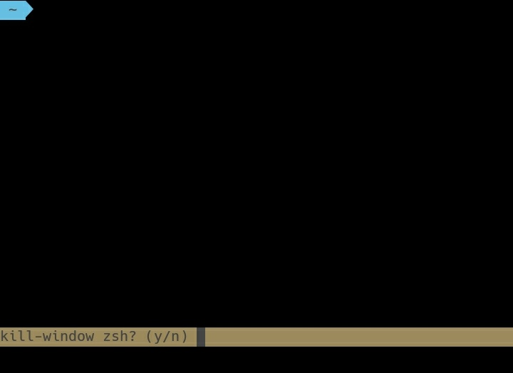

window 會被刪除，切至其它 window。

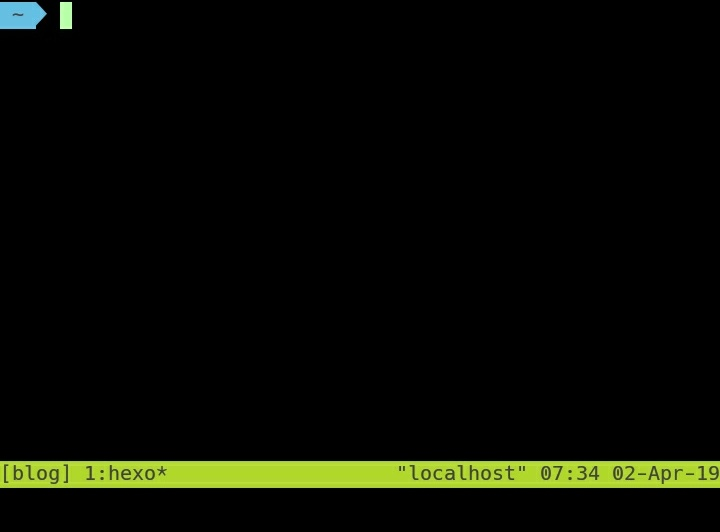

要調整 window 索引，可按下熱鍵 Ctrl + b，再按下 .，輸入索引位置按下 Enter。

window 就會被切至指定索引位置。

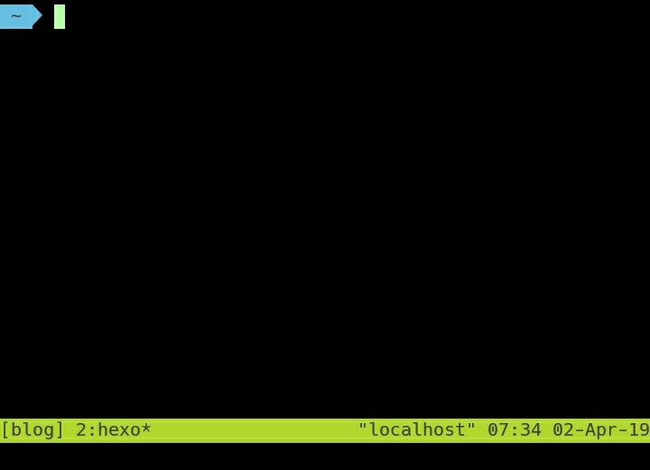