要對 tmux window 做操作，需先進入 tmux session。  

<!-- More -->

    tmux

 

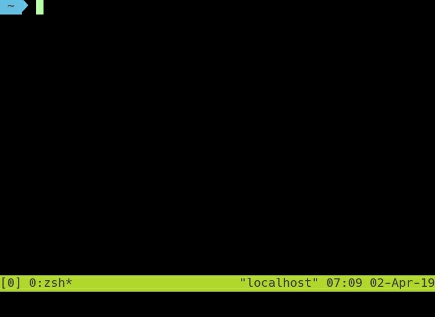

 

要建立新的 window，可按下熱鍵 Ctrl + b，再按下 c。  

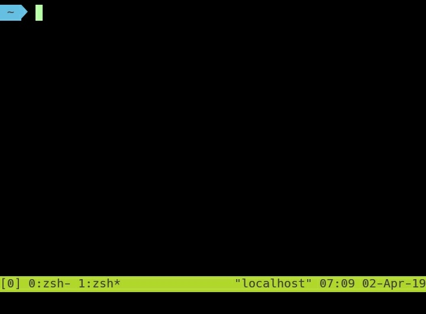

 

要切到上一個 window，可按下熱鍵 Ctrl + b，再按下 p。  

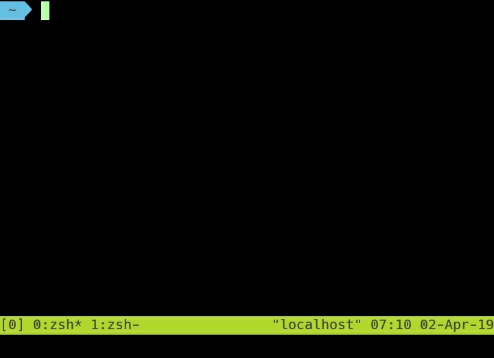

 

切到下一個 window 可按下熱鍵 Ctrl + b，再按下 n。  

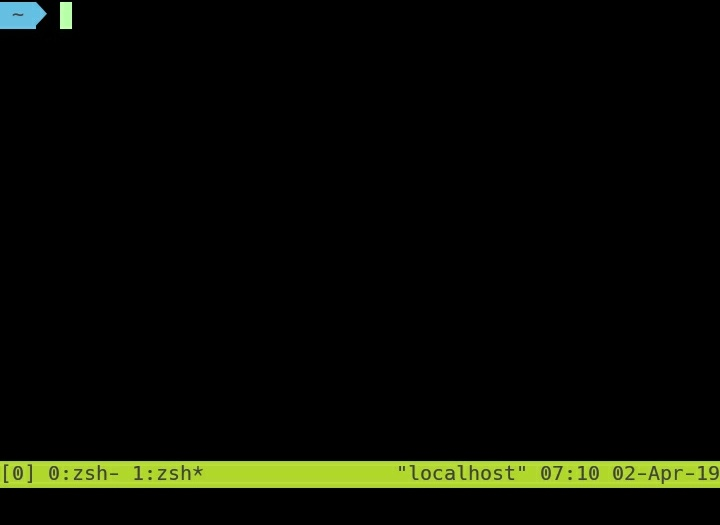

 

要變更 window 名稱，可按下熱鍵 Ctrl + b，再按下 ,。  

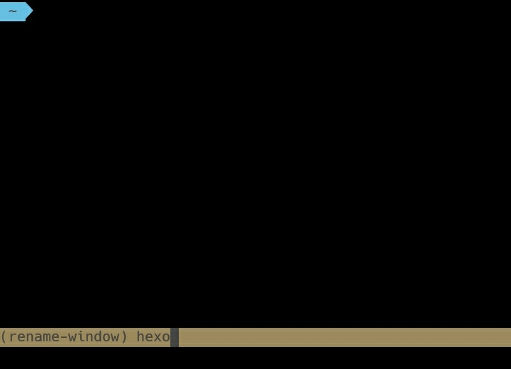

 

window 名稱即會變更成設定的名稱。  

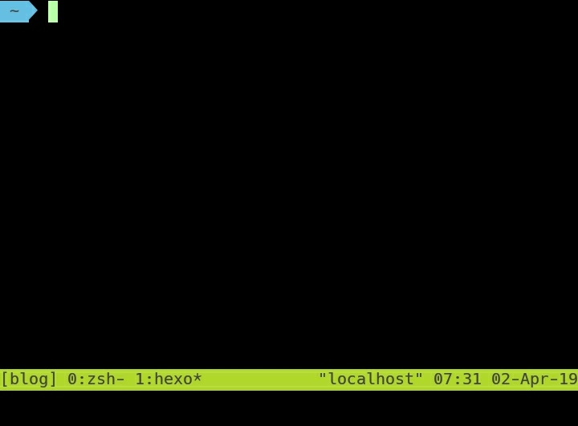

 

要列出 window 清單去選取切換 window，可按下熱鍵 Ctrl + b，再按下 w。  

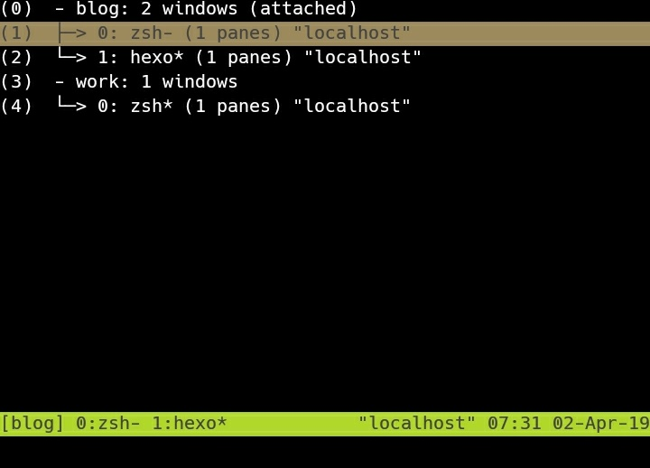

 

上下移動按下 Enter 選取即可切換至指定 window。

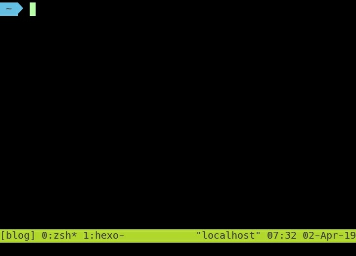

 

若知道 window 關鍵字想要列出符合的 window 清單去選取切換 window，可按下熱鍵 Ctrl + b，再按下 f，輸入關鍵字後按下 Enter。  

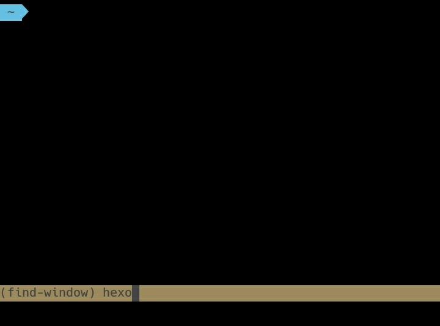

 

可看到符合關鍵字的 window 列表，上下移動按下 Enter 選取即可切換至指定 window。  

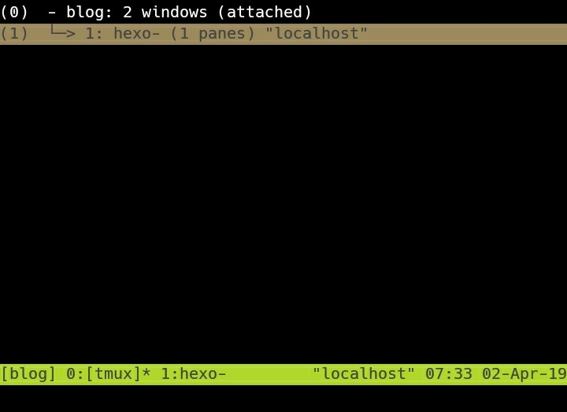

 

要刪除當前 window，可按下熱鍵 Ctrl + b，再按下 &。

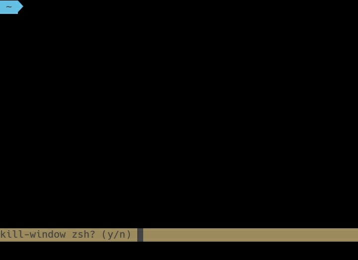

 

window 會被刪除，切至其它 window。  

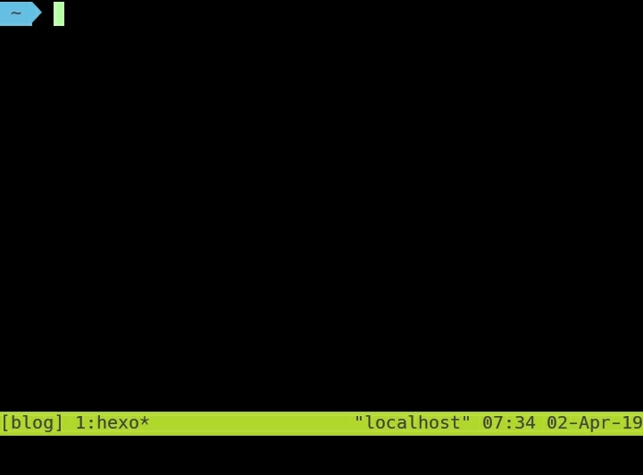

 

要調整 window 索引，可按下熱鍵 Ctrl + b，再按下 .，輸入索引位置按下 Enter。  

 

window 就會被切至指定索引位置。  

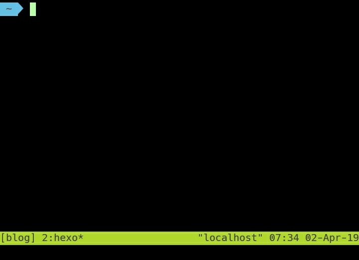
