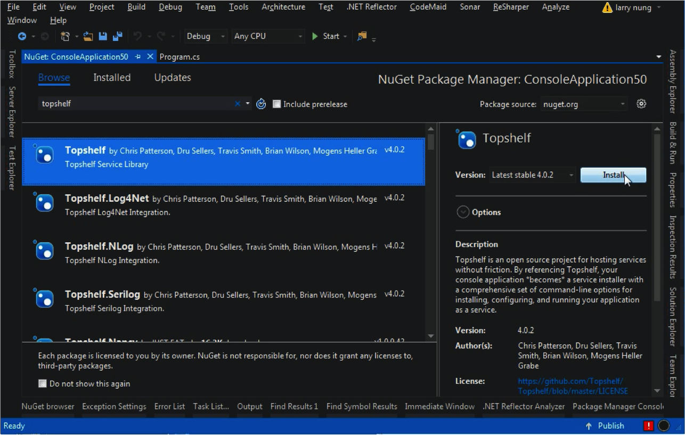
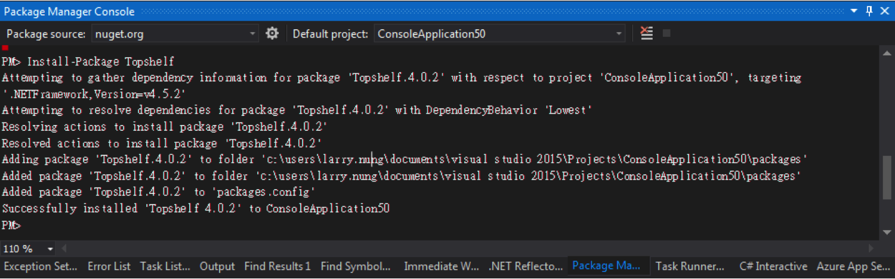
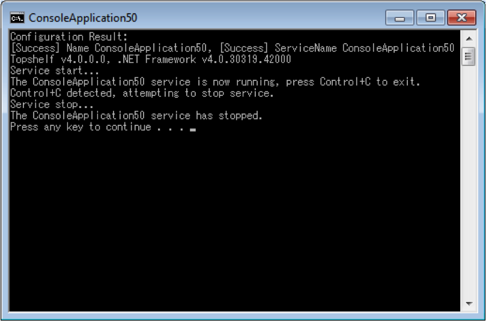
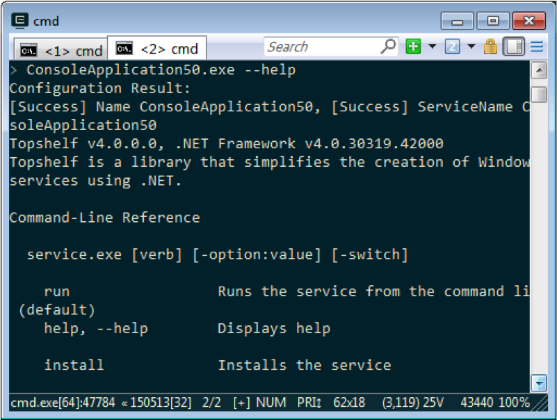
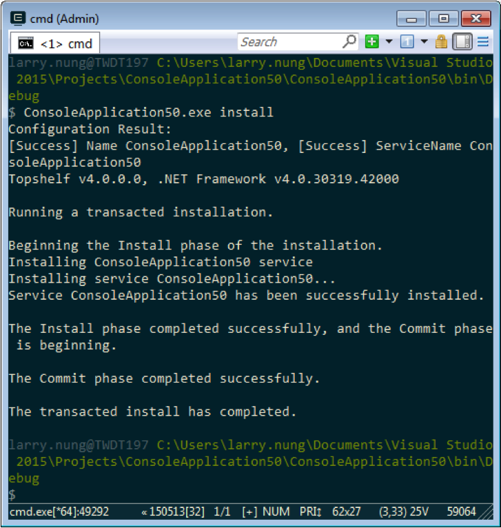
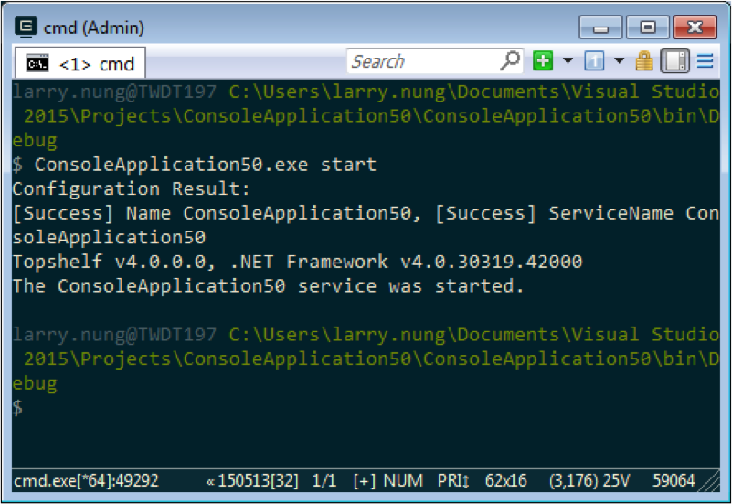
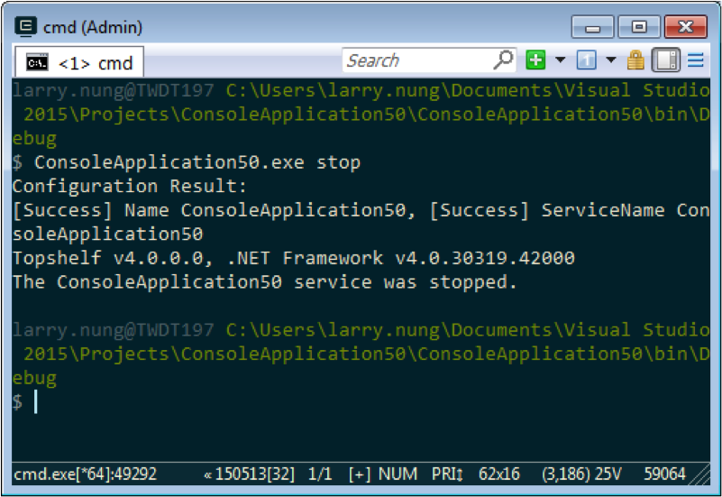
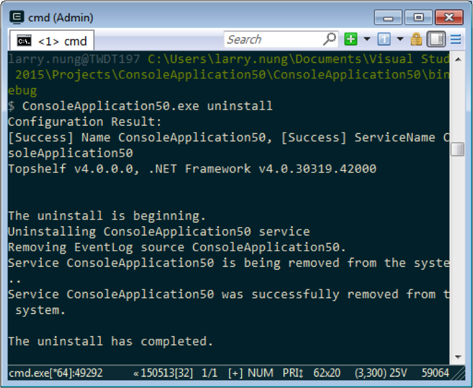
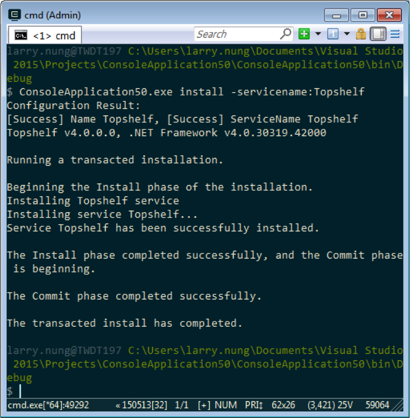
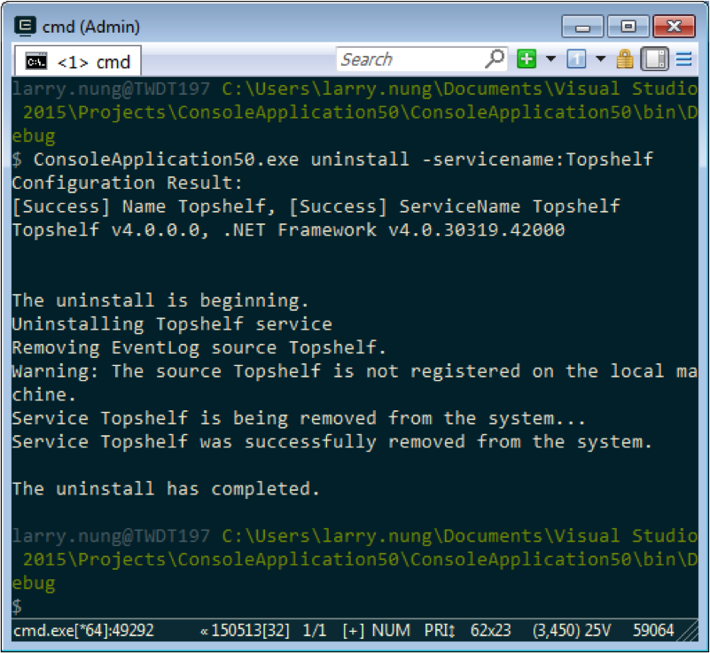

Topshelf 是一 Hosting Framework，能讓我們很簡易的建造 Windows Services 程式，並將之 Hosting 起來運行。可以增加使用彈性、易於除錯、更可以跨平台運行。  

<!-- More -->

<br/>


首先開個主控台程式，將之安裝 Topshelf 套件。  



<br/>




<br/>


套件安裝好後即可進行程式的撰寫，大方向是透過 HostFactory 建立 Host 後，將 Host 運行起來即可。  

<br/>


若是進一步來看，可再細分為兩種撰寫方式。一種是像下面這樣用委派的方式將怎樣建立服務、服務怎樣啟動、服務怎樣停止...等對應的設定設上去。  

```c#
using System; 
using Topshelf;
…
class Program { 
  static void Main(string[] args) { 
    HostFactory.Run(x => { 
      x.Service<Program>(s => { 
        s.ConstructUsing(name => new Program()); 
        s.WhenStarted(p => p.Start()); 
        s.WhenStopped(p => p.Stop());
      }); 
    }); 
} 

  public void Start() { 
    Console.WriteLine("Service start..."); 
  } 

  public void Stop() { 
    Console.WriteLine("Service stop..."); 
  }
} 
```

<br/>


一種則是實作 ServiceControl，將 Service 的動作都寫在 ServiceControl 中。  

```c#
using System; 
using Topshelf;
... 
class Program { 
  static void Main(string[] args) { 
    HostFactory.Run(x => { 
      x.Service<ProgramService>(); 
    }); 
  } 
} 
class ProgramService : ServiceControl { 
  public bool Start(HostControl hostControl) { 
    Console.WriteLine("Service start..."); 
    return true; 
  } 
  public bool Stop(HostControl hostControl) { 
     Console.WriteLine("Service stop..."); 
    return true; 
  } 
} 
...
```

<br/>


除了 Start 與 Stop，還有很多東西可以設定，像是 Service 的名稱，Service 的描述...等等，這邊不多作闡述，有興趣可參閱[官方文件](https://topshelf.readthedocs.io/en/latest/index.html)。  

<br/>


寫完程式後可以直接運行，運行起來會像下面這樣，服務會 Host 在主控台程式上運行，直到我們按下 Ctrl + C 將之中斷。  



<br/>


除了直接運行外，用 Topshelf 開發完的程式能支援命令列指令，可以帶上參數 `--help` 查閱。  



<br/>


像是要將服務安裝到機器上，可以用 install。  



<br/>


要將服務啟動，可以用 start。  



<br/>


要將服務停止，可以用 stop。  



<br/>


要移除服務，可以用 uninstall。  



<br/>


如果安裝時要指定 Service 的名稱，可以在叫用 install 時用 -servicename 帶入指定的 Service 名稱。  



<br/>


但這樣做移除時記得也要帶上 Service 名稱。  



<br/>


Link
----
* [Topshelf](http://topshelf-project.com/)
* [Welcome to Topshelf’s documentation! — Topshelf 3.0 documentation](https://topshelf.readthedocs.io/en/latest/index.html)
* [Topshelf/Topshelf: An easy service hosting framework for building Windows services using .NET](https://github.com/Topshelf/Topshelf)
