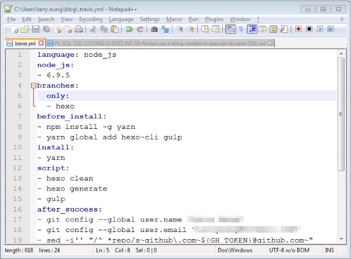
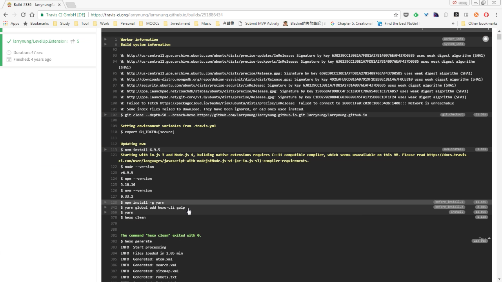

要讓 Travis CI 使用 Yarn 去還原套件，最簡單的方式就是將 yarn.lock 一併簽入版控，Travis CI 偵測到 yarn.lock 後就會改使用 Yarn 去做套件的還原。  

<!-- More -->

 

當然我們也可以自己處理，只要在 travis.yml 內的 before_install 安裝 Yarn，然後在 install 這邊使用 yarn 指定使用 Yarn 來還原套件即可。  

 

設定完 Travis CI 建置時就會改使用 Yarn 來還原套件了。  

 

Link
----
* [Using Yarn on Travis-CI](https://gist.github.com/ericelliott/070750b292583ac8849d0de93f68f7ce)
