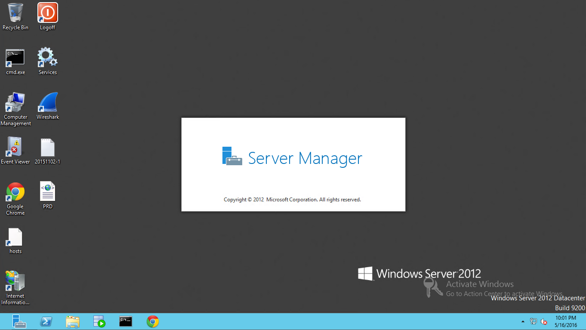

Windows Server 作業系統在登入時，預設會幫我們把 Server Manager 給帶起。但有些情境我們登入多半並不需要 Server Manager，這時等待他開啟完我們還要手動的將之關閉，十分的不便。  

<!-- More -->

 

 

如果有這樣的困擾，我們可以調整設定讓他不要自動開啟。  

 

可透過 Server Manager 的 [Manager | Server Manager Properties] 選單選項開啟 Server Manager Properties 對話框。  

 

勾選 `Do not start Server Manager automatically at logon`，最後按下確定按鈕即可。

 

或是呼叫 `gpedit.msc`。  

 

在 Local Group Policy Editor 中找到 `Computer Configuration\Administrative Templates\System\Server Manager`。  

 

然後將 `Do not display Server Manager automatically at logon` 設定調為 Enabled。

 

Link
----
* [How To Turn Off The Automatic Display Of Server Manager At Logon](http://www.elmajdal.net/win2k8/How_to_Turn_Off_The_Automatic_Display_of_Server_Manager_At_logon.aspx)
