要使用 GitHub 做 Vault 的認證，可用 vault auth enable 帶入 github 啟動 GitHub auth method。  

<!-- More -->

    vault auth enable [-path=$path] github

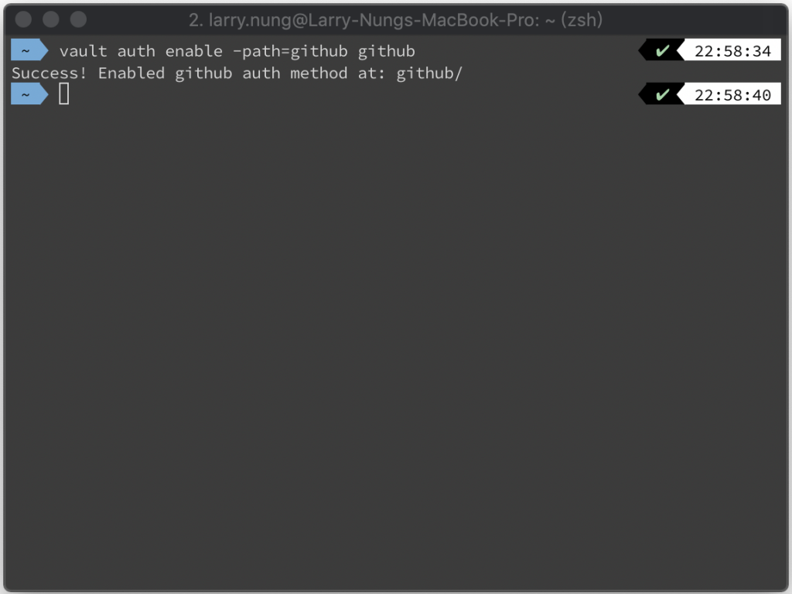

 

查驗一下是否正常啟用。

  vault auth list

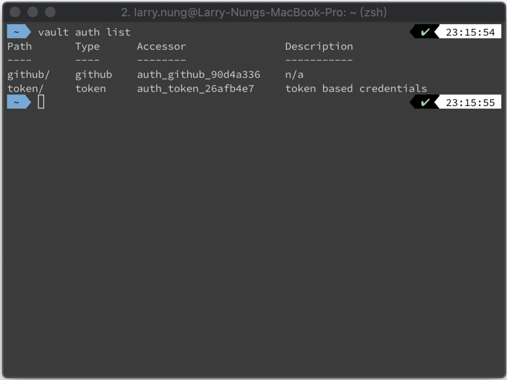                       

 

接著設定 GitHub 的 Organization。  

    vault write auth/github/config organization=$organization

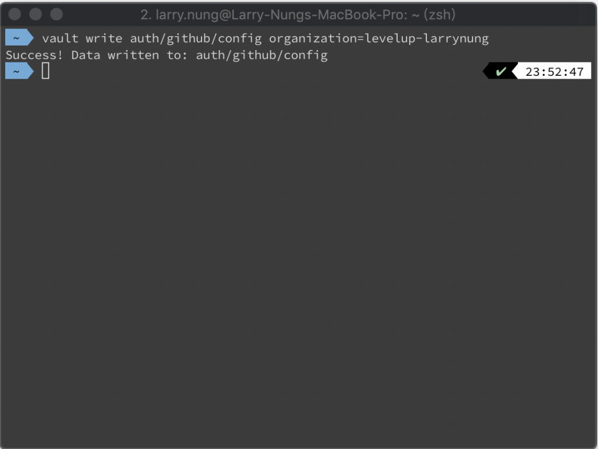

 

設定 GitHub Organization 的 Team，與要使用的 Policy。  

    vault write auth/github/map/teams/$team value=$policy

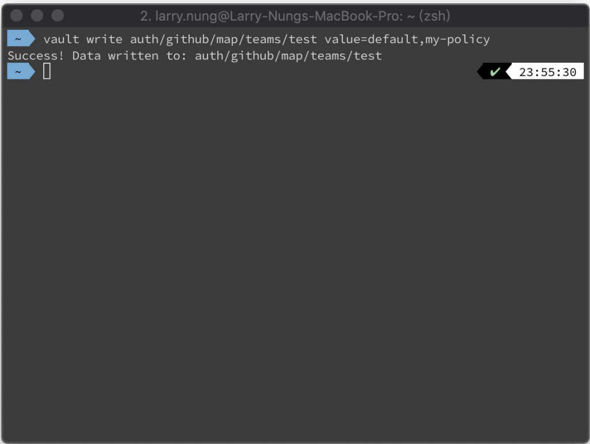

 

因為用 GitHub 認證，這邊要先準備好 GitHub personal access token。  

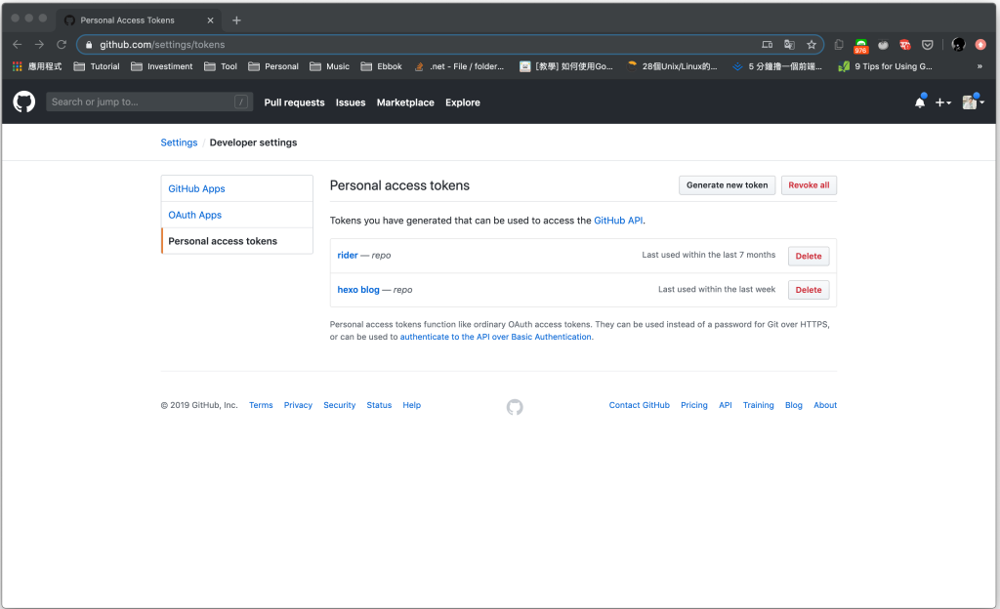

 

GitHub personal access token 這邊建立時要給予 read:org 權限。

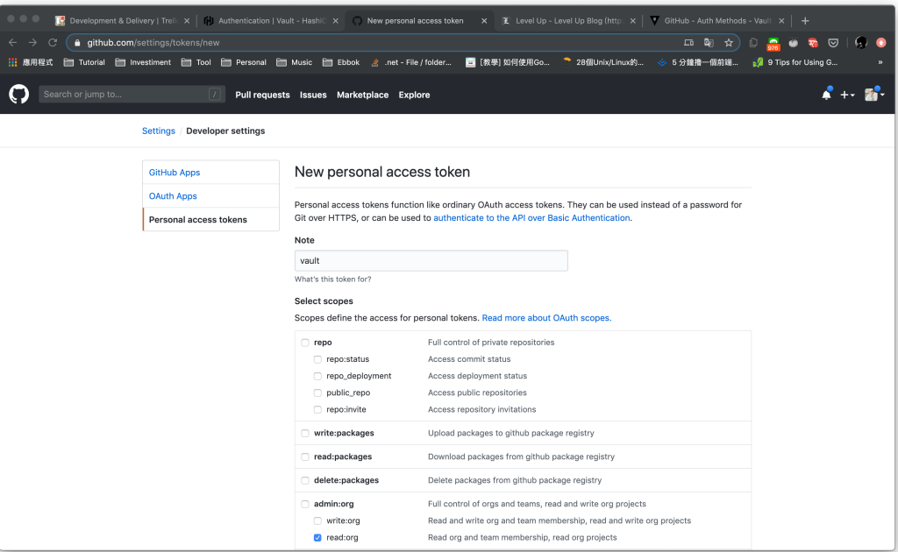

 

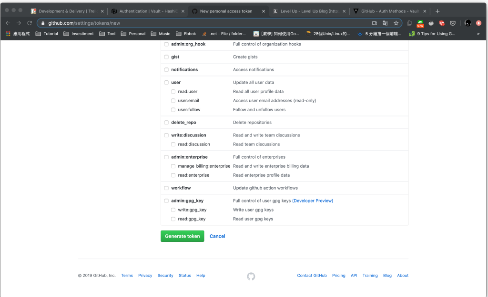

 

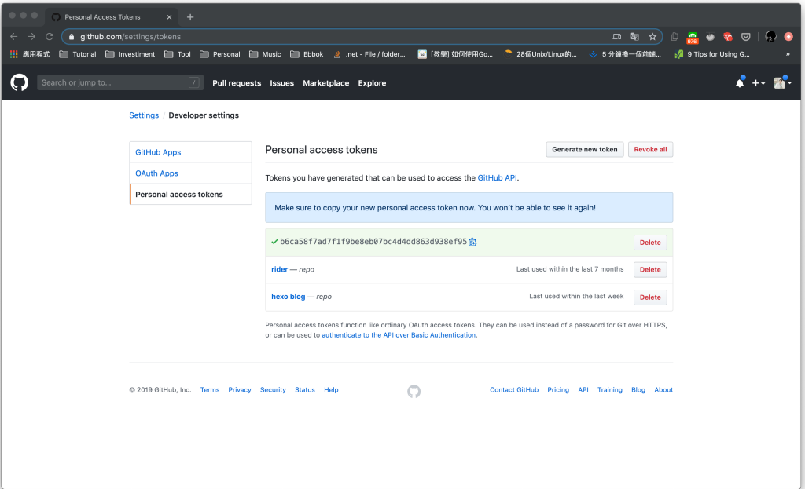

 

建立完調用 vault login，帶入 -method 參數指定用 GitHub 登入，並帶入剛建立的 GitHub personal access token 即可。  

    vault login -method=github

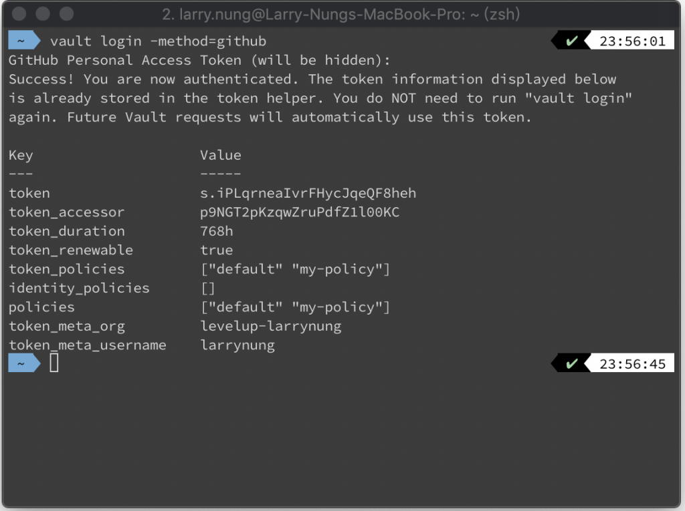

 

若後續不再使用，可登回 root。  

    vault login $VAULT_DEV_ROOT_TOKEN_ID

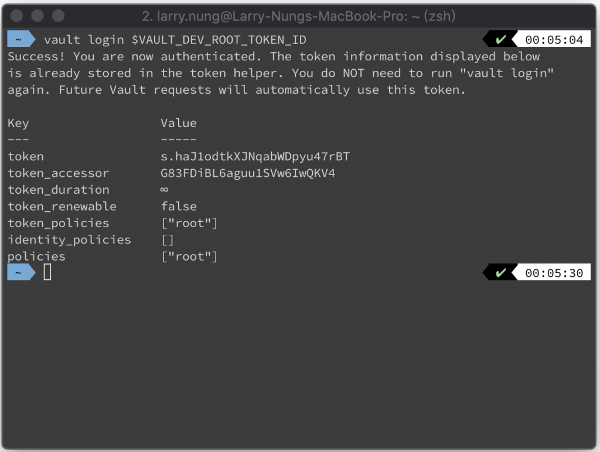

 

撤銷所有透過 GitHub 的登入。  

    vault token revoke -mode path auth/github

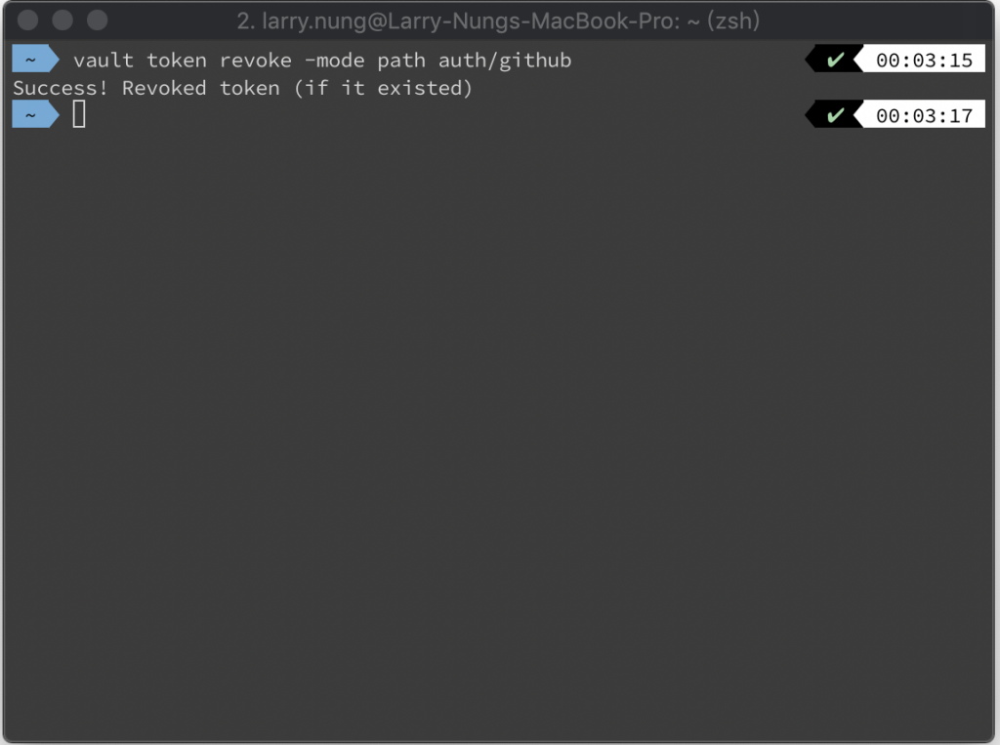

 

關閉 GitHub auth method。

    vault auth disable github

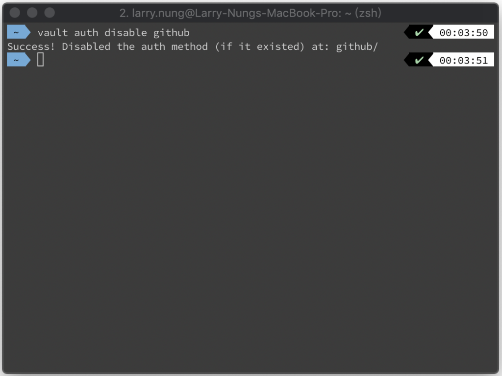

 

Link
=====
* [Authentication](https://learn.hashicorp.com/vault/getting-started/authentication)
