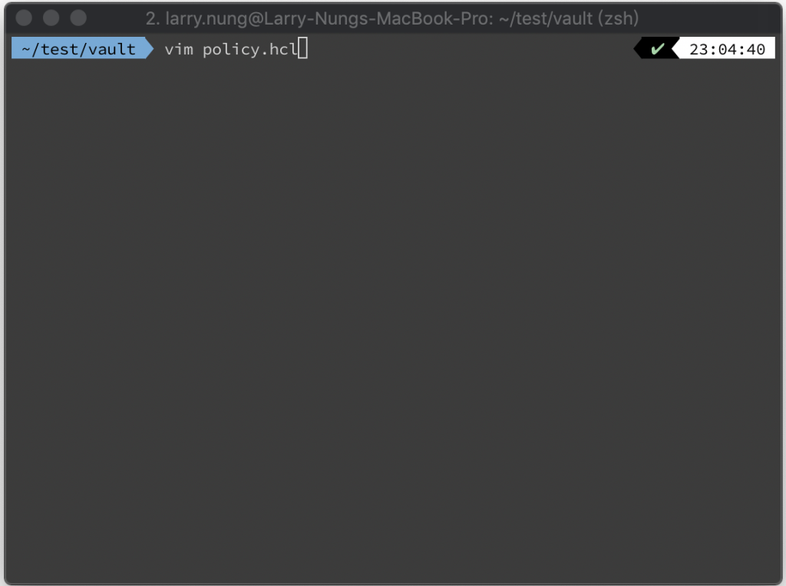
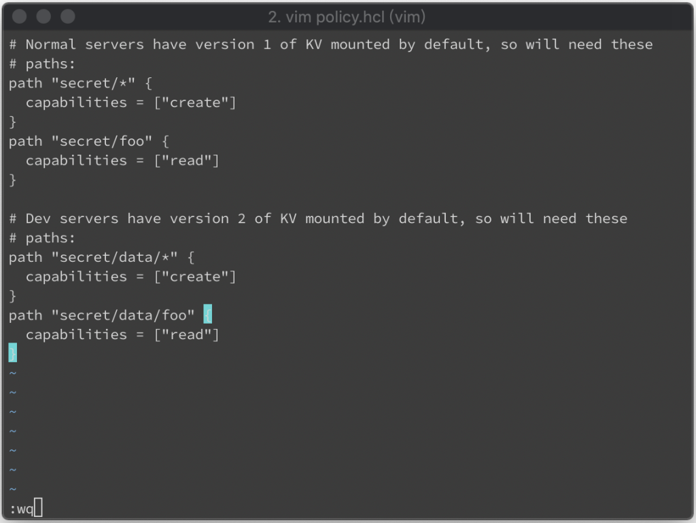
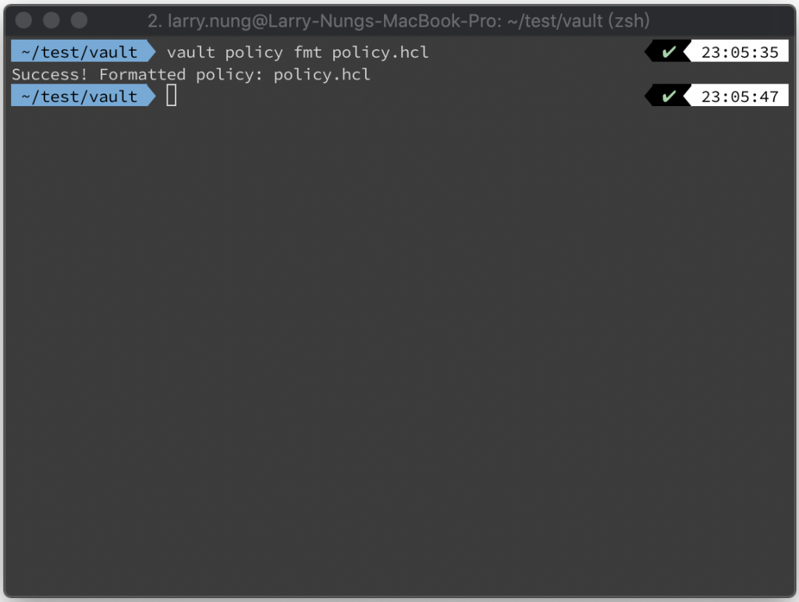
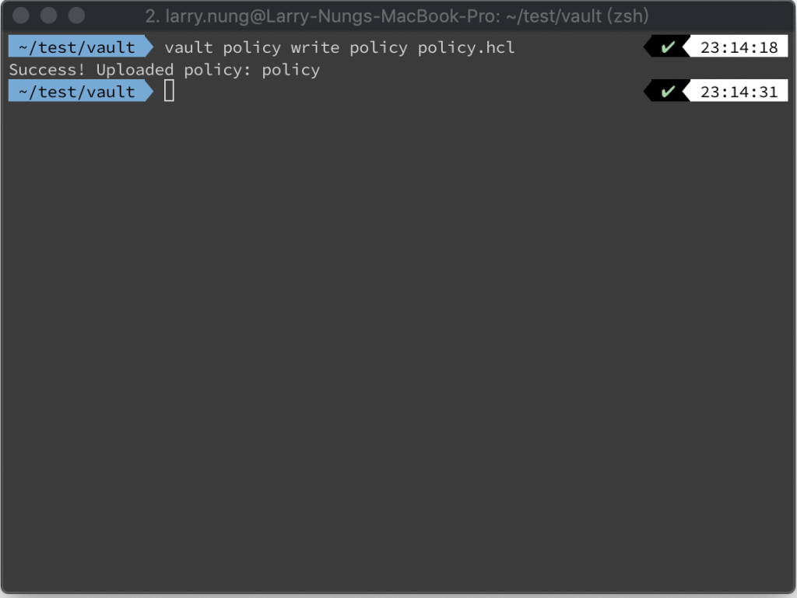
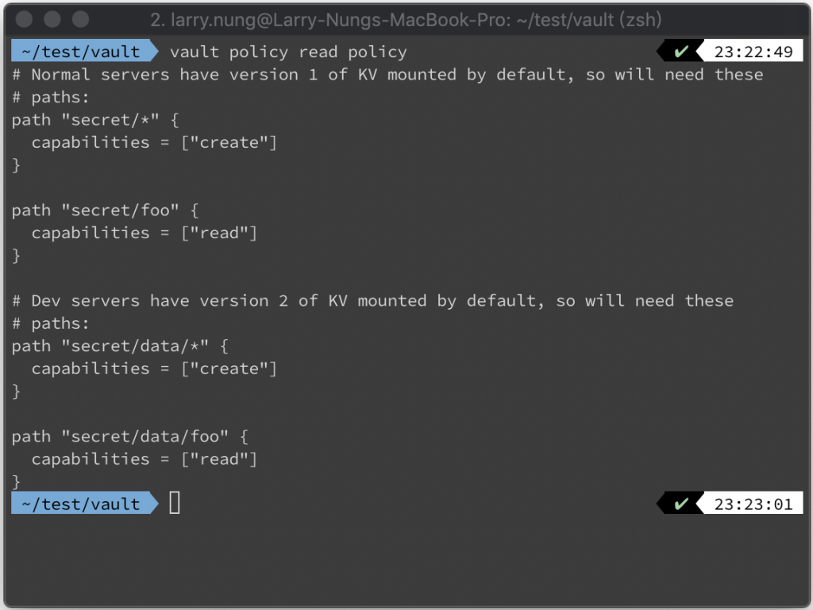
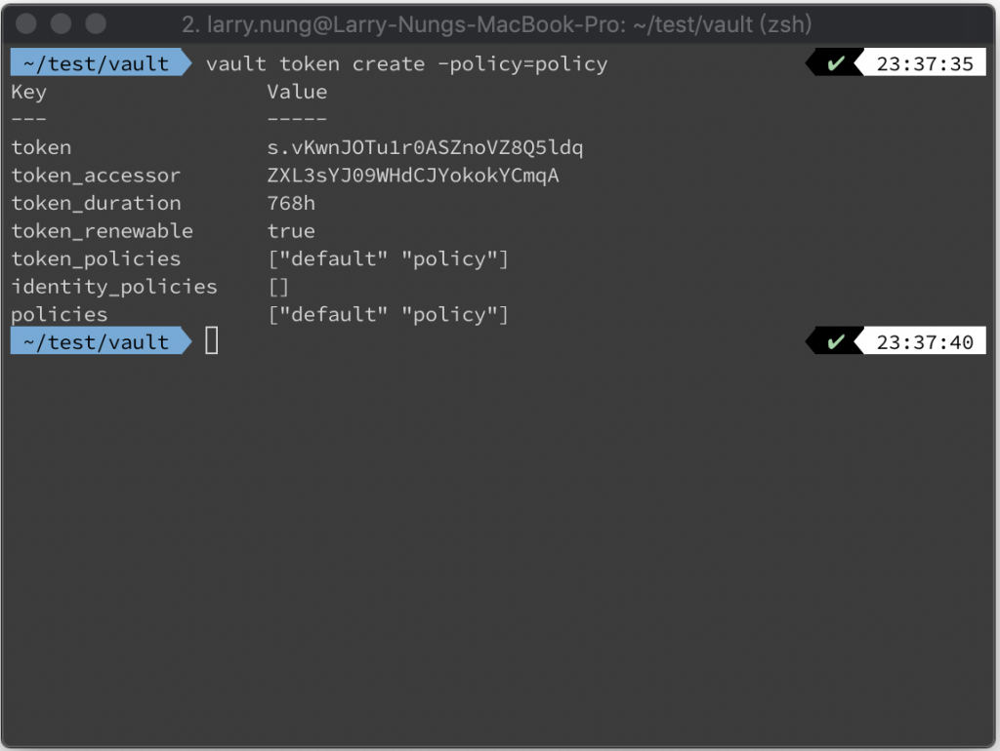
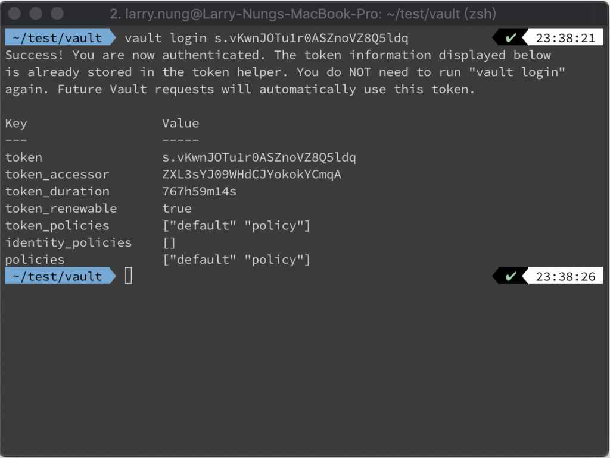
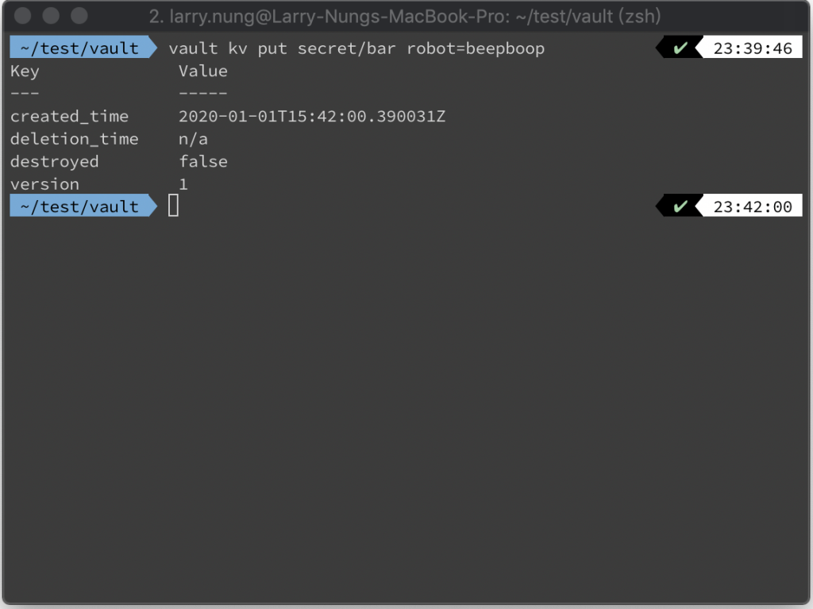
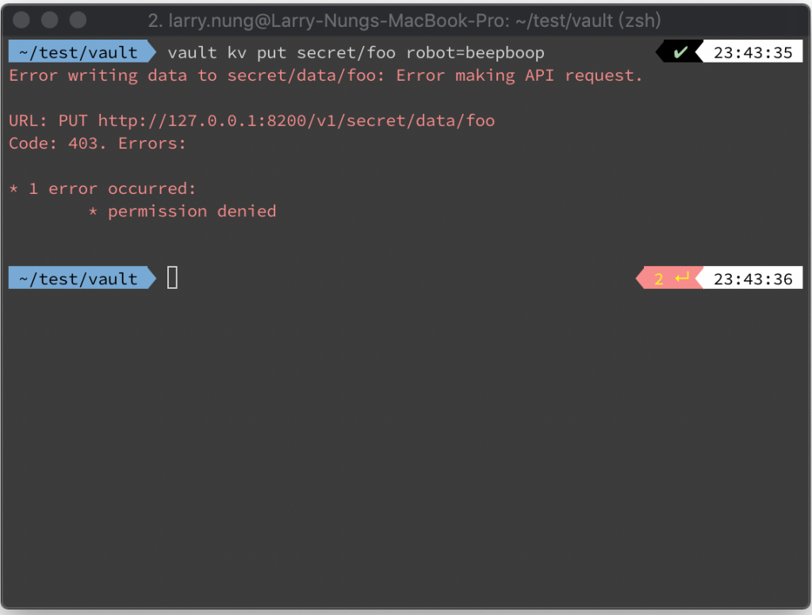

要設定 Vault 的 Policy，先建立 Policy 設定檔。  

<!-- More -->

    vim $policy_file



</br>


在設定檔內用 HCL (HashiCorp Configuration Language) 做 Policy 的設定。  

```
# Normal servers have version 1 of KV mounted by default, so will need these
# paths:
path "secret/*" {
  capabilities = ["create"]
}
path "secret/foo" {
  capabilities = ["read"]
}


# Dev servers have version 2 of KV mounted by default, so will need these
# paths:
path "secret/data/*" {
  capabilities = ["create"]
}
path "secret/data/foo" {
  capabilities = ["read"]
}
```



</br>


像是這邊設定的是可以在 secret/ 下做寫入的動作，只有 secret/foo 是唯讀;secret/data/ 下可寫入，但 secret/data/foo 唯讀。  

</br>


特別注意到這邊，未設定的位置預設是拒絕存取的。  

</br>


對 Policy 檔進行整理與檢查。  

    vault policy fmt $policy_file



</br> 


將 Policy 上傳至 Vault。  

    vault policy write $policy_name $policy_file



</br>


查 Policy 清單會看到剛所上傳的 Policy。Policy 清單中的 default 與 root 是預設的 Policy，default 是比較一般操作的權限、root 是管理者權限。  

    vault policy list


</br>


確認 Policy 的內容正確無誤。  

    vault policy read $policy_name



</br>


建立指定 Policy 的 Token。  

    vault token create -policy=$policy_name



</br>


用剛產生的 Token 進行登入。  

    vault login $token



</br>


實際對 secret/ 寫入，可正常寫入。  

    vault kv put secret/bar robot=beepboop



</br>


對 secret/foo 寫入，存取就會被拒。  

    vault kv put secret/foo robot=beepboop



</br>


Link
====
* [Policies](https://learn.hashicorp.com/vault/getting-started/policies)
