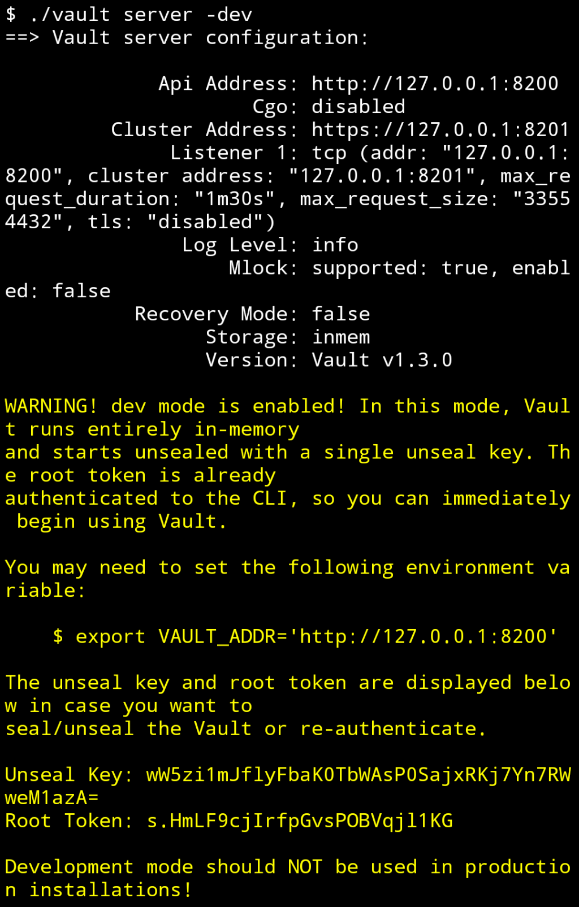
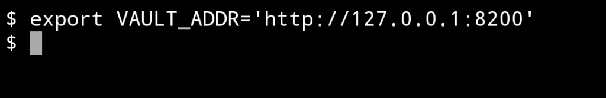
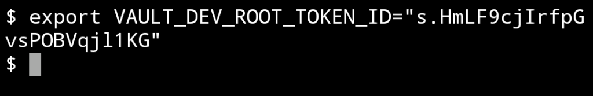
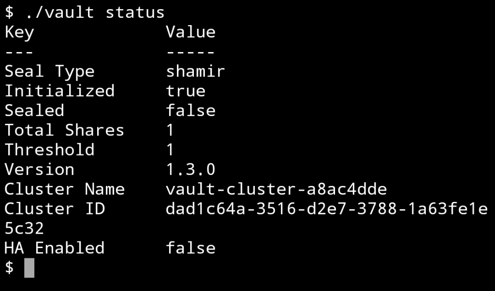

Vault 安裝後可調用 Vault server 命令起服務試試，這邊可加帶 -dev 參數起 Dev server。

vault server -dev

服務啟用後注意到特別變色的區塊，裡面有 Vault server 的位置與 Root token。

可複製新開 Terminal 後貼上，設定 VAULT_ADDR。

export VAULT_ADDR='http://127.0.0.1:8200'

以及 VAULT_DEV_ROOT_TOKEN_ID。

export VAULT_DEV_ROOT_TOKEN_

設定完後調用 vault status 命令測試看看，沒意外的話應該可以正常連到 Vault server，並將 Vault server 的資訊顯示出來。

vault status

Link
====
* [Starting the Server](https://learn.hashicorp.com/vault/getting-started/dev-server)