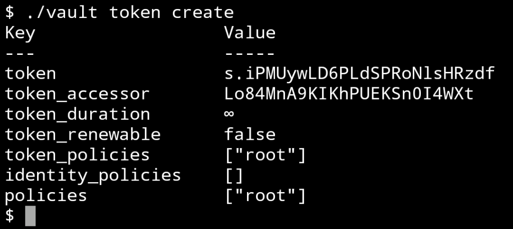
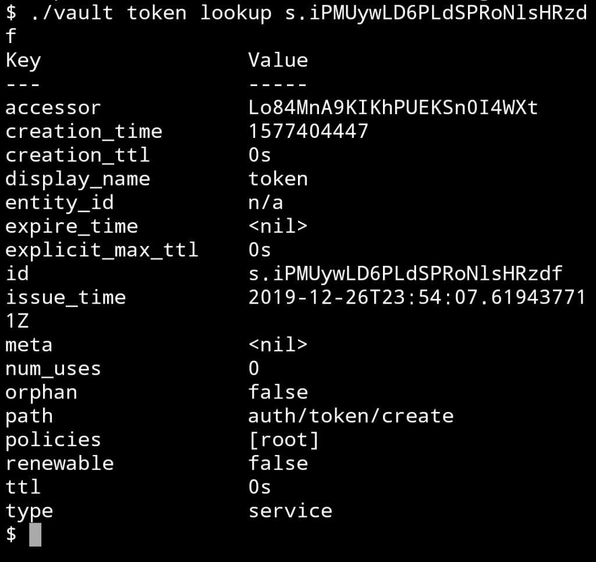
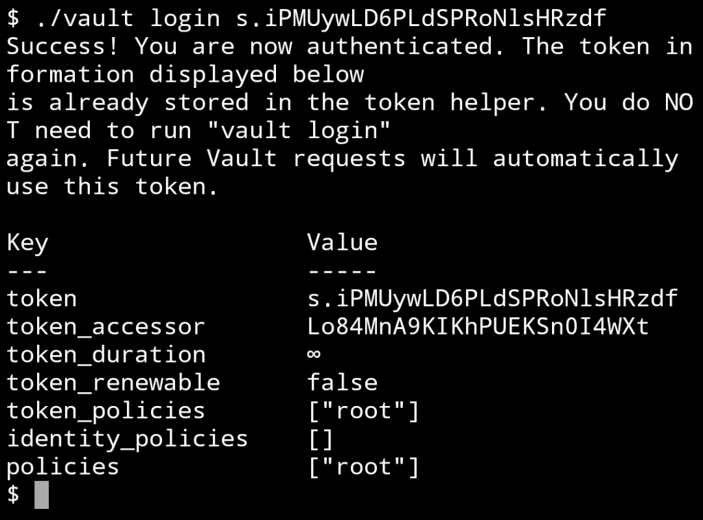
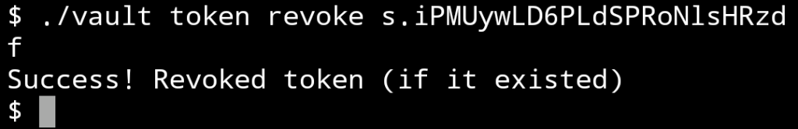
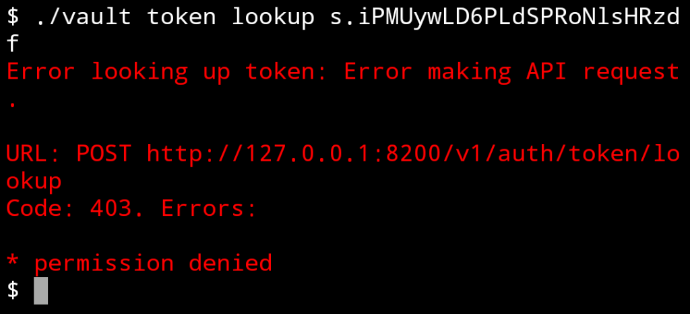
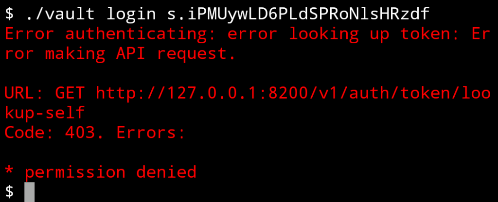

Vault 支援 Token 認證方式，在 Vault server 啟動後會顯示 Root token，可直接取用。  

<!-- More -->

 

也可以透過 vault token create 命令建立新的 token 使用。

    vault token create

 

Token 的相關資訊可用 vault token lookup 帶入 Token 查驗。

    vault token lookup $token

 

Token 取得後可用 vault login 帶入 Token 登入。  

    vault login $token

 

若要註銷 Token，可用 vault token revoke 帶入 Token。  

    vault token revoke $token

 

Token 註銷後不得使用，無法查驗 Token 資訊。  

 

也無法用來登入。  

 

Link
=====
* [Authentication](https://learn.hashicorp.com/vault/getting-started/authentication)
