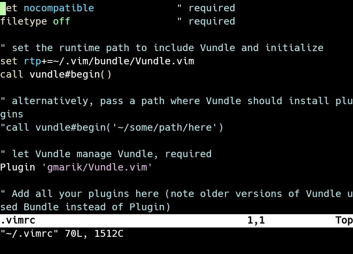
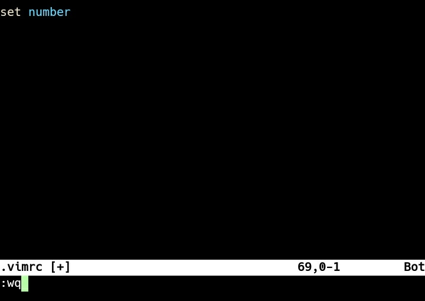
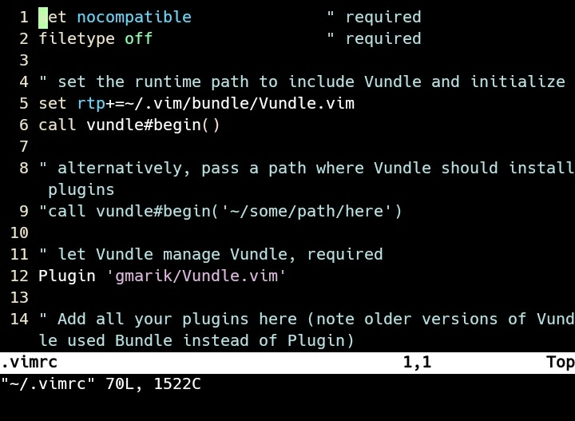
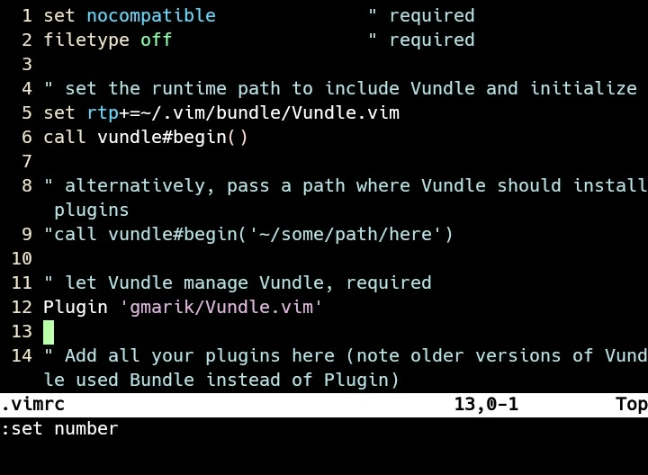
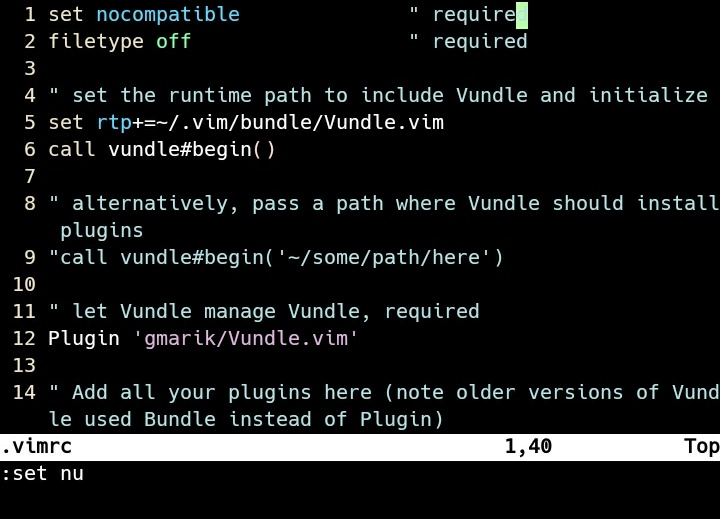
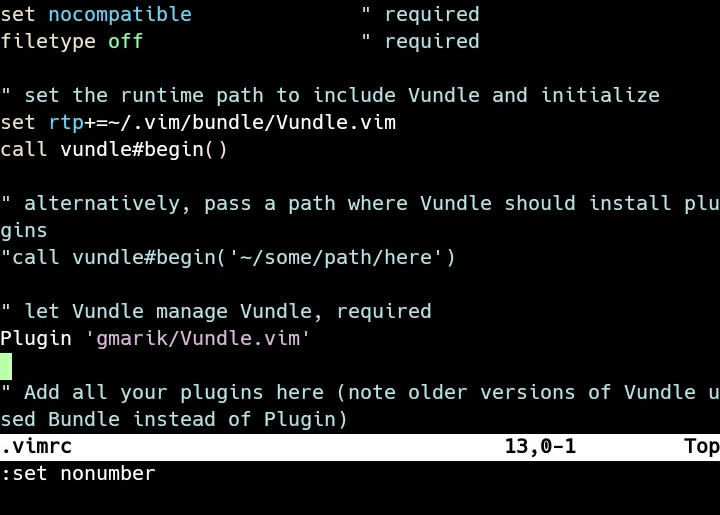
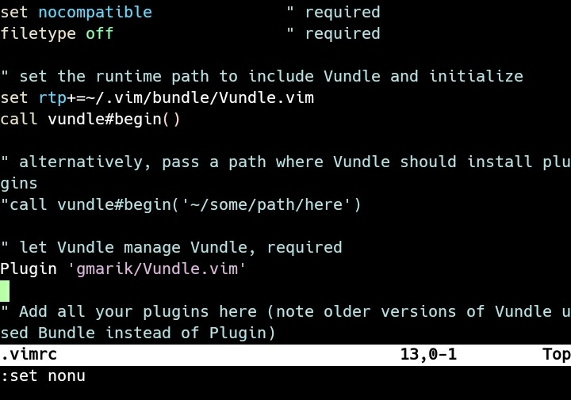

Vim 預設 Line number 是關閉的。

如有需要將開啟 Vim 的設定檔。

vi ~/.vimrc

在設定檔內加上設定開啟 Line number。

set number

再次進入 Vim 就會看到 Line number 已被開啟。

如果只是暫時要開關 Line number，可以不用修改到設定檔。

可以直接輸入命令暫時開啟。

set number

set nu

或是直接輸入命令暫時關閉。

set nonumber

set nonu

Link
----
* [Display line numbers](http://vim.wikia.com/wiki/Display_line_numbers)