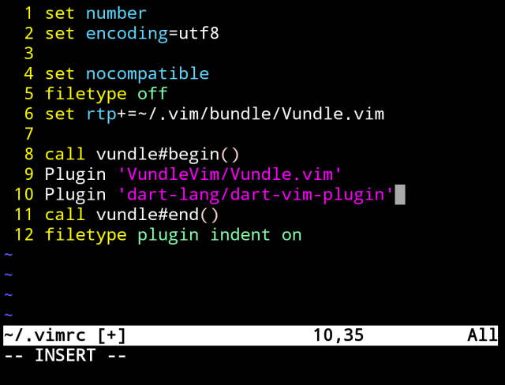
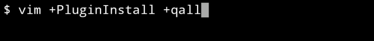
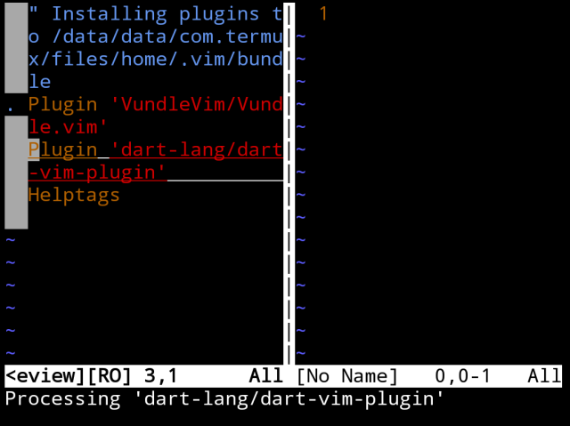
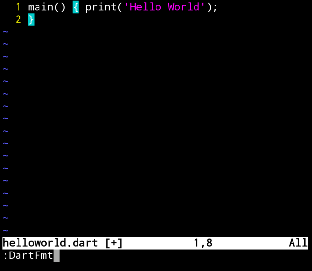
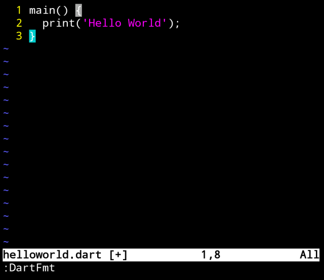
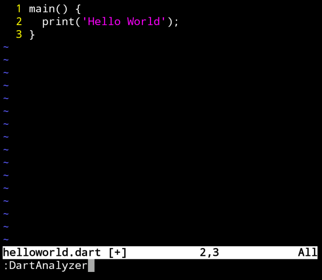
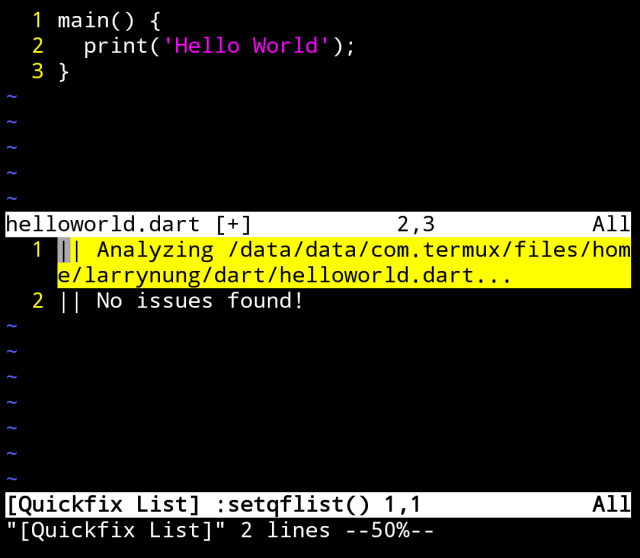

使用 Vim 撰寫 Dart，可透過 Vundle 安裝 dart-vim-plugin 套件。

開啟 ~/.vimrc 檔。

vim ~/.vimrc

設定 Vundle 與 dart-vim-plugin。
```
...
set nocompatible
filetype off
set rtp+=~/.vim/bundle/Vundle.vim

call vundle#begin()
Plugin 'VundleVim/Vundle.vim'
Plugin 'dart-lang/dart-vim-plugin'
call vundle#end()
filetype plugin indent on
...
```


然後調用命令進行 Vim plugin 的安裝。

vim +PluginInstall +qall





安裝好後 Dart 程式碼會支援 Highlight。

也支援排版的功能。

:DartFmt





甚至是程式碼的分析。

:DartAnalyzer



