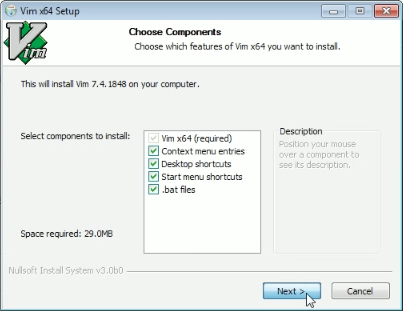
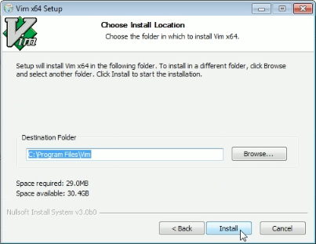
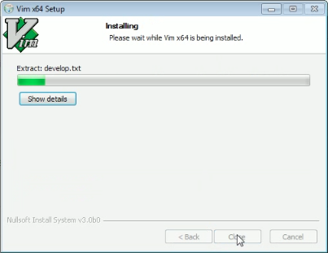
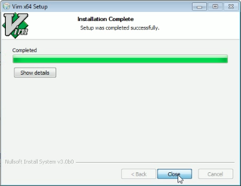
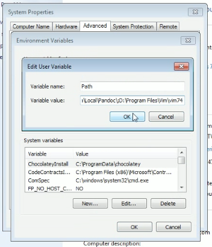
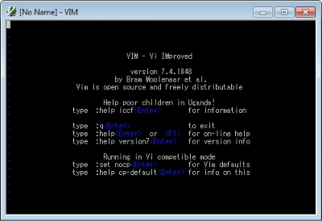
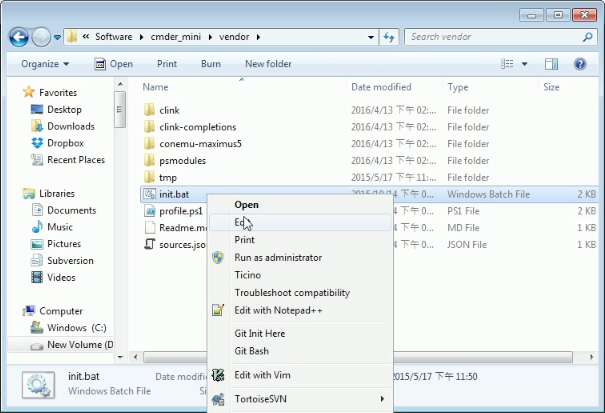
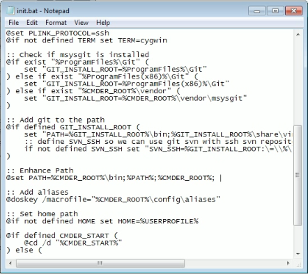
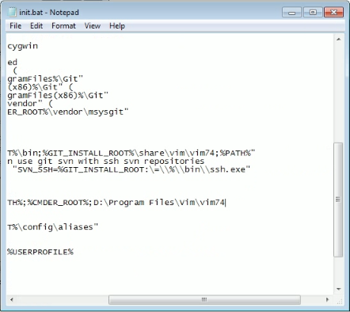
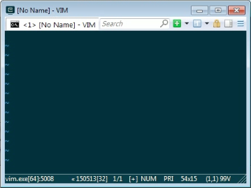

Vim 要在 Windows 使用，可下載 Windows 安裝包下來安裝。  

<!-- More -->

 

 

 

 

安裝完設定環境變數，在 Path 這邊加上 Vim 的目錄位置。  

 

這樣在 MS-DOS 視窗就可以直接調用 Vim 命令了。  

 

若是使用的是 cmder，那可以開啟 [cmder folder]endor\init.bat 進行設定。  

 

找到 Path 設定的部分。  

 

添加 Vim 目錄位置後存檔。  

 

在 cmder 內就可以調用 Vim 了。  

 

Link
----
* [Vim in Windows – Medium](https://medium.com/@saaguero/vim-in-windows-1e0789127ed6#.94jzajb7y)
* [Setting up Vim in Windows – Medium](https://medium.com/@saaguero/setting-up-vim-in-windows-5401b1d58537#.mi0w59qw0)
* [How To Install and Configure Vi / Vim Editor on Windows OS](http://www.thegeekstuff.com/2009/12/vim-editor-for-windows)
