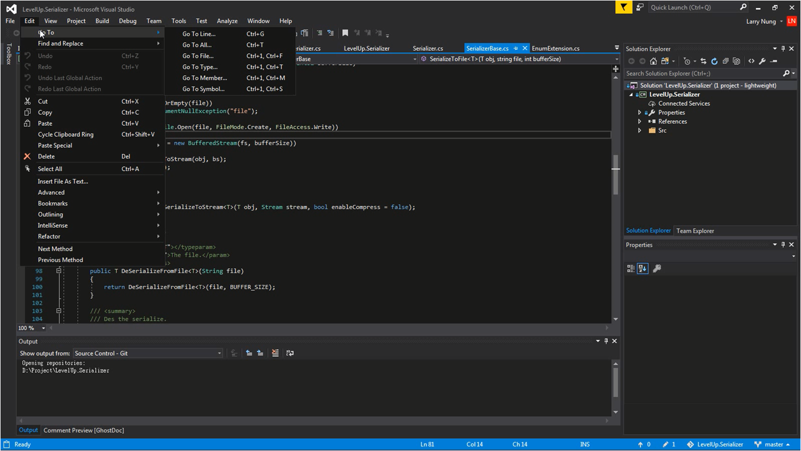
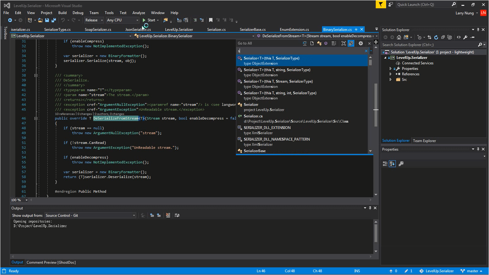
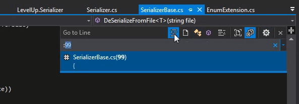
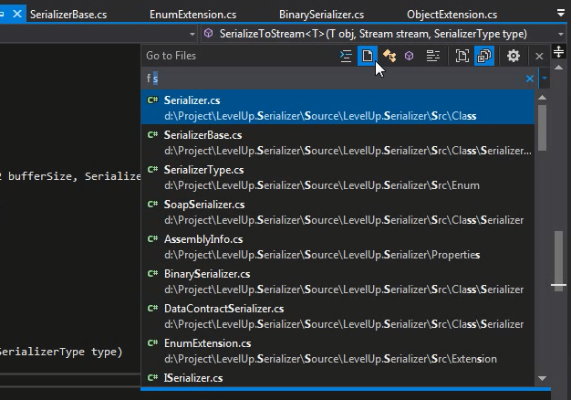
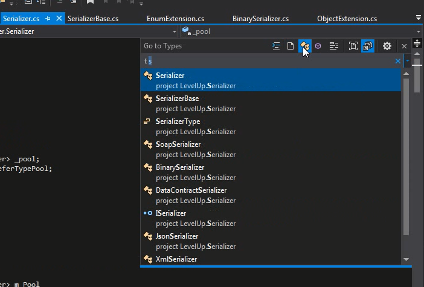
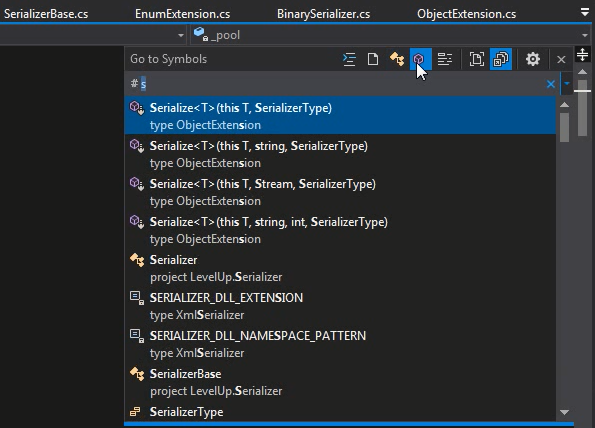
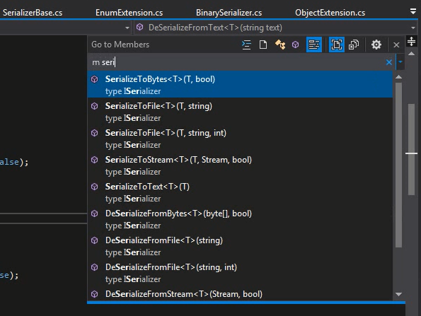

Visual Studio 2017 對程式碼的巡覽做了些強化，[Edit | Go To] 主選單選項內有著所有的巡覽功能。  

<!-- More -->

 

像是 `Go To All...` (熱鍵 Ctrl+T)

 

`Go To Line...` (熱鍵 Ctrl+G)

 

`Go To File...` (熱鍵 Ctrl+1, Ctrl+F)

 

`Go To Type...` (熱鍵 Ctrl+1, Ctrl+T)

 

`Go To Symbol...` (熱鍵 Ctrl+1, Ctrl+S)

 

`Go To Member...` (熱鍵 Ctrl+1, Ctrl+M)

 

也可以記住搜尋框認的關鍵字，像是 `Go To Line...` 是用 `:`、`Go To File...` 是用 `f`、`Go To Type...` 是用 `t`、`Go To Symbol...` 是用 `#`、`Go To Member...` 是用 `m`，這樣會更方便使用。
