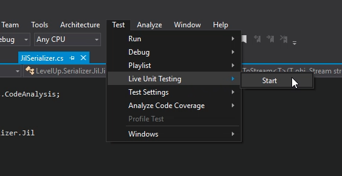
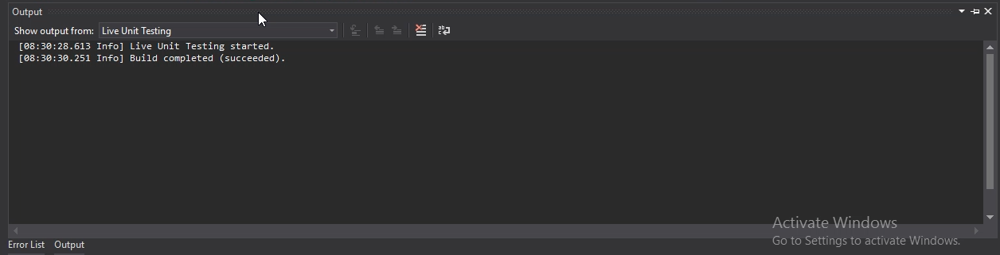
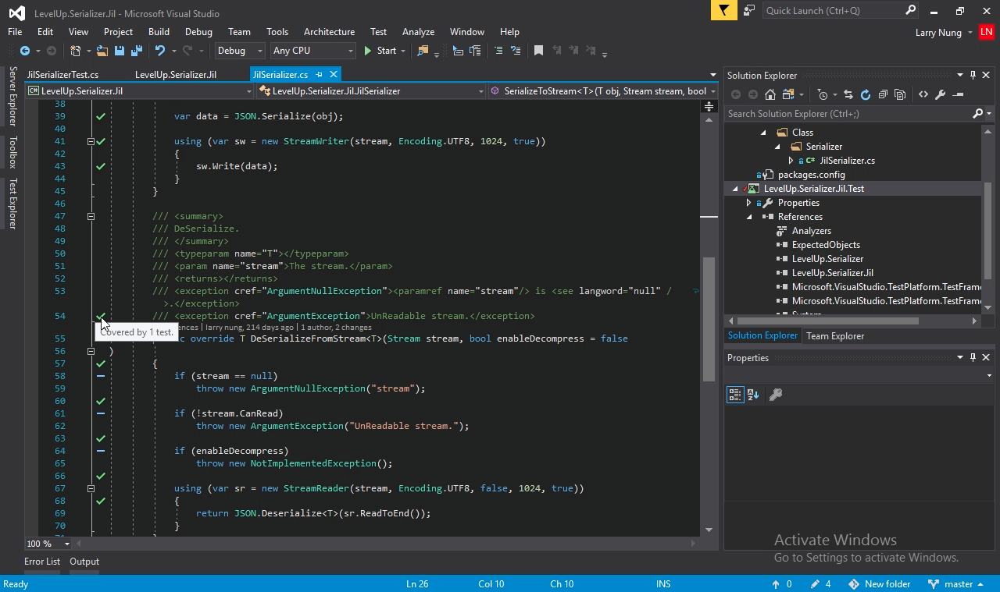
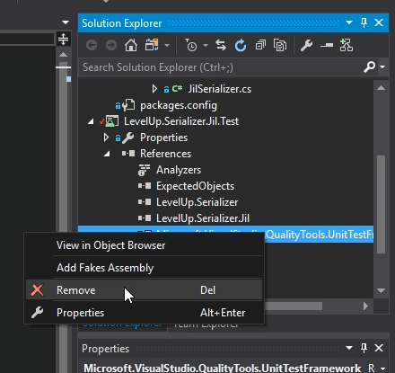
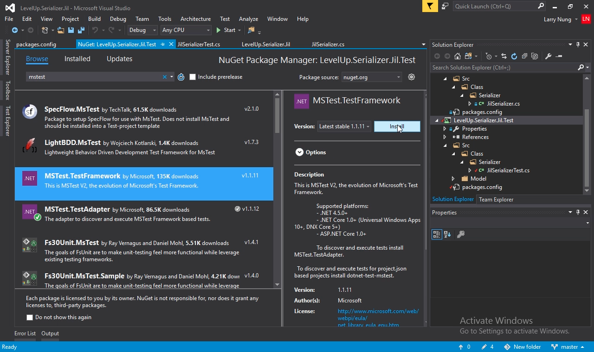
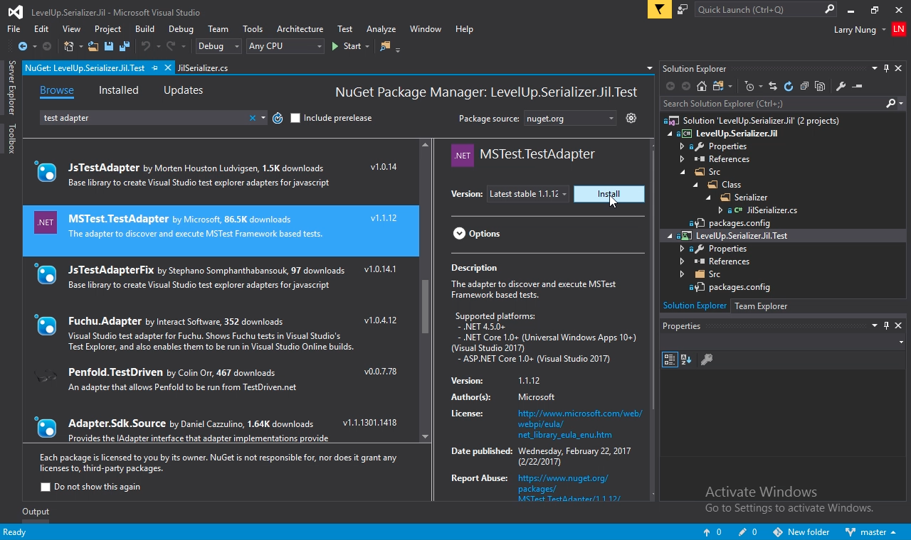
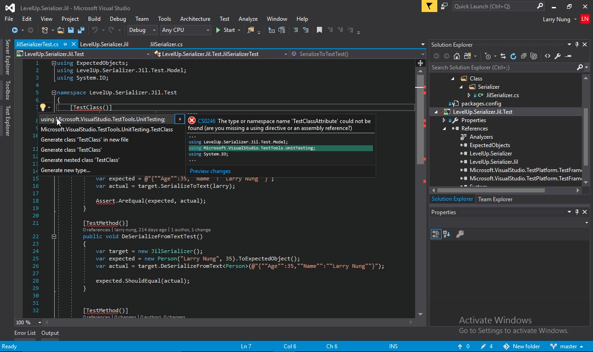

要啟動 Visual Studio 2017 Live Unit Testing 功能，可點選 [Test | Live Unit Testing | Start] 主選單選項。

啟動後單元測試會持續在背景運行。

可在開發程式時即時看到測試的狀況與覆蓋情形。

需注意的是這功能需要 MSTest V2 才能啟用，舊測試專案需要移除 `Microsoft.VisualStudio.QualityTools.UnitTestFramework` 的參考。

加入 MSTest.TestFramework 套件。

加入 TestAdapter 套件。

最後調整命名空間即可。

