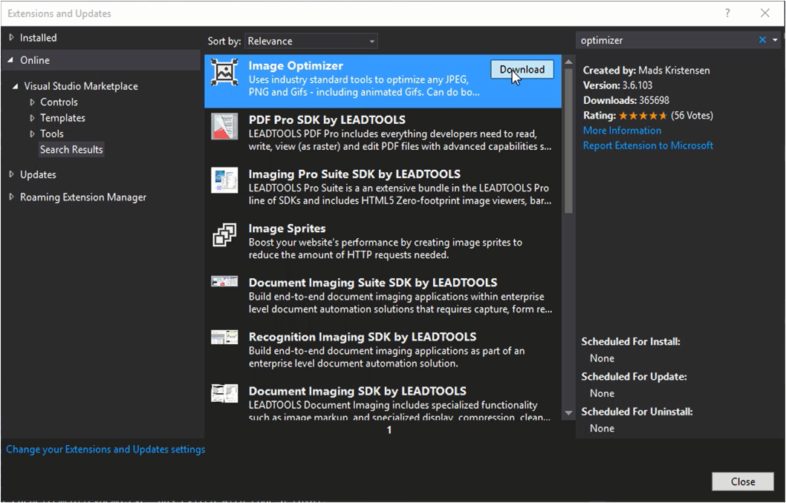
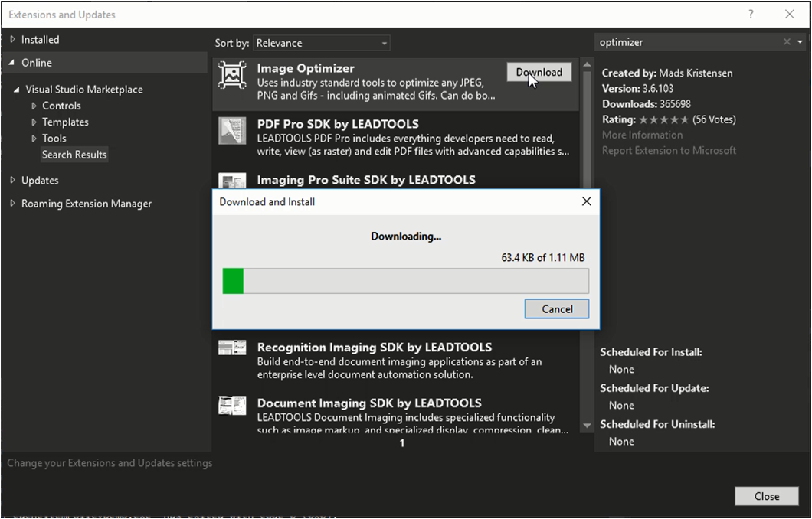
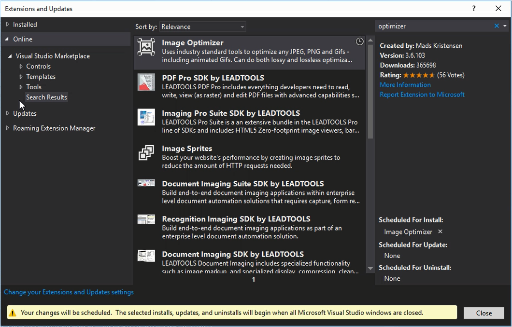
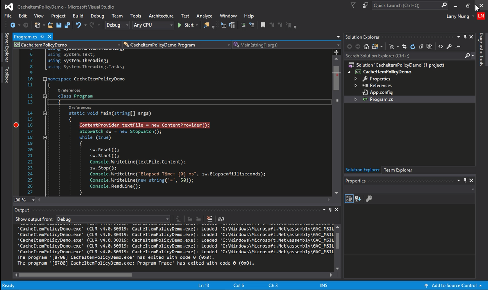
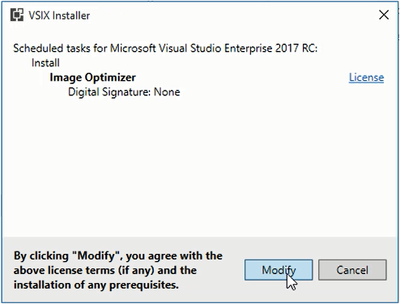
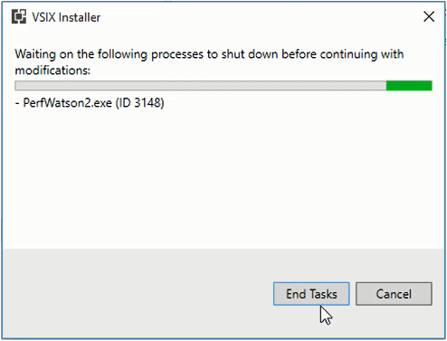
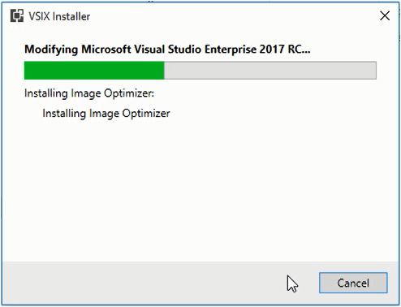
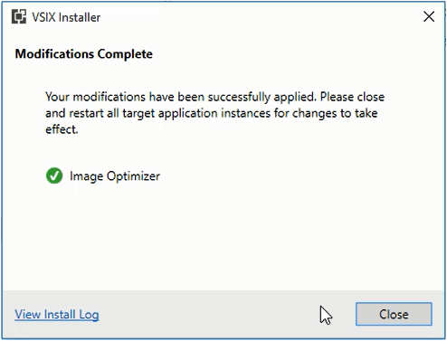

Visual Studio 2017 以後使用 Extensions and Updates 視窗進行 Extension 的修改。  

<!-- More -->

 

 

修改的 Extension 會被加入排程，排程的 Extension 可以在 Extensions and Updates 視窗的右下角看到，若有需要也可以將排程刪除。  

 

接著將 Visual Studio 關閉。  

 

排程的 Extension 即會開始運行對應的動作。  

 

 

 

 
