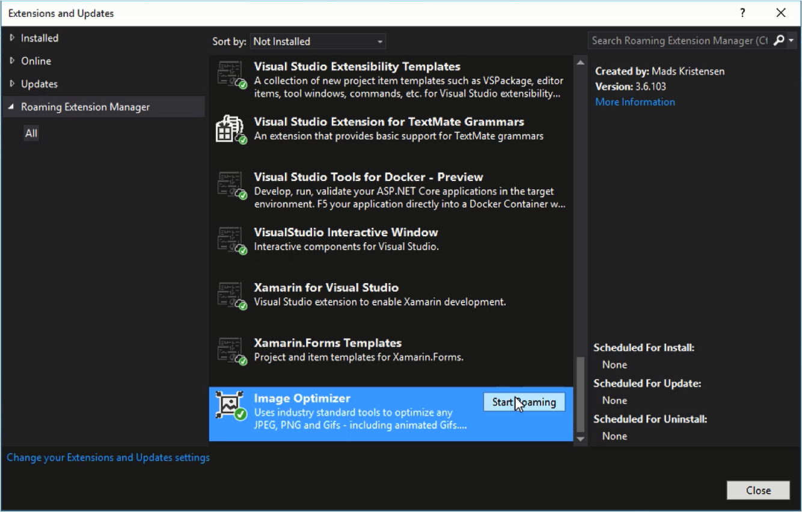

Visual Studio 2017 以前安裝的 Extension 無法同步，所以在不同電腦間 Extension 都需要自行安裝。  

<!-- More -->

 

Visual Studio 2017 以後新增了 Roaming Extension Manager，可用來設定要同步的 Extension。只要開啟 Extensions and Updates 視窗，切到 Roaming Extension Manager 頁面，在想要同步的 Extension 後面按下 `Start Roaming` 按鈕，指定的 Extension 即可同步到不同電腦。  

 
