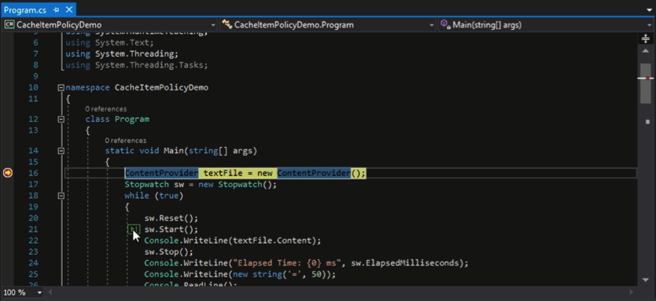
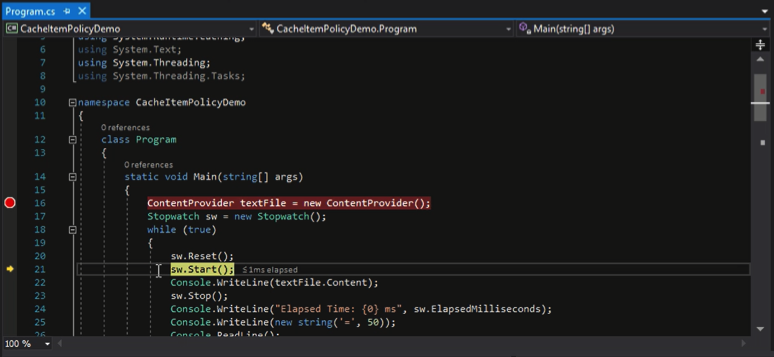

Visual Studio 2017 以前，在除錯時若要讓斷點繼續向下運行至指定位置，我們需要在指定位置設定斷點後讓他向下運行，或是直接在指定位置上按下滑鼠右鍵，點選 `Run to cursor` 滑鼠右鍵選單也可以。  

<!-- More -->

 

在 Visual Studio 2017 以後新增了 Run to click 的功能，提供我們另一個選擇。使用上要先設定個斷點進入除錯模式，讓它中斷在設定的斷點上。  

 

接著將滑鼠移到指定位置上，指定位置的前方會浮現個小圖示，滑鼠點擊該圖示即可運行至指定位置後中斷。  

 
