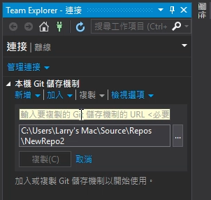
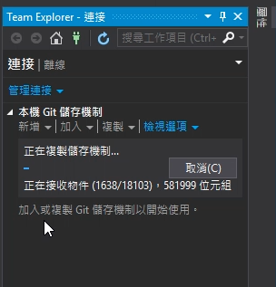
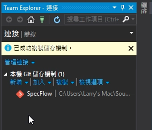
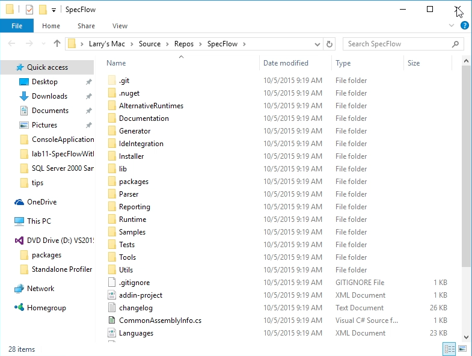

使用 Visual Studio clone git repository，先將 Team Explorer 視窗開啟。  

<!-- More -->

 

在 `本機 Git 儲存機制` 這邊點選 `複製` 按鈕。  

 

再來要設定欲 clone 的 git repository 位置，以及 clone 下來存放的位置。  

 

填完按下 `複製` 按鈕開始進行 Clone。  

 

 

 

Clone 完成會在 Team Explorer 直接列出該 Repository。  

 

透過滑鼠右鍵快顯選單我們可以用命令提示字元或是檔案總管開啟 Clone 下來的 Repository。  

 

 
