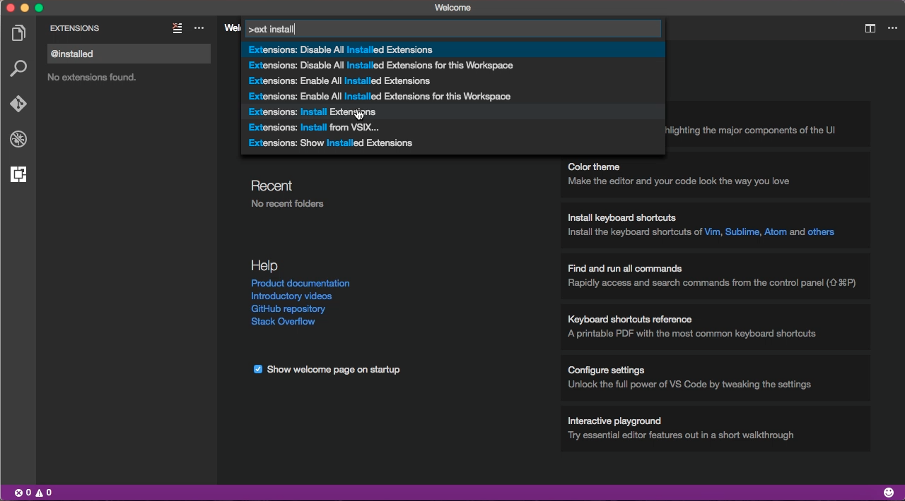
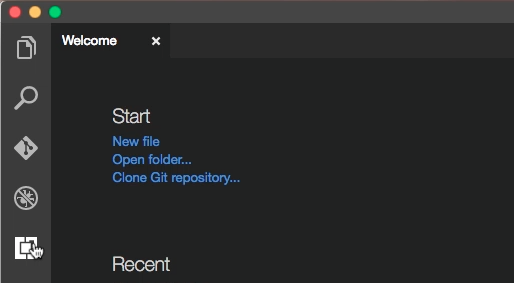
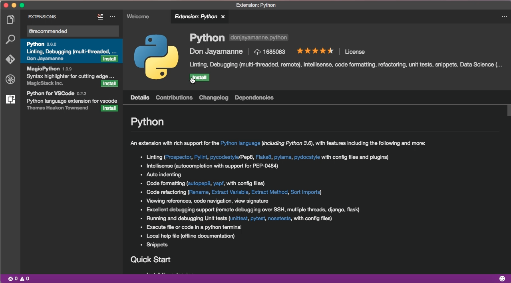
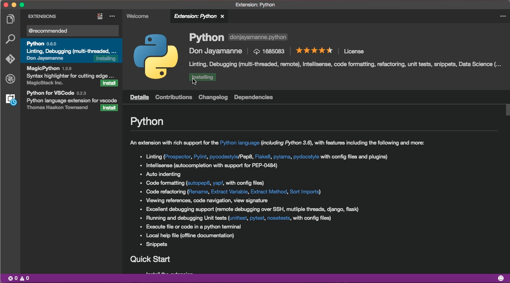
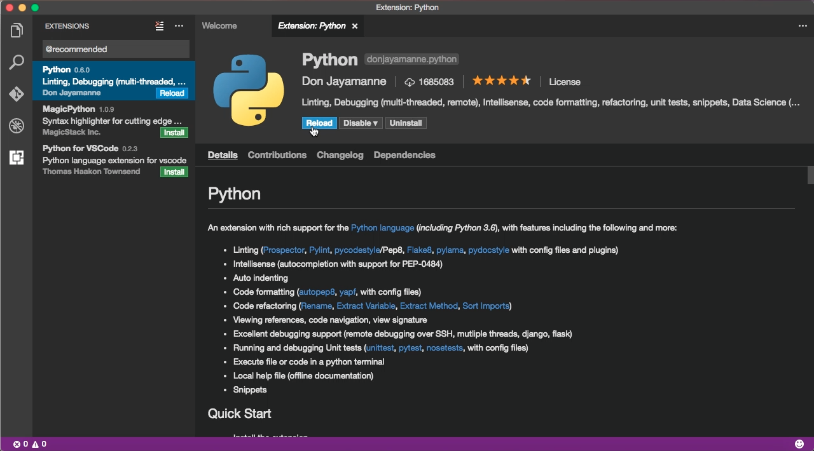
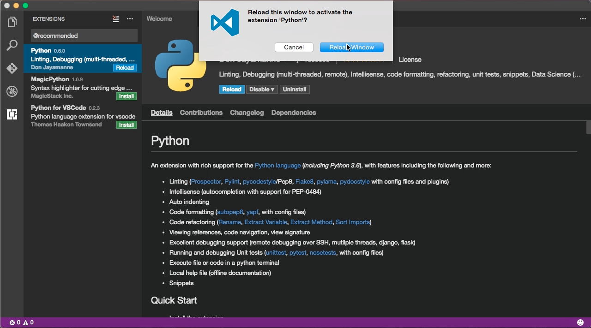

要安裝 Visual Studio Cdoe 的外掛套件，可按下熱鍵打開 Command Palette (Windows 為 Ctrl+ Shift + P， OS X 為 CMD + SHIFT + P)，搜尋並運行 `Extensions:Install Extensions`。  

<!-- More -->

 

或是直接透過左邊的工具列按鈕開啟 `Extensions:Install Extensions`。  

 

接著搜尋欲安裝的外掛套件後按下 Install 按鈕。  

 

選取的外掛套件即會開始進行安裝。  

 

安裝完後按下 `Reload` 按鈕讓安裝的外掛套件生效。  

 

再次按下 `Reload Window` 按鈕確認 Reload 即可。  

 
