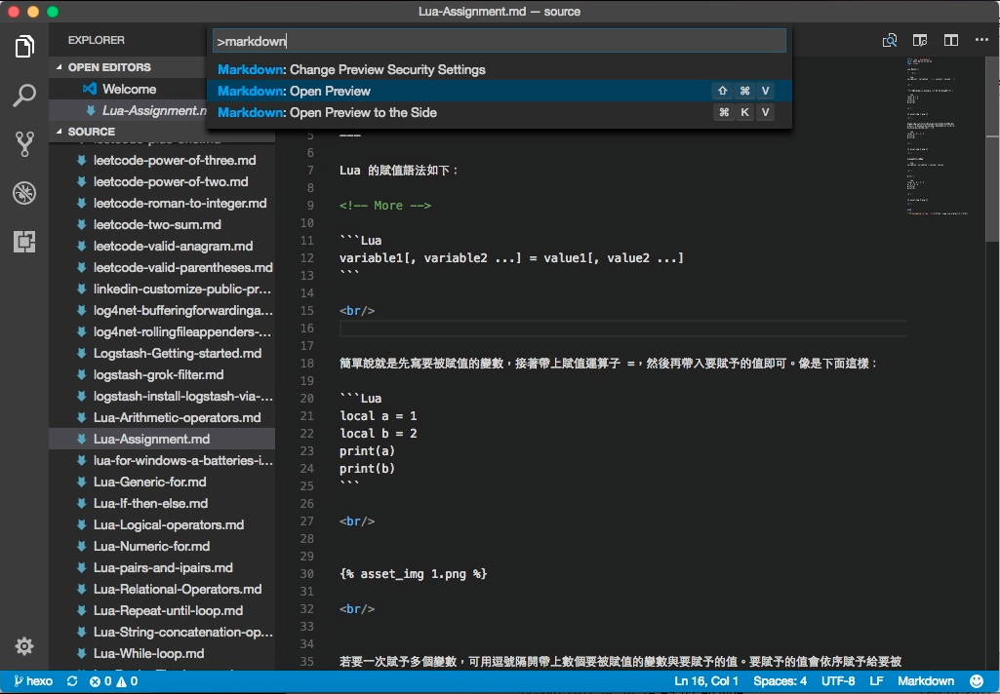
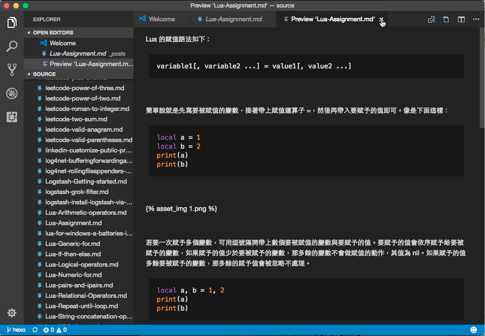
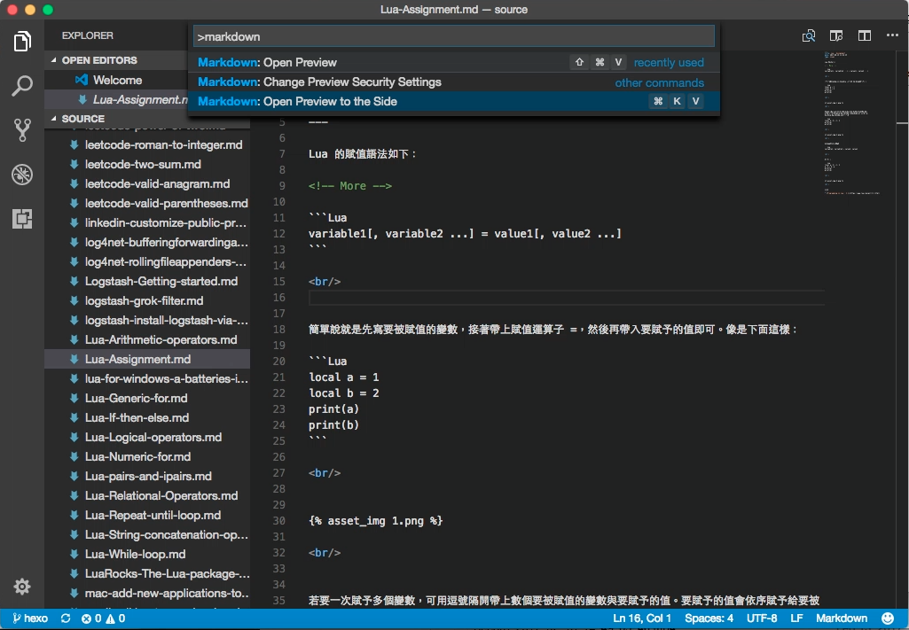
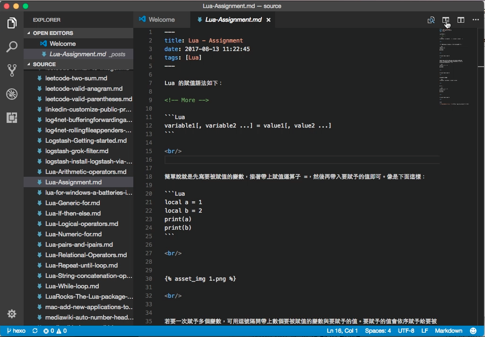
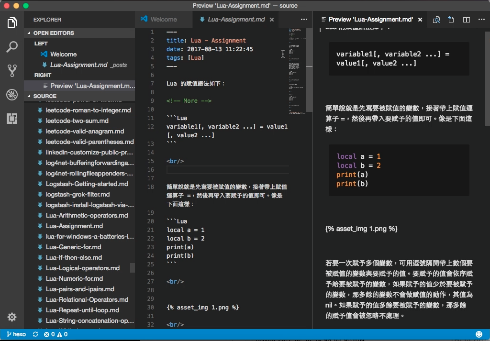

Visual Studio Code 要預覽 Markdown，可以按下熱鍵 Ctrl + Shift + P / Cmd + Shift + P 開啟 command palette，選取 Markdown:Open Preview。  

<!-- More -->

 

或是使用熱鍵 Ctrl + Shift + V，即可切換至 Markdown 的預覽。  

 

若是想要在預覽的同時做編輯，可以按下熱鍵 Ctrl + Shift + P / Cmd + Shift + P 開啟 command palette，選取 Markdown:Open Preview to the Side。 

 

或是透過編輯區右上角的 Open Preview to the Side 按鈕。  

 

抑或是按下熱鍵 Ctrl + K V / Cmd + K V，Markdown 預覽即會開在新的水平分割視窗，且在預覽畫面上滾動捲軸，編輯視窗的捲軸會跟著同步滾動。  

 
