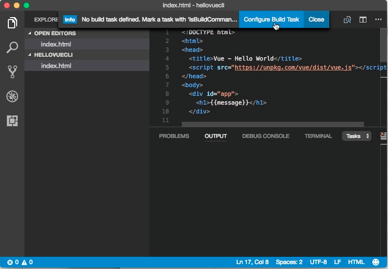
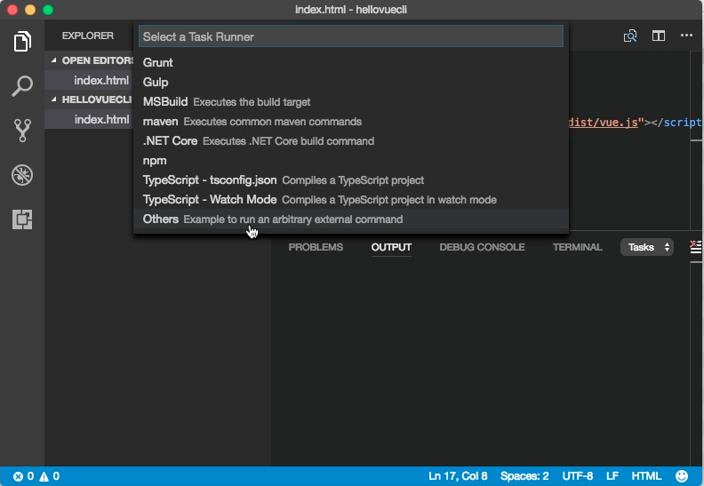
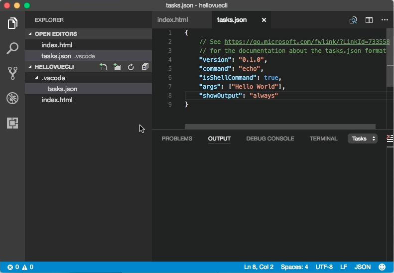
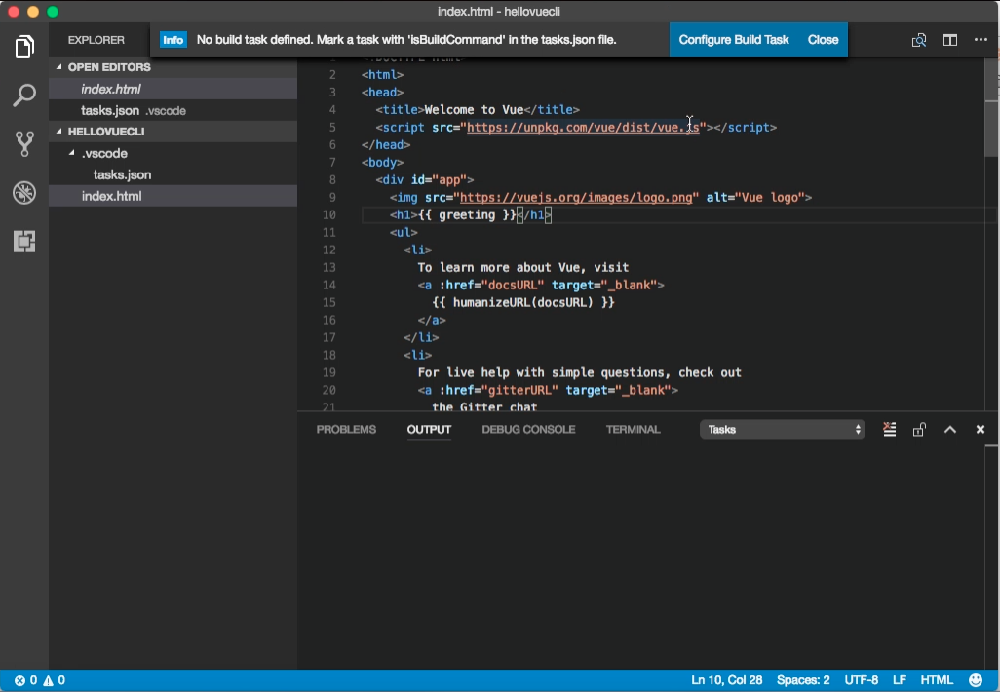

在使用 Visual Studio Code 建置時如果看到 `No build task defined. Mark a task with 'isBuildCommand' in the tasks.json file.` 這樣的訊息，可能是因為 tasks.json 沒做設定導致。  

<!-- More -->

可直接按下 `Configure Build Task` 按鈕。  

 

選取 Task Runner。  

 

調整 tasks.json 設定。  

 

除了 tasks.json 沒設定外，還有個可能是因為 Visual Studio Code 沒載入設定導致，將 Visual Studio Code 重啟即可。  

 
