要用 Visual Studio Code 開發 .NET Core，需先安裝 .NET Core SDK。

然後安裝 Visual Studio Code 的 C# Extension。

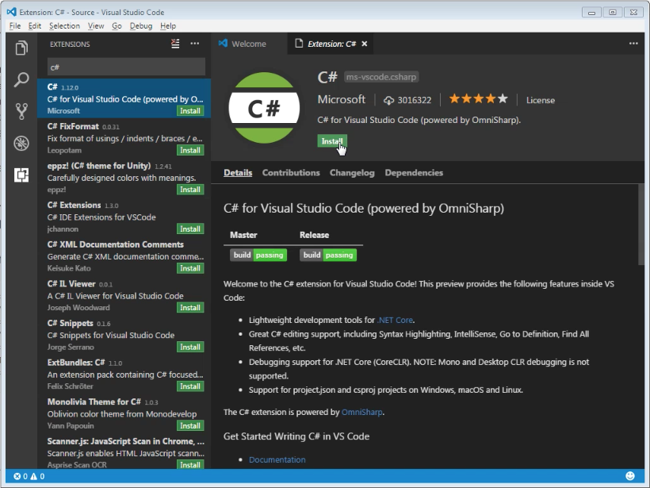

C# Extension 安裝後進行重啟。

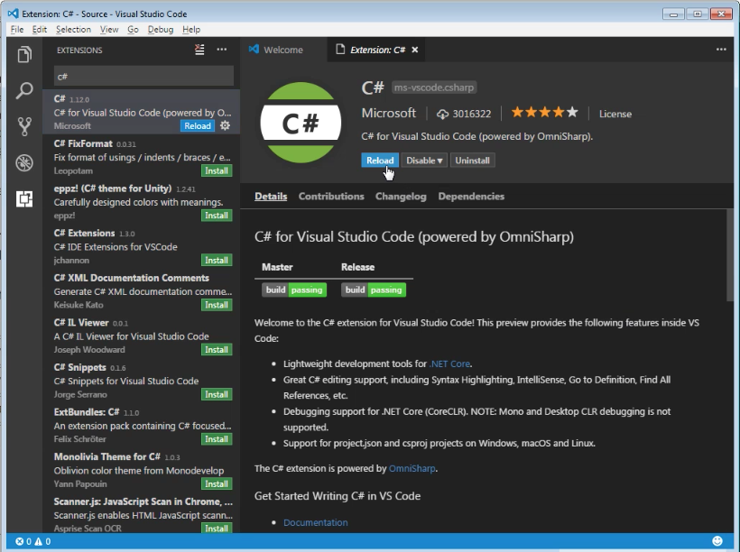

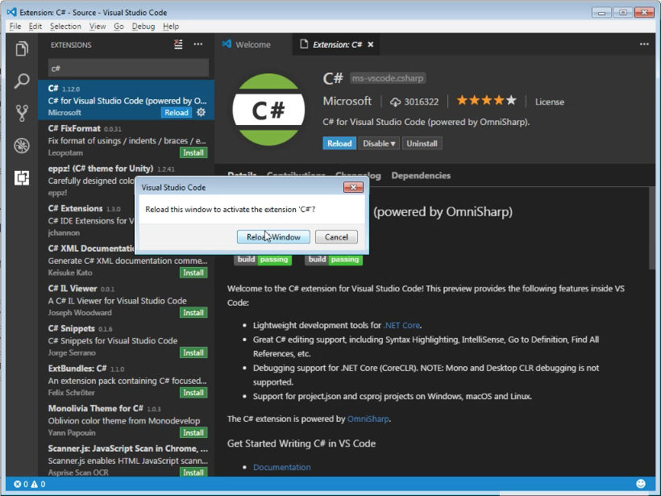

將 Visual Studio Code 切至專案目錄，透過 Terminal 視窗建立專案。

dotnet new [ProjectTemplate]

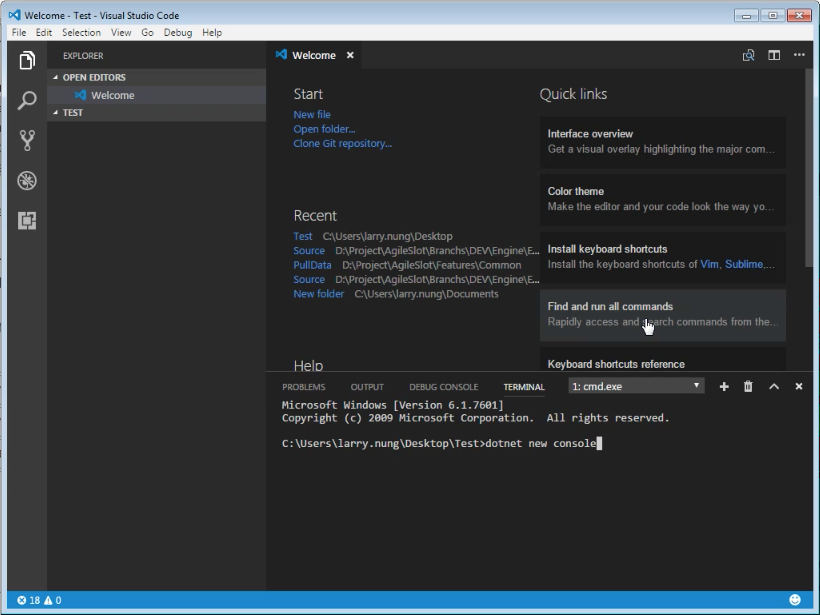

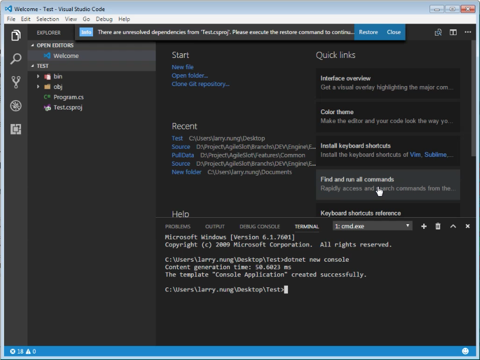

還原套件。

dotnet restore

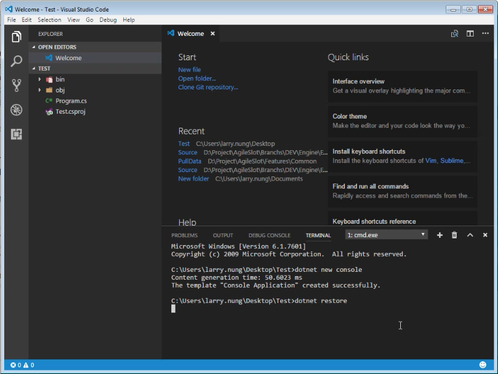

運行結果。

dotnet run

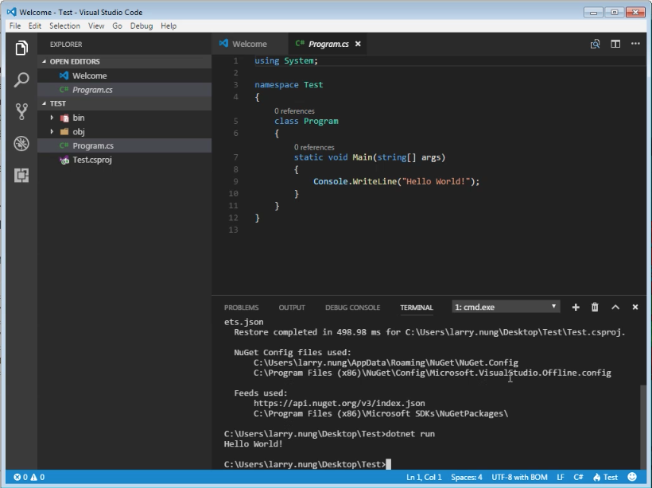

若要除錯的話，需先建立 launch.json 檔。

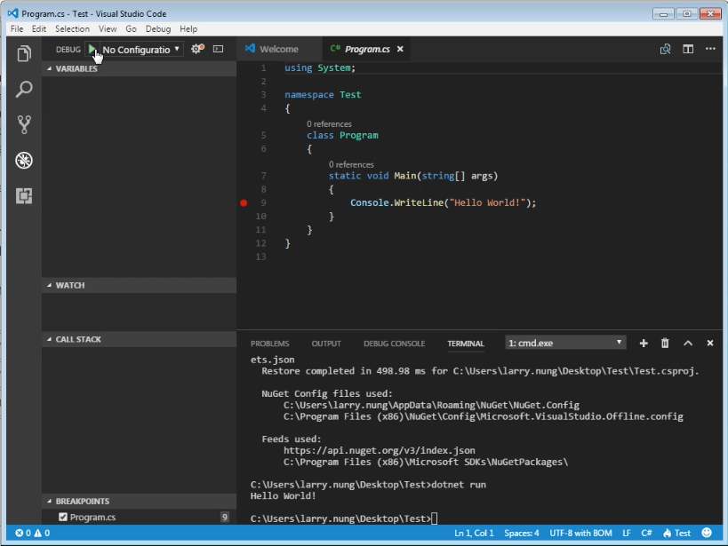

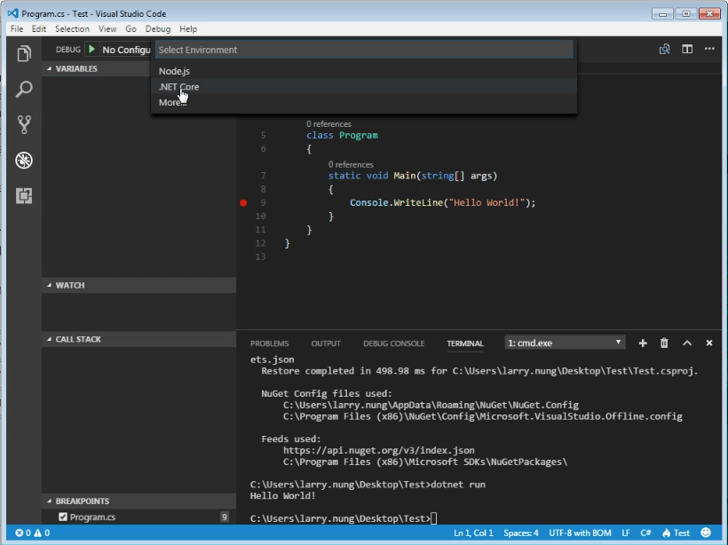

將 program 位置設為專案輸出檔的位置，以筆者這邊的例子來說就是 "${workspaceRoot}/bin/BPC/Debug/netcoreapp1.1/Test.dll"。

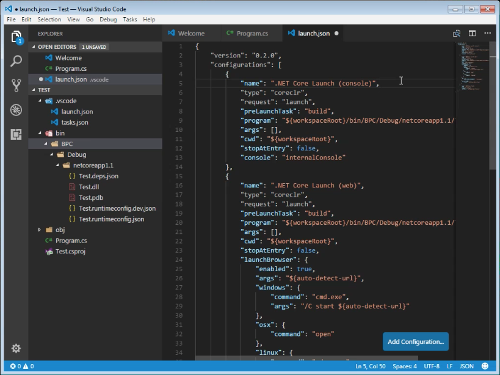

再來建立 task.json 檔。

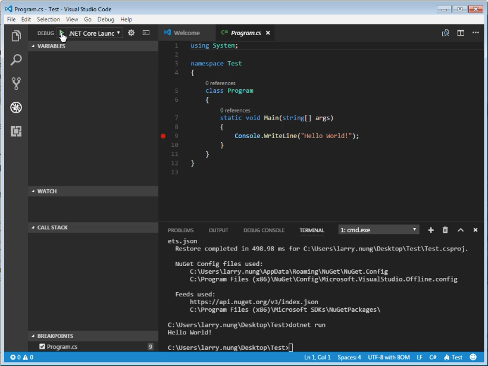

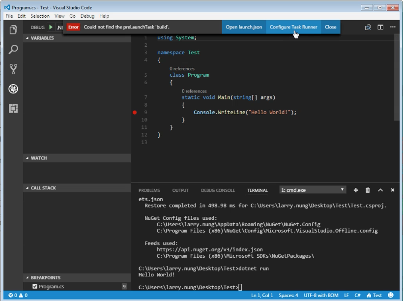

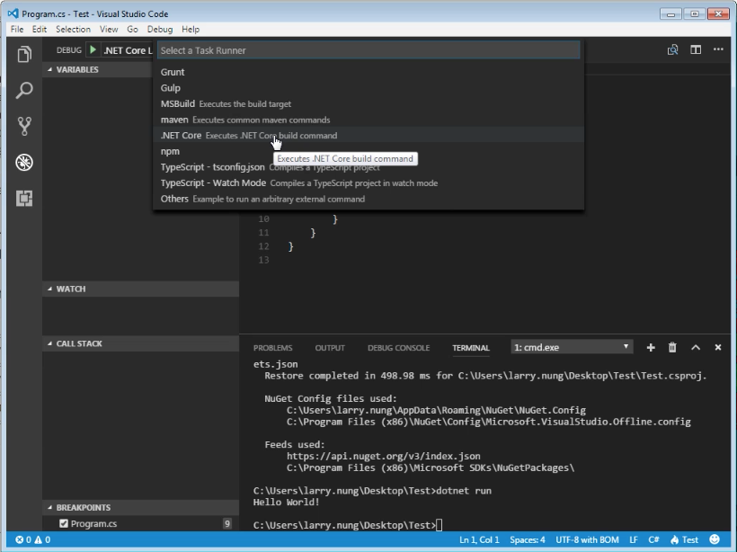

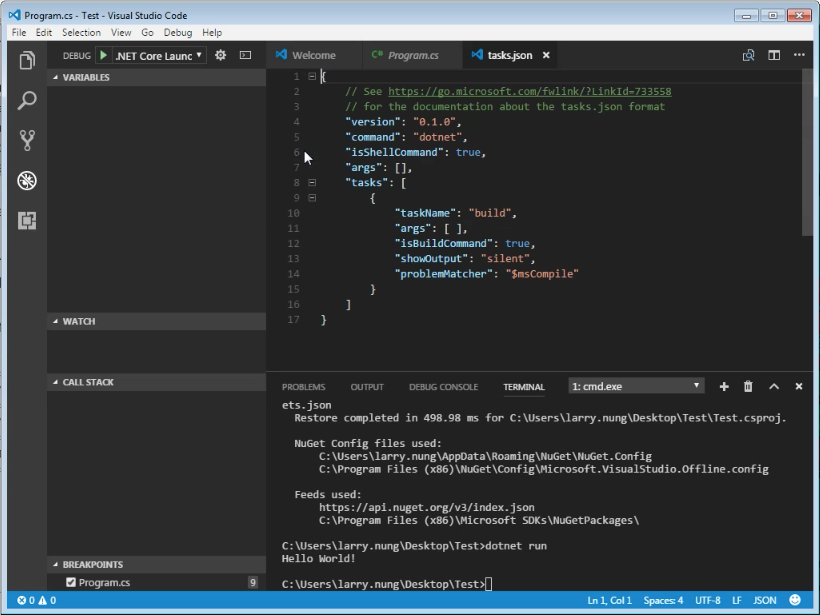

最後設斷點啟動除錯即可。

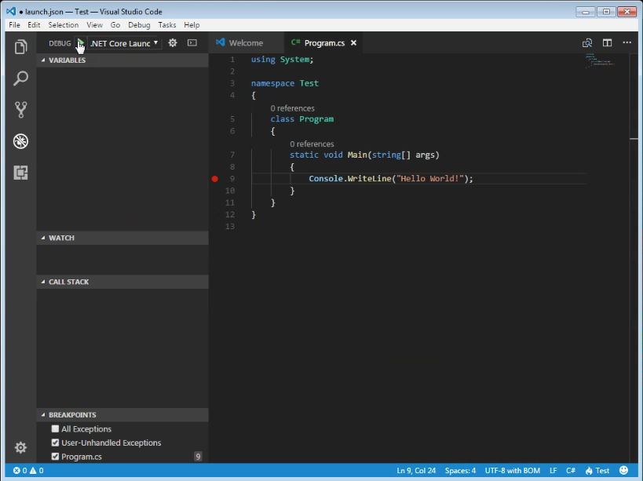

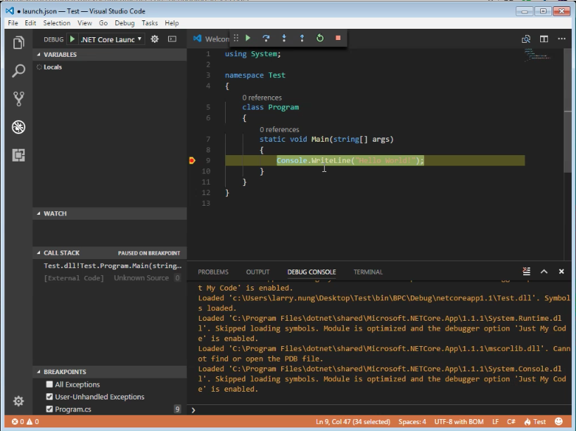

Link
----
* [C# programming with Visual Studio Code](https://code.visualstudio.com/docs/languages/csharp)
* [.NET Core and Visual Studio Code](https://code.visualstudio.com/docs/other/dotnet)
* [Get started with C# and Visual Studio Code - C# Guide | Microsoft Docs](https://docs.microsoft.com/en-us/dotnet/core/tutorials/with-visual-studio-code)