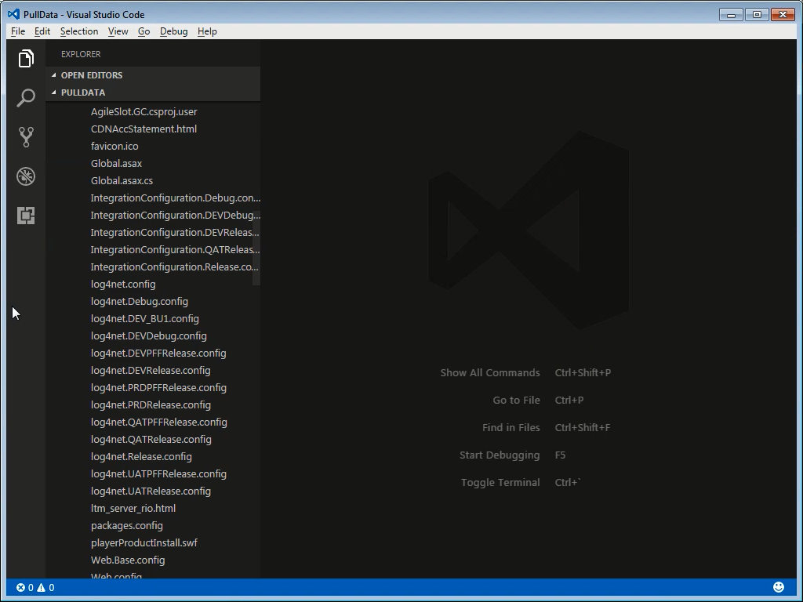
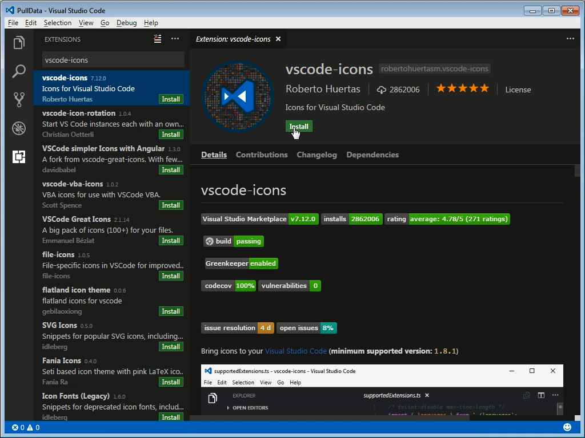
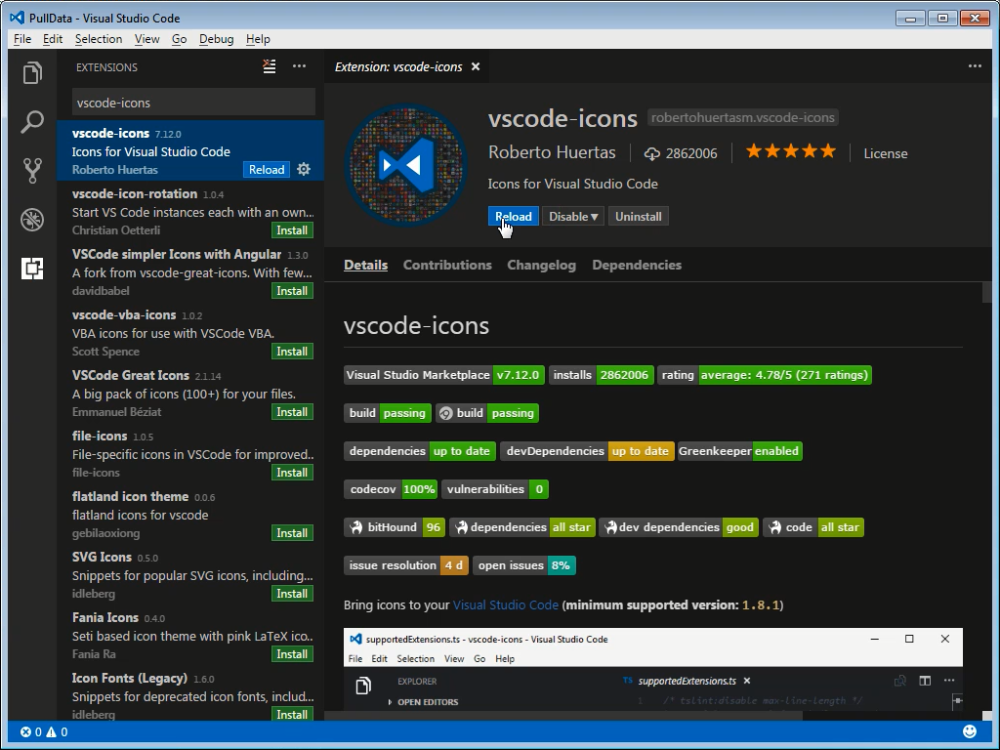
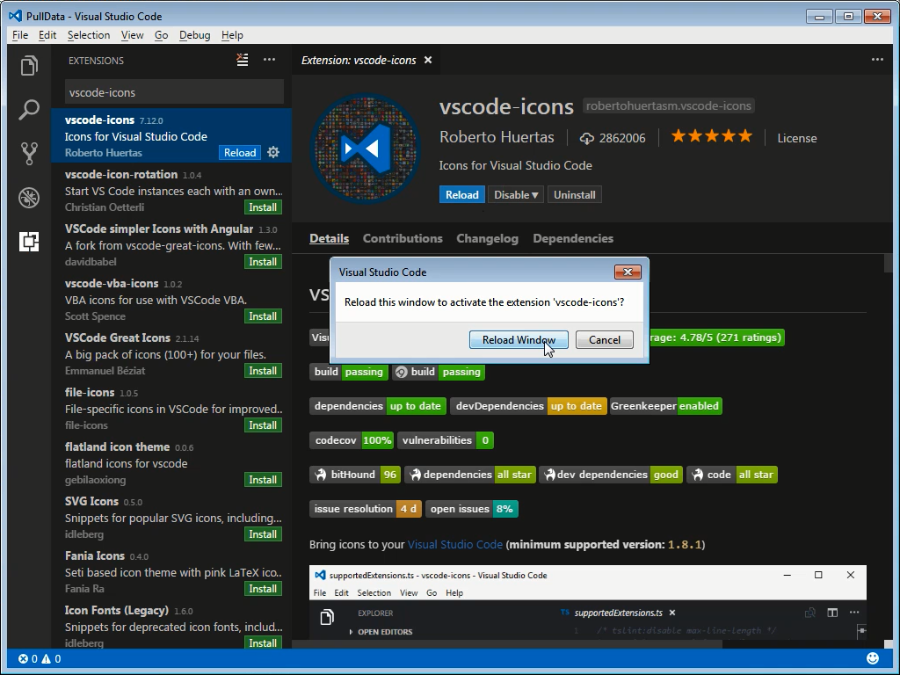
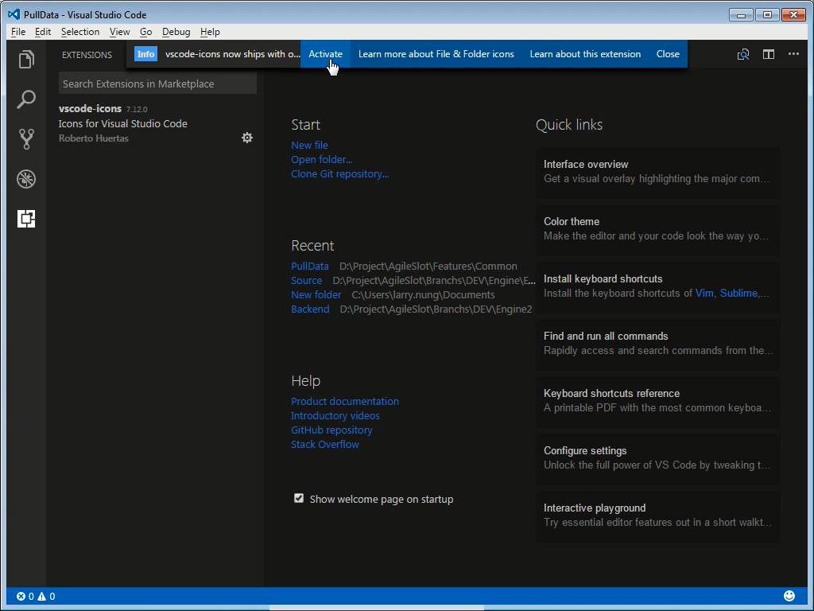
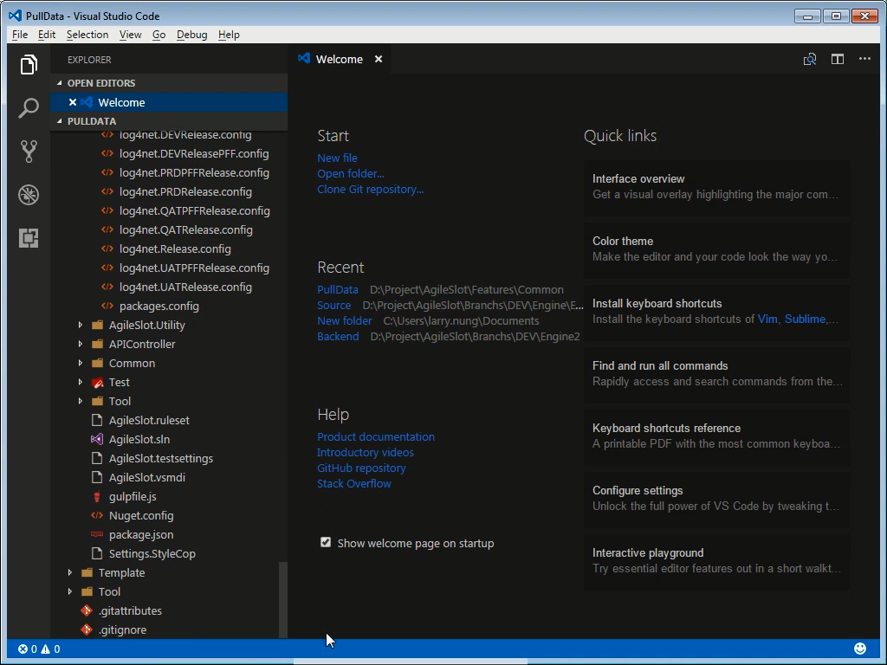

vscode-icons 是 Visual Studio Code 的套件，能讓 Visual Studio Code 的 Explorer 對 Icon 的支援更好。  

<!-- More -->

 

未安裝 vscode-icons 套件前 Visual Studio Code 的 Explorer 在檔案與目錄的顯示上缺少 Icon，檔案格式的識別或是目錄與檔案的識別都不容易。  

 

按下熱鍵 Ctrl-Shift-P / Cmd-Shift-P 開啟 command palette，輸入 Extensions:Install Extensions，輸入 vscode-icons 找到 vscode-icons 擴充套件進行安裝。  

 

安裝後重啟 Visual Studio Code。  

 

 

重啟後啟用 vscode-icons 套件。  

 

切到 Visual Studio Code 的 Explorer，即可看到 Visual Studio Code 的 Explorer 在檔案與目錄上都顯示了對應的 Icon。  

 

Link
----
* [vscode-icons - Visual Studio Marketplace](https://marketplace.visualstudio.com/items?itemName=robertohuertasm.vscode-icons)
* [File and Folder Icons in Visual Studio Code](https://code.visualstudio.com/blogs/2016/09/08/icon-themes)
