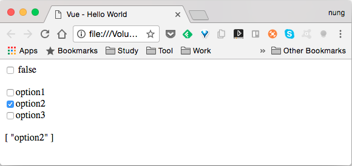
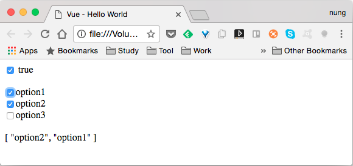

Checkbox 的繫結一樣是在 Vue 建立時連帶設定要用來繫結的屬性，然後在 Checkbox 元素這邊透過 v-model 指定所要繫結的屬性，設定完後資料屬性與控制項之間即會連動。

如果有多個 Checkbox 要做繫結，方法大同小異，只要將繫結的屬性宣告成陣列，Checkbox 這邊使用 v-model 指定繫結至相同的屬性，並在 Checkbox 指定選取時的 value 即可。    

像是下面這樣的程式：  

```html

  Vue - Hello World

    {{ checked }}

    option1  

    option2  

    option3  

    {{ options }}

    new Vue({
      el: '#app',
      data:{
        checked: false,
        options: ["option2"]
      }      
    })

```

其運行結果如下：  



