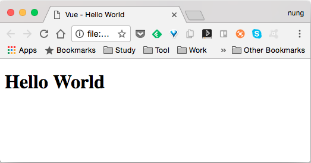
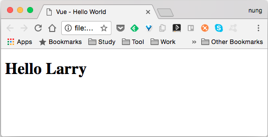

Vue.js Component 可讓我們將畫面與程式封裝程可重用的元件。

可在建立 Vue 時透過 components 宣告，進行局部註冊。  

```html

  Vue - Hello World

    new Vue({
      el: '#app',
      components: {
        'Hello' : {
          template : '
# Hello World
'
        }
      }     
    })

```

也可以使用 Vue.component 宣告，進行全域註冊。  

```html

  Vue - Hello World

    Vue.component( 'Hello' , {
      template : '
# Hello World
'
    })
    new Vue({
      el: '#app'  
    })

```

像是這邊筆者就註冊了名為 Hello 的 Component，該 Component 會顯示出 Hello World 的字樣，Component 註冊完後可以在 HTML 中使用 Hello 這個 Component 的 Element。  



Component 也支援設定 data，可存放ㄧ些 Component 會使用到的資料，但 data 必須是用 function 的方式宣告。  

```html

  Vue - Hello World

    Vue.component( 'Hello' , {
      template : '
# {{message}}
',
      data: function (){
        return {
          message: 'Hello World',
        }
      }
    })
    new Vue({
      el: '#app'      
    })

```

如果 Component 需要由外面傳遞資訊進去，可以在註冊 Component 的同時用 props 設定接受的參數名稱，然後在 HTML 中使用 Component element 時，就可以使用設定的參數將資訊傳入。  

```html

  Vue - Hello World

    Vue.component( 'Hello' , {
      props: ['name'],
      template : '
# Hello {{name}}
'
    })
    new Vue({
      el: '#app'  
    })

```



Link
----
* [Components — Vue.js](https://vuejs.org/v2/guide/components.html)