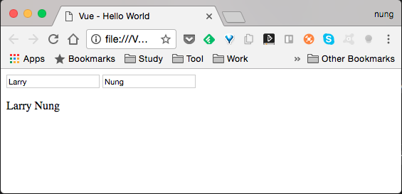
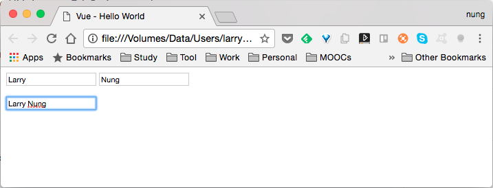

Vue.js 的計算屬性(Computed properties)可以設定經過運算而來的屬性，有點類似其它程式語言的屬性(Property)，而一般的 Vue.js 屬性則是類似其它程式語言的欄位(Field)。  

<!-- More -->

<br/>


使用上只要在建構 Vue 建立時設定 computed 物件，裡面放置計算屬性的方法，這樣在使用計算屬性時就會去調用計算屬性定義的方法去運算。   

```html
  <div id="app">
    ...
    {{&lt;PropertyName&gt;}}
    ...
  </div>
  ...
  <script>
    new Vue({
      el: '#app',
      data:{
        ...
      },
      computed: {
        <PropertyName>: function () {
          ...
        }
      }     
    })
  </script>
```

<br/>


像是下面這樣的程式，設定了 firstName 與 lastName 兩個屬性，並設定了名為 fullName 的計算屬性，其值為 firstName 與 lastName 用空格串接。  

```html
<!DOCTYPE html>
<html>
<head>
  <title>Vue - Hello World</title>
  <script src="https://unpkg.com/vue/dist/vue.js"></script>
</head>
<body>
  <div id="app">
    <input v-model="firstName">
    <input v-model="lastName">
    <p>{{fullName}}</p>
  </div>
  <script>
    new Vue({
      el: '#app',
      data:{
        firstName: "Larry",
        lastName:"Nung"
      },
      computed: {
        fullName: function () {
          return this.firstName + " " + this.lastName;
        }
      }     
    })
  </script>
</body>
</html>
```

<br/>


運行起來不論 firstName 與 lastName 怎樣變動，都可以正確的顯示出 fullName。  



<br/>


如果需要將設定的值經過運算處理存回一般的屬性，可以設定計算屬性的 setter，只要在建構 Vue 建立實設定 computed 物件，裡面放置計算屬性的物件，計算屬性物件內設定 get 與 set 的方法，定義讀取與寫入資料要做的運算。  

```html
  <div id="app">
    ...
    <input v-model="<PropertyName>">
    ...
  </div>
  ...
  <script>
    new Vue({
      el: '#app',
      data:{
        ...
      },
      computed: {
        <PropertyName>: {
          get: function () {
            ...
          },
          set: function (value) {
            ...
          }
        }
      }     
    })
  </script>
```

<br/>


像是下面這樣的程式，設定了 fullName 這個計算屬性，當該值被設定時會將資料切分到 firstName 與 lastName 這兩個屬性。   

```html
<!DOCTYPE html>
<html>
<head>
  <title>Vue - Hello World</title>
  <script src="https://unpkg.com/vue/dist/vue.js"></script>
</head>
<body>
  <div id="app">
    <input v-model="firstName">
    <input v-model="lastName">
    <p><input v-model="fullName"></p>
  </div>
  <script>
    new Vue({
      el: '#app',
      data:{
        firstName: "",
        lastName:""
      },
      computed: {
        fullName: {
          get: function () {
            return this.firstName + " " + this.lastName;
          },
          set: function (value) {
            var names = value.split(' ')
            this.firstName = names[0]
            this.lastName = names[names.length - 1]
          }
        }
      }     
    })
  </script>
</body>
</html>
```

<br/>


運行起來不論 fullName 怎樣變動，都可以正確的顯示出 firstName 與 lastName。



<br/>
