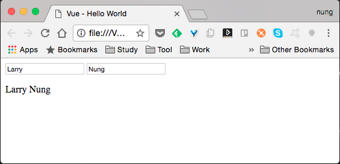
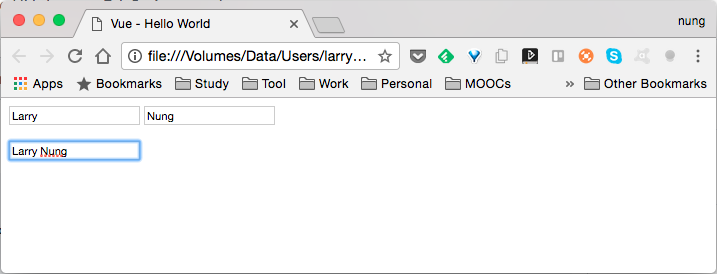

Vue.js 的計算屬性(Computed properties)可以設定經過運算而來的屬性，有點類似其它程式語言的屬性(Property)，而一般的 Vue.js 屬性則是類似其它程式語言的欄位(Field)。

使用上只要在建構 Vue 建立時設定 computed 物件，裡面放置計算屬性的方法，這樣在使用計算屬性時就會去調用計算屬性定義的方法去運算。

```html

...
{{}}
...

...

new Vue({
el: '#app',
data:{
...
},
computed: {
: function () {
...
}
}
})

```

像是下面這樣的程式，設定了 firstName 與 lastName 兩個屬性，並設定了名為 fullName 的計算屬性，其值為 firstName 與 lastName 用空格串接。

```html

Vue - Hello World

{{fullName}}

new Vue({
el: '#app',
data:{
firstName: "Larry",
lastName:"Nung"
},
computed: {
fullName: function () {
return this.firstName + " " + this.lastName;
}
}
})

```

運行起來不論 firstName 與 lastName 怎樣變動，都可以正確的顯示出 fullName。



如果需要將設定的值經過運算處理存回一般的屬性，可以設定計算屬性的 setter，只要在建構 Vue 建立實設定 computed 物件，裡面放置計算屬性的物件，計算屬性物件內設定 get 與 set 的方法，定義讀取與寫入資料要做的運算。

```html

...
">
...

...

new Vue({
el: '#app',
data:{
...
},
computed: {
: {
get: function () {
...
},
set: function (value) {
...
}
}
}
})

```

像是下面這樣的程式，設定了 fullName 這個計算屬性，當該值被設定時會將資料切分到 firstName 與 lastName 這兩個屬性。

```html

Vue - Hello World

new Vue({
el: '#app',
data:{
firstName: "",
lastName:""
},
computed: {
fullName: {
get: function () {
return this.firstName + " " + this.lastName;
},
set: function (value) {
var names = value.split(' ')
this.first
this.last - 1]
}
}
}
})

```

運行起來不論 fullName 怎樣變動，都可以正確的顯示出 firstName 與 lastName。

