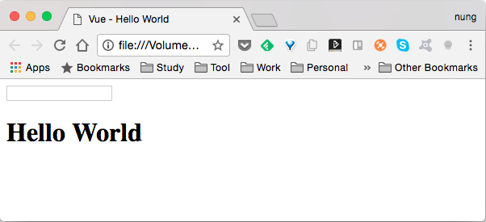
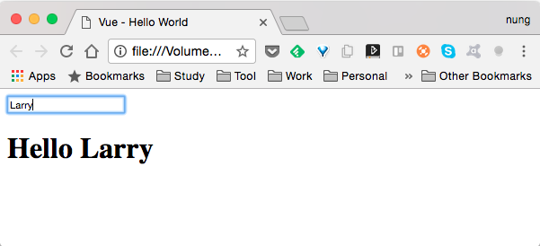
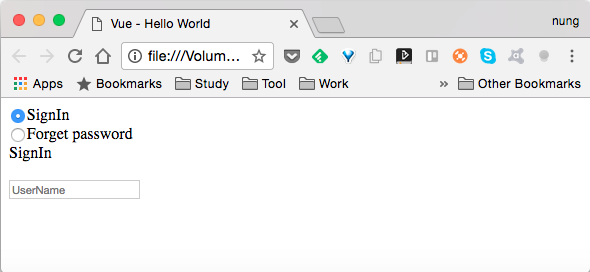
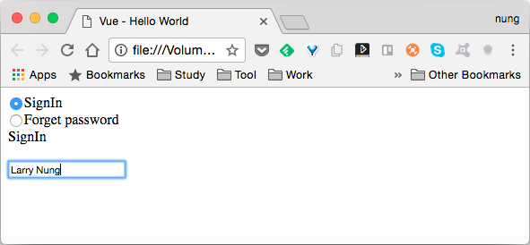
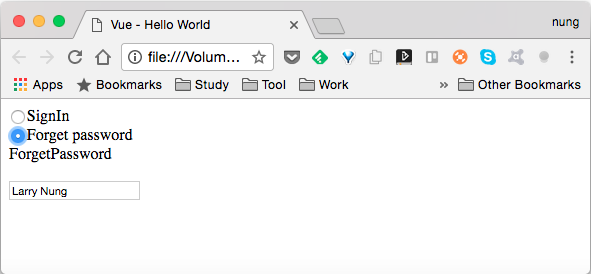
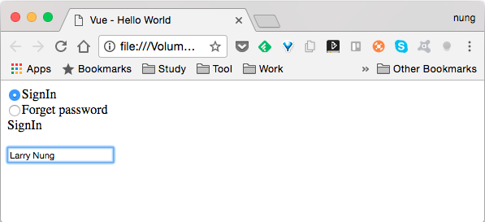
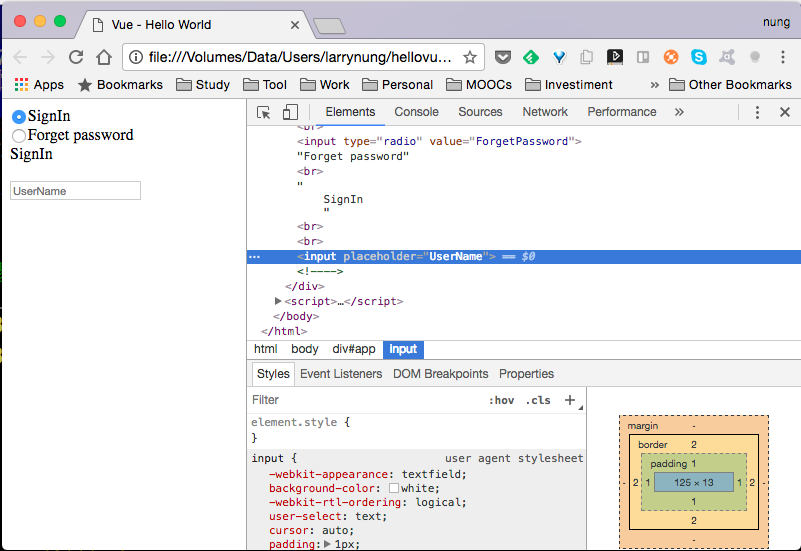
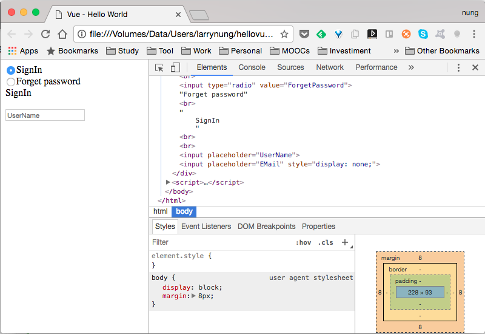

Vue.js 要使用條件渲染，像是想要當條件成立時才渲染，可以使用 v-if、 v-else-if、 v-else。    

<!-- More -->

<br/>


像是下面這程式，筆者使用輸入框繫結的 name 屬性去決定要顯示的文字，如果有輸入名字，則會對該名字 Hello，反之則顯示 Hello World。  

```html
<!DOCTYPE html>
<html>
<head>
  <title>Vue - Hello World</title>
  <script src="https://unpkg.com/vue/dist/vue.js"></script>
</head>
<body>
  <div id="app">
    <input v-model="name">
    <h1 v-if="name != ''">Hello {{name}}</h1>
    <h1 v-else>Hello World</h1>
  </div>
  <script>
    new Vue({
      el: '#app',
      data:{
        name: ""
      }      
    })
  </script>
</body>
</html>
```

<br/>




<br/>




<br/>


條件渲染在使用上，Vue.js 為了效能考量會用最有效率的方式渲染，所以當我們程式像下面這樣時，運行上可能就會不如我們所預期。  

```html
<!DOCTYPE html>
<html>
<head>
  <title>Vue - Hello World</title>
  <script src="https://unpkg.com/vue/dist/vue.js"></script>
</head>
<body>
  <div id="app">
    <input type="radio" value="SignIn" v-model="option">SignIn<br/>
    <input type="radio" value="ForgetPassword" v-model="option">Forget password<br/>
    {{option}}
    <br/><br/>

    <input v-if="option == 'SignIn'" placeholder="UserName">
    <input v-if="option == 'ForgetPassword'" placeholder="EMail">
  </div>
  <script>
    new Vue({
      el: '#app',
      data:{
        option: "SignIn"
      }      
    })
  </script>
</body>
</html>
```

<br/>


像是運行起來在輸入框中輸入名字。  



<br/>




<br/>


進行切換改顯示另外一個輸入框，會發現輸入框中會帶出剛剛在前一個輸入框所填入的內容，這是因為 Vue.js 為了渲染的效率對元素進行了重用所導致。  



<br/>


這時我們需要為輸入框帶入不同的 key 值。  

```html
<!DOCTYPE html>
<html>
<head>
  <title>Vue - Hello World</title>
  <script src="https://unpkg.com/vue/dist/vue.js"></script>
</head>
<body>
  <div id="app">
    <input type="radio" value="SignIn" v-model="option">SignIn<br/>
    <input type="radio" value="ForgetPassword" v-model="option">Forget password<br/>
    {{option}}
    <br/><br/>

    <input v-if="option == 'SignIn'" placeholder="UserName" key='userName'>
    <input v-if="option == 'ForgetPassword'" placeholder="EMail" key='email'>
  </div>
  <script>
    new Vue({
      el: '#app',
      data:{
        option: "SignIn"
      }      
    })
  </script>
</body>
</html>
```

<br/>


運行上就會正常了。  



<br/>


<br/>


除了 v-if 外我們也可以使用 v-show 來達到類似的效果。  

```html
<!DOCTYPE html>
<html>
<head>
  <title>Vue - Hello World</title>
  <script src="https://unpkg.com/vue/dist/vue.js"></script>
</head>
<body>
  <div id="app">
    <input type="radio" value="SignIn" v-model="option">SignIn<br/>
    <input type="radio" value="ForgetPassword" v-model="option">Forget password<br/>
    {{option}}
    <br/><br/>

    <input v-show="option == 'SignIn'" placeholder="UserName" key='userName'>
    <input v-show="option == 'ForgetPassword'" placeholder="EMail" key='email'>
  </div>
  <script>
    new Vue({
      el: '#app',
      data:{
        option: "SignIn"
      }      
    })
  </script>
</body>
</html>
```

<br/>


雖然在畫面上兩種寫法的效果一致，但是使用 v-if 是不需要顯示的元素就不會放置，可減少初始的成本，但是會有較大的切換成本。  



<br/>


而使用 v-show 則是不需要顯示的元素還是會放置，只是不顯示出來而已。其初始的成本較大，但切換的成本較少。  



<br/>
