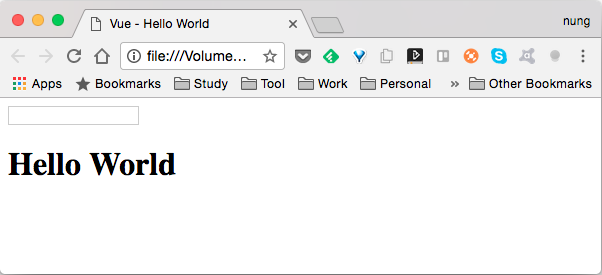
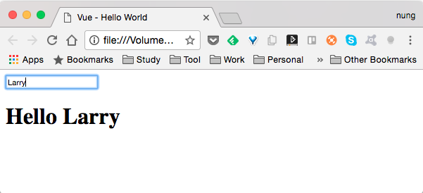
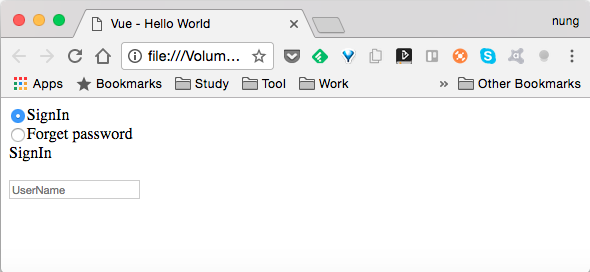
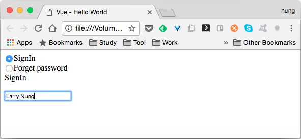
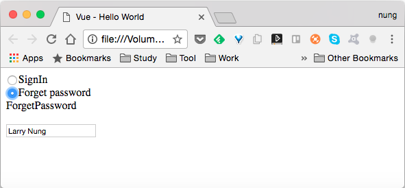
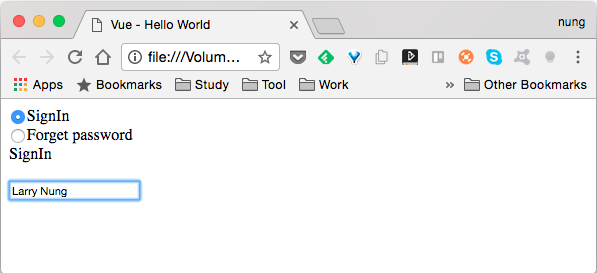
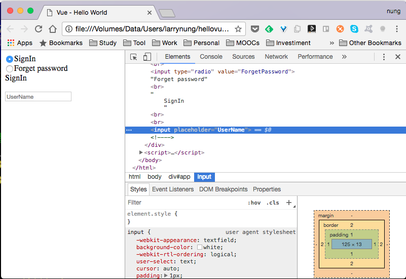
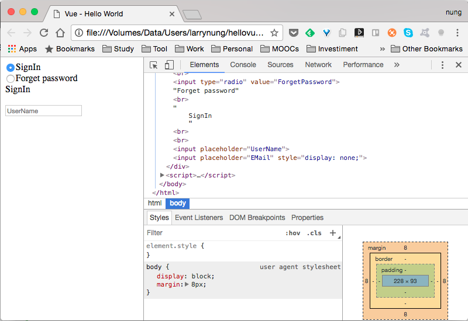

Vue.js 要使用條件渲染，像是想要當條件成立時才渲染，可以使用 v-if、 v-else-if、 v-else。    

像是下面這程式，筆者使用輸入框繫結的 name 屬性去決定要顯示的文字，如果有輸入名字，則會對該名字 Hello，反之則顯示 Hello World。  

```html

  Vue - Hello World

# Hello {{name}}

# Hello World

    new Vue({
      el: '#app',
      data:{
        name: ""
      }      
    })

```





條件渲染在使用上，Vue.js 為了效能考量會用最有效率的方式渲染，所以當我們程式像下面這樣時，運行上可能就會不如我們所預期。  

```html

  Vue - Hello World

    SignIn  

    Forget password  

    {{option}}

    new Vue({
      el: '#app',
      data:{
        option: "SignIn"
      }      
    })

```

像是運行起來在輸入框中輸入名字。  





進行切換改顯示另外一個輸入框，會發現輸入框中會帶出剛剛在前一個輸入框所填入的內容，這是因為 Vue.js 為了渲染的效率對元素進行了重用所導致。  



這時我們需要為輸入框帶入不同的 key 值。  

```html

  Vue - Hello World

    SignIn  

    Forget password  

    {{option}}

    new Vue({
      el: '#app',
      data:{
        option: "SignIn"
      }      
    })

```

運行上就會正常了。  




除了 v-if 外我們也可以使用 v-show 來達到類似的效果。  

```html

  Vue - Hello World

    SignIn  

    Forget password  

    {{option}}

    new Vue({
      el: '#app',
      data:{
        option: "SignIn"
      }      
    })

```

雖然在畫面上兩種寫法的效果一致，但是使用 v-if 是不需要顯示的元素就不會放置，可減少初始的成本，但是會有較大的切換成本。  



而使用 v-show 則是不需要顯示的元素還是會放置，只是不顯示出來而已。其初始的成本較大，但切換的成本較少。  

