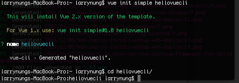
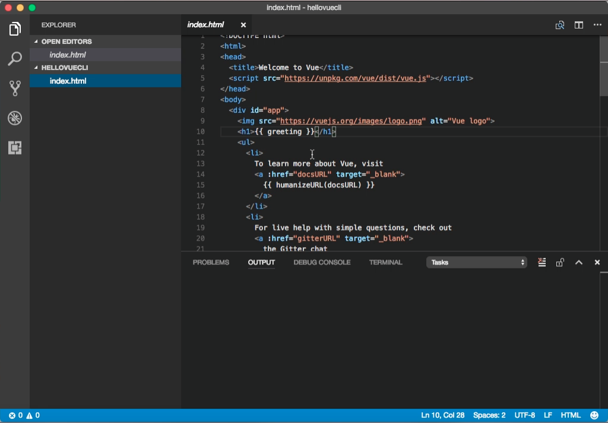
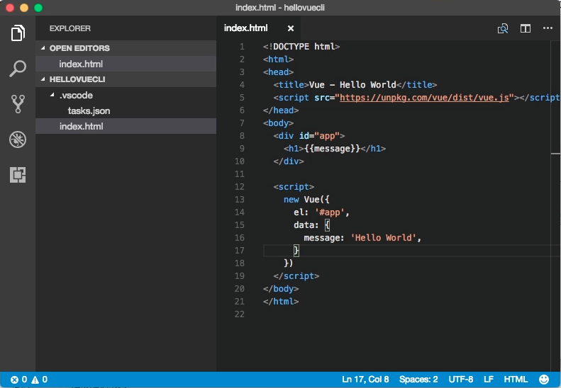
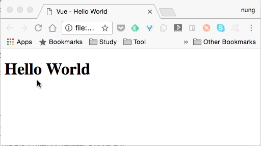

要使用 Vue.js 我們要將 Vue.js 載入，可以手動加入、用 npm 安裝套件、用 vue-cli、用 bower...等。

這邊筆者用 vue-cli 做個簡單的範例，用 simple 範本建立專案。

vue init simple



simple 範本建立出來的專案就只有一個 index.html 檔，裡面已經幫我們加入了 vue.js 套件。



這邊筆者將檔案修改成下面這樣：
```html

Vue - Hello World

# {{message}}

new Vue({
el: '#app',
data: {
message: 'Hello World',
}
})
```


可以看到 script 這邊建立了一個 vue 物件，裡面設定了 el 為 #app，指向上方 id 為 app 的 div 為其作用範圍。接著設定 data，裡面有個 message 值為 'Hello World'，會被綁定到上方的 {{message}}。

所以運行起來會這樣:

