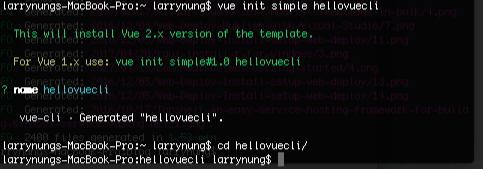
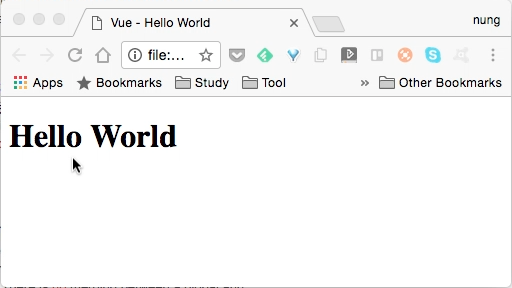

要使用 Vue.js 我們要將 Vue.js 載入，可以手動加入、用 npm 安裝套件、用 vue-cli、用 bower...等。  

<!-- More -->

<br/>


這邊筆者用 vue-cli 做個簡單的範例，用 simple 範本建立專案。  

    vue init simple <ProjectName>  



<br/>


simple 範本建立出來的專案就只有一個 index.html 檔，裡面已經幫我們加入了 vue.js 套件。  


<br/>


這邊筆者將檔案修改成下面這樣：  

```html
<!DOCTYPE html>
<html>
<head>
  <title>Vue - Hello World</title>
  <script src="https://unpkg.com/vue/dist/vue.js"></script>
</head>
<body>
  <div id="app">
    <h1>{{message}}</h1>
  </div>

  <script>
    new Vue({
      el: '#app',
      data: {
        message: 'Hello World',
      }      
    })
  </script>
</body>
</html>
```

<br/>


<br/>


可以看到 script 這邊建立了一個 vue 物件，裡面設定了 el 為 #app，指向上方 id 為 app 的 div 為其作用範圍。接著設定 data，裡面有個 message 值為 'Hello World'，會被綁定到上方的 {{message}}。  

<br/>


所以運行起來會這樣:   



<br/>
