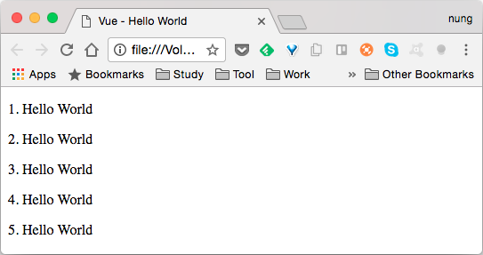
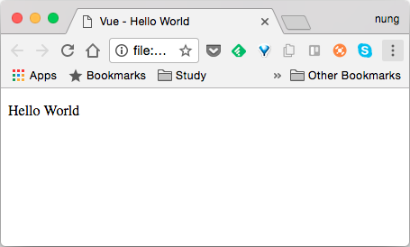

Vue.js 要渲染多個元素，可使用 v-for。  

像是要渲染陣列元素，就可以像下面這樣處理。  

```html

  Vue - Hello World

{{item}}

    new Vue({
      el: '#app',
      data:{
        items: [
          "1.Hello World",
          "2.Hello World",
          "3.Hello World",
          "4.Hello World",
          "5.Hello World"
        ]
      }
    })

```


若有需要索引值，v-for 也有索引值可供使用。  

```html

  Vue - Hello World

{{index + 1}}. {{item}}

    new Vue({
      el: '#app',
      data:{
        items: [
          "Hello World",
          "Hello World",
          "Hello World",
          "Hello World",
          "Hello World"
        ]
      }      
    })

```


除了陣列元素外，v-for 也支援 range 的方式，可明確指定循環的次數。  

```html

  Vue - Hello World

{{n}}. Hello World

    new Vue({
      el: '#app',
      data:{
      }
    })

```



也可以用來遍巡物件元素的值。  

```html

  Vue - Hello World

{{item}}

    new Vue({
      el: '#app',
      data:{
        data: {
          message: "Hello World"
        }
      }      
    })

```

