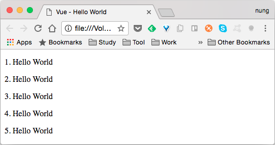

Vue.js 要渲染多個元素，可使用 v-for。  

<!-- More -->

<br/>


像是要渲染陣列元素，就可以像下面這樣處理。  

```html
<!DOCTYPE html>
<html>
<head>
  <title>Vue - Hello World</title>
  <script src="https://unpkg.com/vue/dist/vue.js"></script>
</head>
<body>
  <div id="app">
    <p v-for="item in items">{{item}}</p>
  </div>
  <script>
    new Vue({
      el: '#app',
      data:{
        items: [
          "1.Hello World",
          "2.Hello World",
          "3.Hello World",
          "4.Hello World",
          "5.Hello World"
        ]
      }
    })
  </script>
</body>
</html>
```

<br/>




<br/>


若有需要索引值，v-for 也有索引值可供使用。  

```html
<!DOCTYPE html>
<html>
<head>
  <title>Vue - Hello World</title>
  <script src="https://unpkg.com/vue/dist/vue.js"></script>
</head>
<body>
  <div id="app">
    <p v-for="(item, index) in items">{{index + 1}}. {{item}}</p>
  </div>
  <script>
    new Vue({
      el: '#app',
      data:{
        items: [
          "Hello World",
          "Hello World",
          "Hello World",
          "Hello World",
          "Hello World"
        ]
      }      
    })
  </script>
</body>
</html>
```

<br/>


<br/>


除了陣列元素外，v-for 也支援 range 的方式，可明確指定循環的次數。  

```html
<!DOCTYPE html>
<html>
<head>
  <title>Vue - Hello World</title>
  <script src="https://unpkg.com/vue/dist/vue.js"></script>
</head>
<body>
  <div id="app">
    <p v-for="n in 5">{{n}}. Hello World</p>
  </div>
  <script>
    new Vue({
      el: '#app',
      data:{
      }
    })
  </script>
</body>
</html>
```

<br/>


<br/>


也可以用來遍巡物件元素的值。  

```html
<!DOCTYPE html>
<html>
<head>
  <title>Vue - Hello World</title>
  <script src="https://unpkg.com/vue/dist/vue.js"></script>
</head>
<body>
  <div id="app">
    <p v-for="item in data">{{item}}</p>
  </div>
  <script>
    new Vue({
      el: '#app',
      data:{
        data: {
          message: "Hello World"
        }
      }      
    })
  </script>
</body>
</html>
```

<br/>


<br/>
