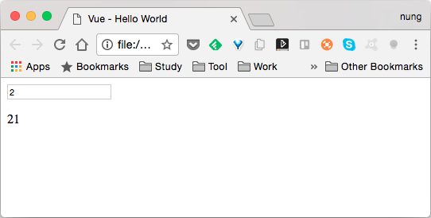
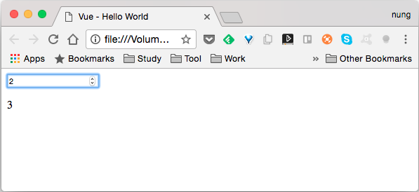

Vue.js 的 .number modifier 可以讓繫結的屬性值轉換成數值型態。  

以下面這段程式為例，若不使用 .number modifer，輸入的資料會被視為字串，如果要拿繫結的屬性值去做數值的處理就會不如我們的預期。  

```html

  Vue - Hello World

{{value + 1}}

    new Vue({
      el: '#app',
      data:{
        value: 0
      }      
    })

```



這時候需要使用 .number modifier 來解決這樣的問題，將繫結的屬性值轉換成數值型態，後續的數值處理才會正常。  

```html

  Vue - Hello World

{{value + 1}}

    new Vue({
      el: '#app',
      data:{
        value: 0
      }      
    })

```

