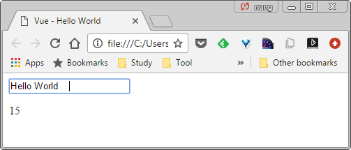
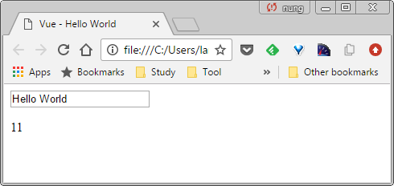

Vue.js 的 .trim modifier 可以將繫結的屬性值去除多餘的空格。  

<!-- More -->

<br/>


以下面這段程式為例，若不使用 .trim modifer，輸入的資料如果有空格，繫結的屬性值也會含有空格。  

```html

<!DOCTYPE html>
<html>
<head>
  <title> Vue - Hello World </title>
  <script src = "https://unpkg.com/vue/dist/vue.js"></script>
</head>
<body>
  <div id = "app">
    <input v-model = "message">
    <p> {{message.length}} </p>
  </div>
  <script>
    new Vue({
      el : '#app' ,
      data :{
        message : "Hello World"
      }      
    })
  </script>
</body>
</html>

```

<br/>




<br/>


這時候需要使用 .trim modifier 來解決這樣的問題，將繫結的屬性值去除多餘的空格。  

```html

<!DOCTYPE html>
<html>
<head>
  <title> Vue - Hello World </title>
  <script src = "https://unpkg.com/vue/dist/vue.js"></script>
</head>
<body>
  <div id = "app">
    <input v-model.trim = "message">
    <p> {{message.length}} </p>
  </div>
  <script>
    new Vue({
      el : '#app' ,
      data :{
        message : "Hello World"
      }      
    })
  </script>
</body>
</html>

```

<br/>




<br/>
