Vundle 是 Vim 的套件管理程式，安裝可直接透過 git 下載。  

<!-- more -->

    git clone https://github.com/VundleVim/Vundle.vim.git ~/.vim/bundle/Vundle.vim

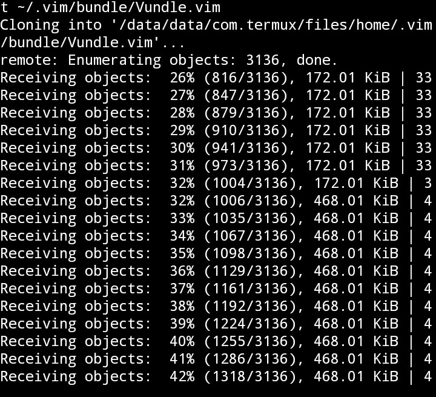

</br>


下載後開啟 Vim 設定檔。  

    vi ~/.vimrc

</br>


加入設定 (不需要的套件請自行移除)。  

```
set nocompatible              " be iMproved, required
filetype off                  " required

" set the runtime path to include Vundle and initialize
set rtp+=~/.vim/bundle/Vundle.vim
call vundle#begin()
" alternatively, pass a path where Vundle should install plugins
"call vundle#begin('~/some/path/here')

" let Vundle manage Vundle, required
Plugin 'VundleVim/Vundle.vim'

" The following are examples of different formats supported.
" Keep Plugin commands between vundle#begin/end.
" plugin on GitHub repo
Plugin 'tpope/vim-fugitive'
" plugin from http://vim-scripts.org/vim/scripts.html
" Plugin 'L9'
" Git plugin not hosted on GitHub
Plugin 'git://git.wincent.com/command-t.git'
" git repos on your local machine (i.e. when working on your own plugin)
Plugin 'file:///home/gmarik/path/to/plugin'
" The sparkup vim script is in a subdirectory of this repo called vim.
" Pass the path to set the runtimepath properly.
Plugin 'rstacruz/sparkup', {'rtp': 'vim/'}
" Install L9 and avoid a Naming conflict if you've already installed a
" different version somewhere else.
" Plugin 'ascenator/L9', {'name': 'newL9'}

" All of your Plugins must be added before the following line
call vundle#end()            " required
filetype plugin indent on    " required
" To ignore plugin indent changes, instead use:
"filetype plugin on
"
" Brief help
" :PluginList       - lists configured plugins
" :PluginInstall    - installs plugins; append `!` to update or just :PluginUpdate
" :PluginSearch foo - searches for foo; append `!` to refresh local cache
" :PluginClean      - confirms removal of unused plugins; append `!` to auto-approve removal
"
" see :h vundle for more details or wiki for FAQ
" Put your non-Plugin stuff after this line
```

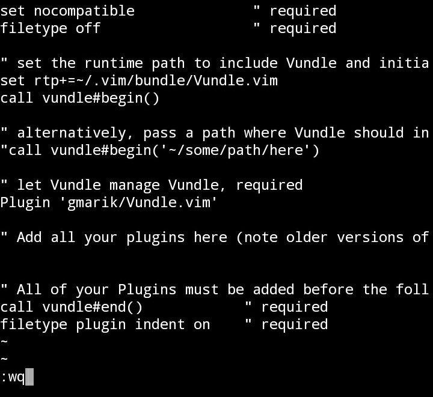

</br>


然後透過命令列命令...

    vim +PluginInstall +qall


</br>


或是 Vim 命令進行安裝。  

    :PluginInstall

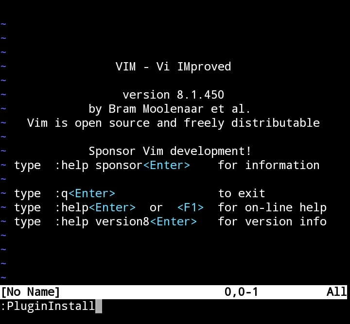

</br>


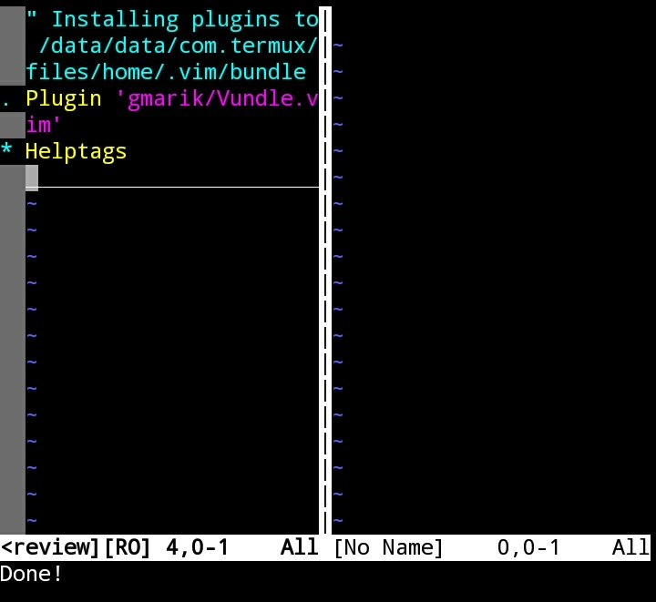

</br>


Vundle 的使用如有不清楚的，可調用 Vim 命令直接查閱。 

    :h vundle

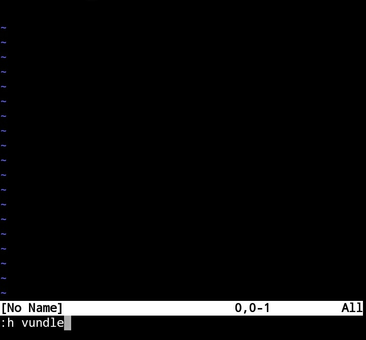

</br>


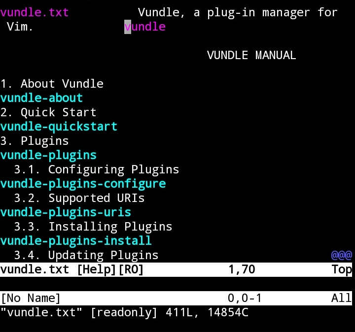

</br>


簡單的操作像是安裝套件，可以使用...

    :PluginInstall <Plugin>

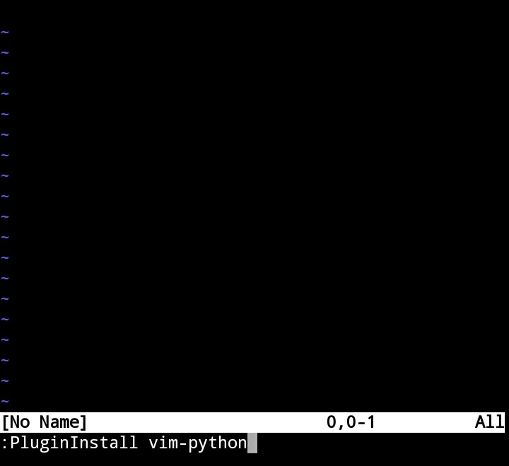

</br>


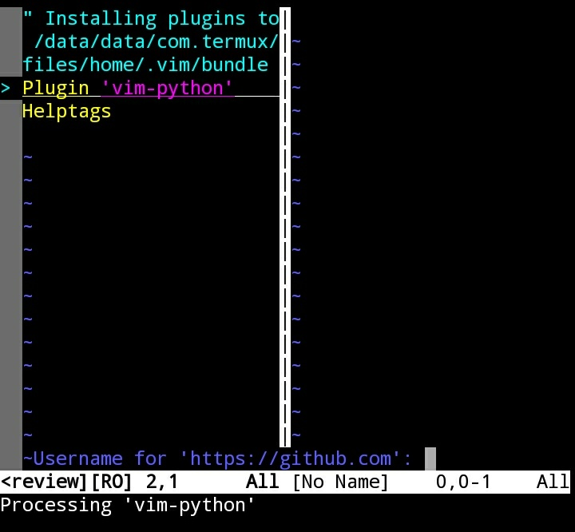

</br>


顯示安裝的套件可調用...

    :PluginList

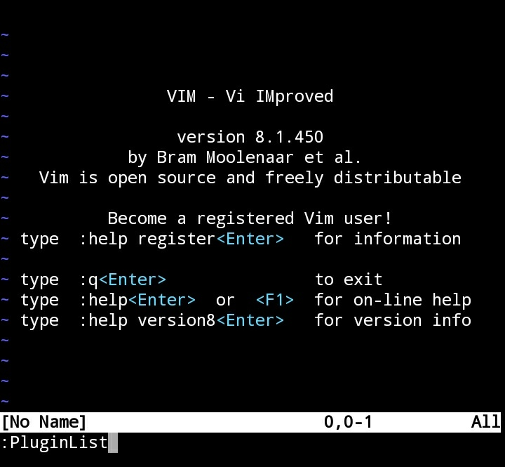

</br>


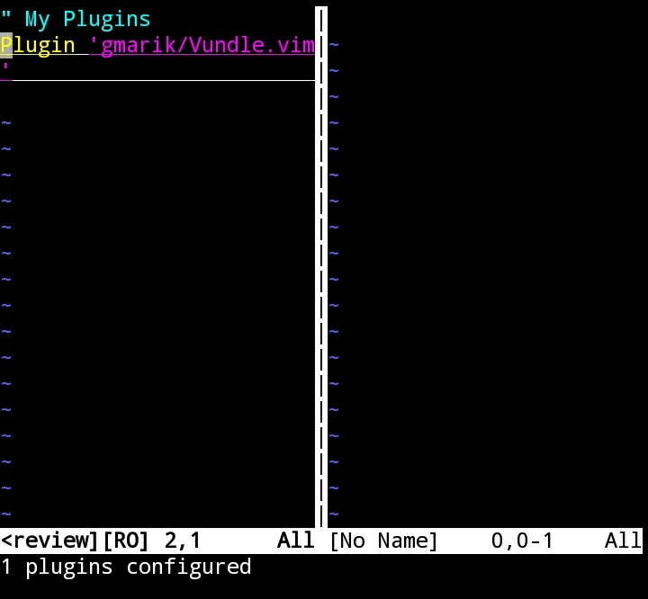

</br>


搜尋指定套件可用...

    :PluginSearch <Plugin>

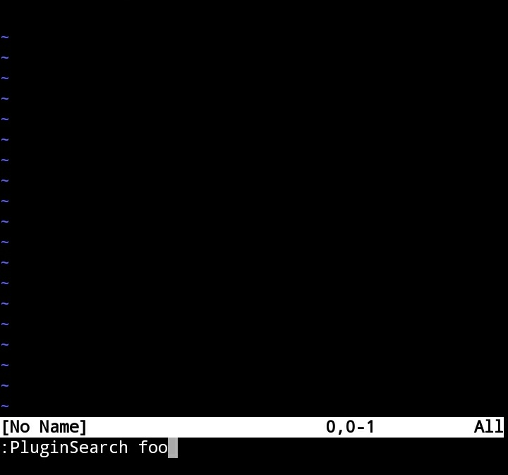

</br>


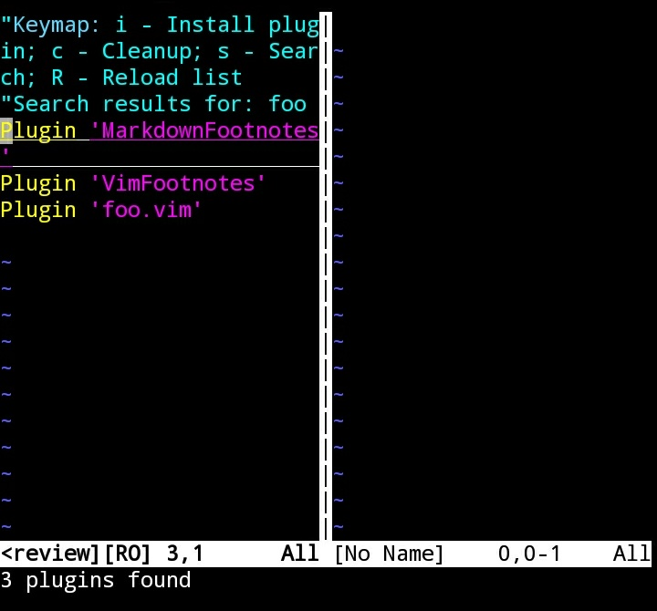

</br>


清除套件可用...

    :PluginClean

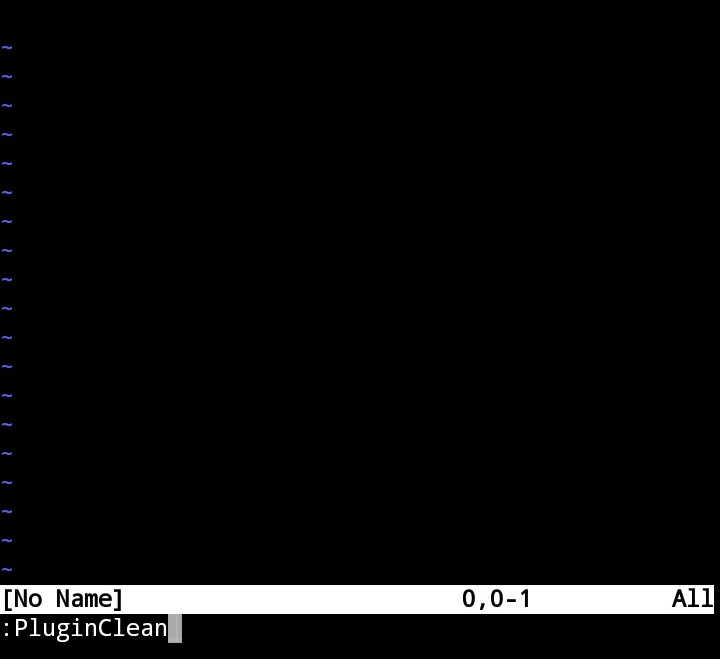

</br>


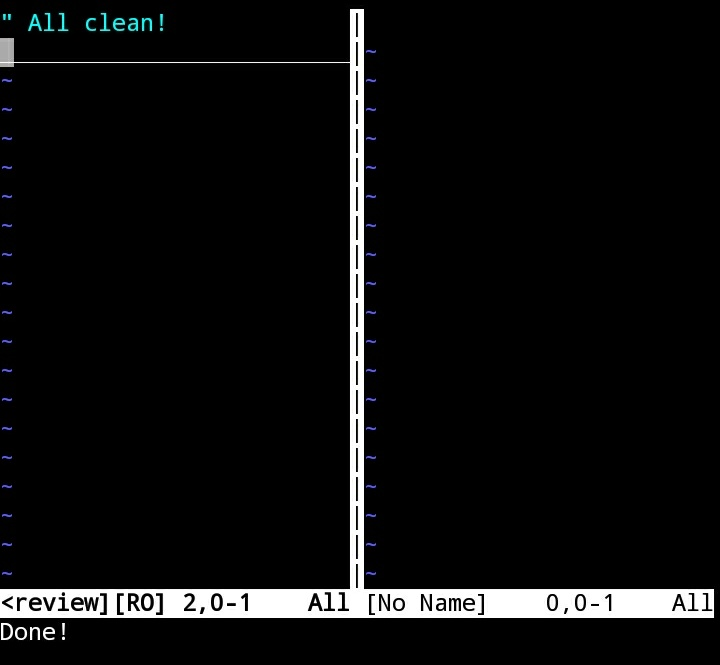

</br>


Link
----
* [VundleVim / Vundle.vim](https://github.com/VundleVim/Vundle.vim)
