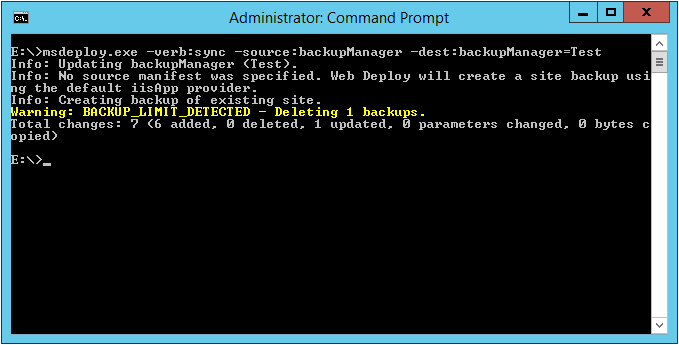

如要使用 Web Deploy 備份本地站台，可以指定 Web Deploy 使用 sync 操作，source 使用 backupManager，dest 也使用 backupManager，並指定要備份的站台名稱。  

<!-- More -->

    msdeploy.exe -verb:sync -source:backupManager -dest:backupManager=<DestSite>

 

 
